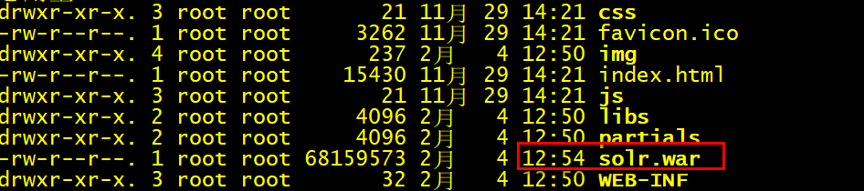
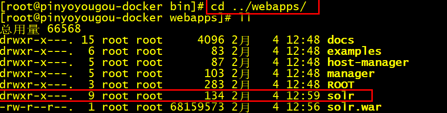
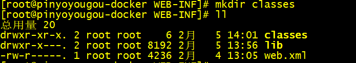
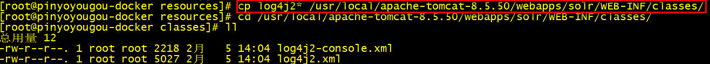

# 1. Solr简介

## 前言

学习Solr需要一些和java相关的储备知识，在此之前，假设您已经：

- 拥有 Java 开发环境以及相应 IDE（eclipse idea）
- 熟悉 Spring Boot
- 熟悉 Maven
- 熟悉 Lucene

## 1.1 Solr是什么

- Solr是Apache旗下基于Lucene开发的全文检索的服务。用户可以通过http请求，向Solr服务器提交一定格式的数据（XML，JSON），完成索引库的索引，也可以通过http请求查询索引库获取返回结果（XML，JSON）

### Solr和Lucene的区别

- Lucene是一个开放源代码的全文检索引擎工具包，它不是一个完整的全文检索引擎，Lucene提供了完整的查询引擎和索引引擎，目的是为软件开发人员提供一个简单易用的工具包，以方便的在目标系统中实现全文检索的功能，或者以Lucene为基础构建全文检索引擎。

-  Solr的目标是打造一款企业级的搜索引擎系统，它是一个搜索引擎服务，可以独立运行，通过Solr可以非常快速的构建企业的搜索引擎，通过Solr也可以高效的完成站内搜索功能。


​	  

## 1.2 Solr的发展历程

- 2004年，CNET NetWorks公司的Yonik Seeley工程师为公司网站开发搜索功能时完成了Solr的雏形。起初Solr只是CNET公司的内部项目；

- 2006年1月，CNET公司决定将Solr源码捐赠给Apache软件基金会；

- 2008年9月，Solr1.3发布了新功能，其他包括分布式搜索和性能增强等功能；

- 2009年11月，Solr1.4版本发布，此版本对索引，搜索，Facet等方面进行优化，提高了对PDF，HTML等富文本文件处理能力，还推出了许多额外的插件；

- 2010年3月，Lucene和Solr项目合并，自此Solr成为了Lucene的子项目，产品现在由双方的参与者共同开发；

- 2011年，Solr改变了版本编号方案，以便与Lucene匹配。为了使Solr和Lucene有相同的版本号，Solr1.4下一版的版本变为3.1；

- 2012年10月，Solr4.0版本发布，新功能Solr Cloud也随之发布；

- ......	

## 1.3 Solr的功能优势

- 灵活的查询语法；
- 支持各种格式文件（Word，PDF）导入索引库；
- 支持数据库数据导入索引库；
- 分页查询和排序；
- Facet维度查询；
- 自动完成功能；
- 拼写检查；
- 搜索关键字高亮显示；
- Geo地理位置查询;
- Group分组查询;
- Solr Cloud;

# 2. 下载和安装

## 2.1 下载

Solr的下载地址：https://lucene.apache.org/solr/downloads.html

Solr最新版本是8.4.1的版本，由于8属于比较新的版本，可能有一些未知的Bug，出现问题后可能不好解决，所以我们使用Solr7

因为Solr是基于java语言开发，且Solr7.x要求的JDK版本最少是JDK8，所以我们在安装solr之前，首先必须安装JDK

​	

## 2.2 Solr学习资源

为了方便学习，Solr官方也提供了很多学习资料，可以在官方的Resources中查看：


官方提供的4种资料：

-    Solr Quick Start（即Solr快速上手教程）

  ​	

-    Solr官方使用指南

  ​	

-  Solr官方Wiki

  ​	

- Solr相关的书籍，如Solr in Action，Solr Cookbook


## 2.3 Window下安装Solr

window系统是我们平时开发和学习使用的一个平台，我们首先先来学习如何在window系统中安装Solr

### 	2.3.1**运行环境**

Solr 需要运行在一个Servlet容器中，Solr7.x 要求jdk最少使用1.8以上，Solr默认提供Jetty（java写的Servlet容器），本教程使用Tocmat作为Servlet容器，环境如下：

​		Solr：Solr7.x

​		JDK：jdk1.8

​		Tomcat：tomcat8.5

### 	2.3.2 安装步骤

- 下载solr-7.zip并解压；

  ​		

  - bin：官方提供的一些solr的运行脚本

  - contrib：社区的一些贡献软件/插件，用于增强solr的功能


  - dist：Solr的核心JAR包和扩展JAR包


  - docs：Solr的API文档


  - example：官方提供的一些Solr的demo代码


  - licenses：Solr遵守的一些开源协议文件


  - server：这个目录有点意思，取名为sever，有点迷惑人，其实就是一个jetty，官方为了方便部署Solr，在安装包中内置了一个jetty，我们就可以利用内置的jetty部署solr


  - server/solr-webapp/webapp：进入到sever目录中有一个webapp的目录，这个目录下部署的就是solr的war包（solr的服务）


  如何使用内置jetty服务器部署solr服务：

  1. 进入bin目录

  2. 启动命令：`solr start`  

  ​	

  3. 关闭命令：`solr stop -all`

  ​	

  4. 重启solr：`solr restart –p p_num`

  使用localhost:8983就可以访问solr后台管理系统；

  

  在实际开发中通常我们需要将solr部署到tomcat服务器中，接下来我们要讲解的就是如何将solr部署到tomcat

- 部署solr到tomcat：

  1. 解压一个新的tomcat

  2. 将安装包下server/solr-webapp/webapp下的solr服务打war包

     a. 进入server/solr-webapp/webapp目录，使用cmd窗口

     b. `jar -cvf solr.war ./*`

  3. 将solr.war复制到tomcat/webapps目录中

  

  4. 启动tomcat，解压war包

  5. 修改tomcat/webapps/solr/WEB-INF/web.xml的配置solr_home的位置

  ```
  <env-entry>
     	<env-entry-name>solr/home</env-entry-name>
     	<env-entry-value>“你的solrhome位置”</env-entry-value>
     	<env-entry-type>java.lang.String</env-entry-type>
   </env-entry>
  ```

  - SolrHome是Solr运行的主目录，将来Solr产生的数据及配置文件就存储在SolrHome中


  - SolrHome可以含多个SolrCore


  - SolrCore即Solr实例，每个SolrCore可以对外单独提供全文检索的服务，可以理解为关系型数据库中的数据库


  6. 取消安全配置

  ```
  <!--
    <security-constraint>
    <web-resource-collection>
        <web-resource-name>Disable TRACE</web-resource-name>
      <url-pattern>/</url-pattern>
        <http-method>TRACE</http-method>
      </web-resource-collection>
      <auth-constraint/>
    </security-constraint>
    <security-constraint>
      <web-resource-collection>
        <web-resource-name>Enable everything but TRACE</web-resource-name>
        <url-pattern>/</url-pattern>
        <http-method-omission>TRACE</http-method-omission>
      </web-resource-collection>
    </security-constraint>-->
  ```

  7. 将solr-7.7.2/server/solr中所有的文件复制到SolrHome（只复制solr.xml和zoo.cfg也可）

  8. 拷贝日志工具相关jar包：将solr-7.7.2/server/lib/ext下的jar包拷贝至上面Tomcat下Solr的/WEB-INF/lib/目录下

  9. 拷贝metrics相关jar包：将solr-7.7.2/server/lib下metrics相关jar包也拷贝至/WEB-INF/lib/目录下

  10. 拷贝dataimport相关jar包:solr-7.7.2/dist下dataimport相关jar包也拷贝至/WEB-INF/lib/目录下

  11. 拷贝log4j2配置文件：将solr-7.7.2/server/resources目录中的两个log4j配置文件拷入web工程目录WEB-INF/classes（自行创建目录）

  12. 重启tomcat，看到welcome，说明solr就安装完毕

  

  13. 访问后台管理系统进行测试

  http://localhost:8080/solr/index.html

  14. 在tomcat的bin\catalina.bat中配置日志文件的环境参数

  ```
  set "JAVA_OPTS=%JAVA_OPTS% -Dsolr.log.dir=日志文件位置"
  ```


## 2.4 Linux下安装Solr

在实际的生产环境中，通常我们都需要将solr安装到linux服务器中

- 环境准备：

  - CentOS 7.0
  - jdk1.8  linux安装包   https://www.oracle.com/technetwork/java/javase/downloads/jdk8-downloads-2133151.html
  - tomcat：tomcat8.5  https://tomcat.apache.org/
  - solr7.x 安装包  http://mirror.bit.edu.cn/apache/lucene/solr/7.7.2/solr-7.7.2.tgz

安装包在资料中已经准备好


- 将linux中相关的安装包上传到linux

  sftp上传 jdk1.8  tomcat8.5   solr7.x 安装包到linux

  1. 使用CRT连接到Linux

  2. alt+p打开sftp,上传相关的软件安装到到linux

     ​	

- 安装jdk

  

  1. 解压jdk

      `tar -xzvf jdk1.8 -C /usr/local`
      
      

  2.    配置环境变量

     ```
  vi /etc/profile
     export JAVA_HOME=/usr/local/jdk1.8.0_171
     export PATH=$JAVA_HOME/bin:$PATH
     ```
     
  3. 重新加载profile文件，让配置文件生效
  
       
  
  4. 测试：`java -version`

      

-    安装tomcat，tomcat的安装比较简单，只需要解压即可

     

- 安装solr，安装solr的过程和windows系统过程完全相同，只不过通过linux命令来操作而已

   1. 解压solr安装包，直接解压在宿主目录即可，解压的目录结构和window版的目录结构相同

   

   2. 将server/solr-webapp/webapp下的solr服务打war包

      a. 进入到webapp目录 `cd server/solr-webapp/webapp`

      b. 将webapp中的代码打成war包 `jar -cvf solr.war ./*`

   

   3. 将war包部署到tomcat的webapps目录

      

   4. 启动tomcat，解压solr.war

      a. 进入到tomcat的bin目录  `cd /usr/local/apache-tomcat-8.5.50`

      b. 启动tomcat

      ​				

      c. 进入到webapp目录中查看

      

   5. 修改webapps/solr/WEB-INF/web.xml的配置solrhome的位置

      ```xml
      <env-entry>
         	<env-entry-name>solr/home</env-entry-name>
      	<env-entry-value>你的solrhome位置</env-entry-value>
         	<env-entry-type>java.lang.String</env-entry-type>
       </env-entry>
      ```

      既然solrhome指定的位置在/user/local/solr_home下面，所以需要创建一个solr_home的文件夹

      

   6. 取消安全配置（和window相同）

   7. 将solr-7.7.2/server/solr中所有的文件复制到solrHome

      a. 进入到solr-7.7.2/server/solr

      

      b.将所有的文件复制到SolrHome

      

   8. 拷贝日志工具相关jar包：将solr-7.7.2/server/lib/ext下的jar包拷贝至上面Tomcat下Solr的/WEB-INF/lib/目录下

      a. 进入solr-7.7.2/server/lib/ext    `cd solr-7.7.2/server/lib/ext`

      b. 将所有文件复制到tomcat下solr的/WEB-INF/lib/

      

   9. 拷贝 metrics相关jar包：将solr-7.7.2/server/lib下metrics相关jar包也拷贝至/WEB-INF/lib/目录下

      a. 进入solr-7.7.2/server/lib    `cd solr-7.7.2/server/lib`

      

      b. 将metrics-开始的所有文件复制到Tomcat下Solr的/WEB-INF/lib/

      

   10. 将solr安装包中dist目录中和数据导入相关的2个包，复制到tomcat/webapps/solr/WEB-INF/lib

       

       `cp solr-dataimporthandler-* /usr/local/apache-tomcat-8.5.50/webapps/solr/WEB-INF/lib/`

   11. 拷贝log4j2配置文件：将solr-7.7.2/server/resource目录中的log4j配置文件拷入web工程目录WEB-INF/classes（自行创建目录） ，并且修改日志文件的路径

       a. 进入到solr-7.7.2/server/resource目录中	`cd solr-7.7.2/server/resource`

       

       b. 将log4j2的配置文件复制到solr 的WEB-INF/classes目录

       创建classes目录

       ​			

       log4j的文件复制

       

   12. 重启tomcat

       进入到日志文件中查看启动情况；

       ```
       cd ../logs
       
       more catalina.out
       ```

   13. 访问后台管理系统进行测试    http://192.168.200.129:8080/solr/index.html


# 3. Solr基础

## 3.1 SolrCore

Solr部署启动成功之后，需要创建Core才可以使用，类似于我们安装MySQL以后，需要创建数据库一样

### 3.1.1 什么是SolrCore

在Solr中每一个Core代表一个索引库，里面包含索引数据及其配置信息

Solr中可以拥有多个Core，也就是可以同时管理多个索引库，就像mysql中可以有多个数据库一样

SolrCore可以理解成MySQL中的数据库

### 3.1.2 SolrCore维护（windows）

在创建SolrCore之前，首先认识一下SolrCore目录结构：

1. SolrCore目录结构

   Core中有二个重要目录：conf和data

​    

- conf：存储SolrCore相关的配置文件
- data：SolrCore的索引数据
- core.properties：配置Core的自身属性，比如SolrCore的名称（name=SolrCore名称）

所以搭建一个SolrCore只需要创建 2个目录和一个properties文件即可   

2. SolrHome中搭建SolrCore

   2.1 在之前搭建Solr的时候，我们说一个solr_home是由多个SolrCore构成，SolrCore是搭建在solrHome中	

   2.2 将solr安装包中的配置文件复制到conf目录

   搭建好solrCore以后，conf目录还没没有配置文件，我们需要将solr安装包中提供的所有示例配置文件复制到conf目录 

   solr安装包中配置文件的位置：solr-7.7.2\example\example-DIH\solr\solr\conf

   2.3 重启solr

   2.4 在solr的管理后台来查看

   

3. 如何创建多个solrCore

   只需要复制SolrCore一份，重启solr

   

### 3.1.3 SolrCore维护（linux）

1. 进入到SolrHome

   `cd /usr/local/solr_home/`

​        

2. 创建SolrCore

   ```
   mkdir -p collection1/data
   mkdir -p collection1/conf
   cd collection1
   touch core.properties
   ```

   

3. 将solr安装包中提供的示例配置文件复制到conf目录

   ```
   cd solr-7.7.2/example/example-DIH/solr/solr/conf/
   cp -r *  /usr/local/solr_home/collection1/conf/
   ```

4. 重启tomcat

5. 访问后台管理系统


## 3.2 Solr后台管理系统的使用

有了SolrCore以后我们就可以进行索引和搜索的操作，在进行索引和搜索操作之前，首先学习一下Solr后台管理系统的使用

- DashBoard：Solr的版本信息，jvm的相关信息还有一些内存信息

- Logging：日志信息，也有日志级别，刚进入查看的时候肯定是有几个警告（warn）信息的，因为复制solr的时候路径发生了变化导致找不到文件，但是并不影响
- Core Admin：SolrCore的管理页面，可以使用该管理界面完成SolrCore的卸载，也可以完成SolrCore的添加，能添加的前提是SolrCore在solr_home中目录结构是完整的
- Java Properties：顾名思义，java的相关配置，比如类路径，文件编码等

- Thread Dump：Solr服务器当前活跃的一些线程的相关信息。
  


以上了解即可，当我们选择某一个SolrCore以后，又会出现一些菜单，这些菜单就是对选择的SolrCore进行操作的，接下来我们重点要讲解的是这些菜单的使用

### 3.2.1 Documents

作用：向SolrCore中添加数据、删除数据、更新数据（同一称为索引）

在讲解如何使用Documents菜单向Solr中添加数据之前，我们首先回顾一下我们之前在Lucene中学习的一些概念

​	1. 概念介绍：

​	 文档：document是Lucene进行索引创建以及搜索的基本单元，我们要把数据添加到Lucene的索引库中，数据结构就是document，如果我从Lucene的索引库中进行数据的搜索， 搜索出来的结果的数据结构也是document

​	文档的结构：一个文档是由多个域（Field）组成，每个域包含了域名和域值

如果数据库进行类比，文档相当于数据库中的一行记录，域（Field）则为记录的字段

​	数据库中的一条记录：


​	lucene/solr中文档

​	

​	索引：通常把添加数据这个操作也成为创建索引

​    搜索：通常把搜索数据这个操作也成为搜索索引

​    倒排索引：

​			Solr添加数据的流程：	 


​								

​	Lucene首先对文档域中的数据进行分词，建立词和文档之间的关系

​			

​			将来我们就可以根据域中的词，快速查找到对应的文档

​	2.添加文档

​			使用后台管理系统，向Solr中添加文档。文档的数据格式可以是JSON，也可以XML；

​			以JSON的形式添加文档：

​				

​		以XML的形式添加文档

​				

3.修改数据

​	Solr要求每一个文档都需要有一个id域，如果添加的文档id在SolrCore中已经存在，即可完成数据修改

4.删除数据

​	 只能通过XML的格式删除文档，下面我们提供2种删除方式

```
根据id删除
<delete>
 <id>8</id>
</delete>
<commit/>

根据条件删除，需要指定查询的字符串，根据查询的字符串删除。查询字符串如何编写，后面详细讲解。
<delete>
 <query>*:*</query>
</delete>
<commit/>
```

### 3.2.2 Analysis 

​	作用：测试域/域类型的分词效果

​	之前我们在讲解倒排索引的时候，当我们向Solr中添加一个文档，底层首先要对文档域中的数据进行分词，建立词和文档关系。

​	在Analysis中可以我们可以测试刚才添加的文档中的 id ,title,name 域的分词效果


思考：

​	  id为什么不分词，name域为什么可以分词？

​	  name域可以对中文进行分词吗?

​	  添加文档的时候，域名可以随便写吗？     

​	 要想搞清楚这些问题，我们需要学习Solr的配置

### 3.2.4 Solr的配置-Field

在Solr中我们需要学习其中4个配置文件：

​		**SolrHome中solr.xml**

​		**SolrCore/conf中solrconfig.xml**

​		**SolrCore/confSolrCore中managed-schema**

​		**SolrCore/conf/solr-data-config.xml**

其中我们最常用的一个配置文件，managed-schema

#### managed-schema（掌握）

在Solr中进行索引时，文档中的域需要提前在managed-schema文件中定义，在这个文件中，solr已经提前定义了一些域，比如我们之前使用的id, price, title域

通过管理界面查看已经定义的域

​	  

下面就是solr中一定定义好的一个域：name

```
<field name="name" type="text_general" indexed="true" stored="true"/>
```

**field标签**：定义一个域

**name属性**：域名

**indexed**：是否索引，即是否可以根据该域进行搜索（一般哪些域不需要搜索呢？例如图片的路径）

**stored**：是否存储，将来查询的文档中是否包含该域的数据（一般哪些域不需要查询呢？例如图书的详细信息）


举例：将图书的description信息存储到Solr中，description域，indexed设置为true，store设置成false

可以根据商品描述域进行查询，但是查询出来的文档中是不包含description域的数据


**multiValued**：是否多值，该域是否可以存储一个数组（ 例如图片列表）

**required**：是否必须创建文档的时候，该域是否必须；id

**type**：域类型，决定该域使用的分词器。分词器可以决定该域的分词效果（分词，不分词，是否支持中文分词）。域的类型在使用之前必须提前定义；在solr中已经提供了很多的域类型

```
<fieldType name="text_general" class="solr.TextField" positionIncrementGap="100">
      <analyzer type="index">
        <tokenizer class="solr.StandardTokenizerFactory"/>
        <filter class="solr.StopFilterFactory" ignoreCase="true" words="stopwords.txt" />
        <!-- in this example, we will only use synonyms at query time
        <filter class="solr.SynonymGraphFilterFactory" synonyms="index_synonyms.txt" ignoreCase="true" expand="false"/>
        <filter class="solr.FlattenGraphFilterFactory"/>
        -->
        <filter class="solr.LowerCaseFilterFactory"/>
      </analyzer>
      <analyzer type="query">
        <tokenizer class="solr.StandardTokenizerFactory"/>
        <filter class="solr.StopFilterFactory" ignoreCase="true" words="stopwords.txt" />
        <filter class="solr.SynonymGraphFilterFactory" synonyms="synonyms.txt" ignoreCase="true" expand="true"/>
        <filter class="solr.LowerCaseFilterFactory"/>
      </analyzer>
    </fieldType>
```

​	以上这些概念和Lucene中讲解的是一样的；

​	自定义一个商品描述域：

```
<field name="item_description" type="text_general" indexed="true" stored="false"/>
```

​	定义一个图片域

```
<field name="item_image" type="string" indexed="false" stored="true" multiValued=true/>
```

重启solr

​	测试分词效果

​		通过测试我们发现text_general域类型，支持英文分词，不支持中文分词；


​	测试添加文档

```
{id:"1101",name:"java编程思想",item_image:["big.jpg","small.jpg"],item_description:"lucene是apache的开源项目，是一个全文检索的工具包。"}
```

测试item_description域搜索

​	

通过我们测试，我们发现可以通过item_description域进行搜索，但是搜索结果的文档中是没有item_description域的数据的；

测试item_pic域搜索


通过我们测试，我们发现不能通过item_pic域进行搜索；


### 3.2.5 Solr的配置-FieldType

介绍

上一章节我们讲解了Field的定义。接下来我们要讲解的是FieldType域类型；

刚才我们给大家讲解了如何在schema文件中定义域，接下来我们要讲解域类型如何定义；

每个域都需要指定域类型，而且域类型必须提前定义。域类型决定该域使用的索引和搜索的分词器，影响分词效果。

Solr中已经提供好了一些域类型；

​	text_general：支持英文分词，不支持中文分词；

​	string：不分词；适合于id,订单号等。

​	pfloat:适合小数类型的域，特殊分词，支持大小比较；

​	pdate:适合日期类型的域，特殊分词，支持大小比较；

​	pint:适合整数类型的域，特殊分词，支持大小比较；

​	plong:适合长整数类型的域，特殊分词，支持大小比较；

我们以text_general为例看一下如何定义FiledType.text_general是solr中已经提供好的一个域类型；他的定义如下；

```
  <fieldType name="text_general" class="solr.TextField" positionIncrementGap="100">
      <analyzer type="index">
        <tokenizer class="solr.StandardTokenizerFactory"/>
        <filter class="solr.StopFilterFactory" ignoreCase="true" words="stopwords.txt" />
        <!-- in this example, we will only use synonyms at query time
        <filter class="solr.SynonymGraphFilterFactory" synonyms="index_synonyms.txt" ignoreCase="true" expand="false"/>
        <filter class="solr.FlattenGraphFilterFactory"/>
        -->
        <filter class="solr.LowerCaseFilterFactory"/>
      </analyzer>
      <analyzer type="query">
        <tokenizer class="solr.StandardTokenizerFactory"/>
        <filter class="solr.StopFilterFactory" ignoreCase="true" words="stopwords.txt" />
        <filter class="solr.SynonymGraphFilterFactory" synonyms="synonyms.txt" ignoreCase="true" expand="true"/>
        <filter class="solr.LowerCaseFilterFactory"/>
      </analyzer>
    </fieldType>
```

##### 3.2.5.1 相关属性

name:域类型名称，定义域类型的必须指定，并且要唯一；将来定义域的时候需要指定通过域名称来指定域类型；（重点）

class:域类型对应的java类，必须指定，如果该类是solr中的内置类，使用solr.类名指定即可。如果该类是第三方的类，需要指定全类名。（重点）

如果class是TextField，我们还需要使用<analyzer>子标签来配置分析器；

positionIncrementGap：用于多值字段，定义多值间的间隔，来阻止假的短语匹配（了解）。

autoGeneratePhraseQueries：用于文本字段，如果设为true，solr会自动对该字段的查询生成短语查询，即使搜索文本没带“”（了解）

enableGraphQueries：是否支持图表查询（了解）
docValuesFormat：docValues字段的存储格式化器：schema-aware codec，配置在solrconfig.xml中的（了解）
postingsFormat：词条格式器：schema-aware codec，配置在solrconfig.xml中的（了解）

##### 3.2.5.2 Solr自带的FieldType类

​		solr除了提供了TextField类，我们也可以查看它提供的其他的FiledType类，我们可以通过官网查看其他的FieldType类的作用：

http://lucene.apache.org/solr/guide/8_1/field-types-included-with-solr.html


以上的FieldType类的使用，我们不会一一进行讲解，只会讲解常用的一部分；


##### 3.2.5.3 FieldType常用类的使用

首先我们来讲解第一个FieldType类；


 TextField：支持对字符类型的数据进行分词；对于 solr.TextField 域类型，需要为其定义分析器;

我们首先先来搞清楚什么是Solr分析器；

###### 	分析器的基本概念

​	分析器就是将用户输入的一串文本分割成一个个token，一个个token组成了tokenStream，然后遍历tokenStream对其进行过滤操作，比如去除停用词,特殊字符，标点符号和统一转化成小写的形式等。分词的准确的准确性会直接影响搜索的结果，从某种程度上来讲，分词的算法不同，都会影响返回的结果。因此分析器是搜索的基础；

​	分析器的工作流程：

​		分词

​		过滤


  

在solr中已经为我们提供了很多的分词器及过滤器；

Solr中提供的分词器tokenizer：http://lucene.apache.org/solr/guide/8_1/tokenizers.html

标准分词器，经典分词器，关键字分词器，单词分词器等，不同的分词器分词的效果也不尽相同；


Solr中提供的过滤器tokenfilter：http://lucene.apache.org/solr/guide/8_1/about-filters.html

不同的过滤器过滤效果也不同，有些是去除标点符号的，有些是大写转化小写的；


这是关于Solr中的分析器我们先介绍到这里；


###### 常用分词器的介绍

​	Standard Tokenizer

​	作用：这个Tokenizer将文本的空格和标点当做分隔符。注意，你的Email地址（含有@符合）可能会被分解开；用点号（就是小数点）连接的部分不会被分解开。对于有连字符的单词，也会被分解开。

例子：

```
<analyzer>
  <tokenizer class="solr.StandardTokenizerFactory"/>
</analyzer>
```

```
输入：“Please, email john.doe@foo.com by 03-09, re: m37-xq.”
输出： “Please”, “email”, “john.doe”, “foo.com”, “by”, “03”, “09”, “re”, “m37”, “xq
```

​	Classic Tokenizer

作用：基本与Standard Tokenizer相同。注意，用点号（就是小数点）连接的部分不会被分解开；用@号（Email中常用）连接的部分不会被分解开；互联网域名（比如wo.com.cn）不会被分解开；有连字符的单词，如果是数字连接也会被分解开。

例子：

```
<analyzer>
  <tokenizer class="solr.ClassicTokenizerFactory"/>
</analyzer>
```

```
输入： “Please, email john.doe@foo.com by 03-09, re: m37-xq.”
输出： “Please”, “email”, “john.doe@foo.com”, “by”, “03-09”, “re”, “m37-xq”
```

​	Keyword Tokenizer

​	作用：把整个输入文本当做一个整体。

例子：

```
<analyzer>
  <tokenizer class="solr.KeywordTokenizerFactory"/>
</analyzer>
```

```
输入： “Please, email john.doe@foo.com by 03-09, re: m37-xq.”
输出： “Please, email john.doe@foo.com by 03-09, re: m37-xq.”
```

 Letter Tokenizer

​	作用：只处理字母，其他的符号都被认为是分隔符

例子：

```
<analyzer>
  <tokenizer class="solr.LetterTokenizerFactory"/>
</analyzer>
```

```
输入： “I can’t.”
输出： “I”, “can”, “t”
```

 Lower Case Tokenizer

​	作用：以非字母元素分隔，将所有的字母转化为小写。

```
<analyzer>
  <tokenizer class="solr.LowerCaseTokenizerFactory"/>
</analyzer>
```

```
输入： “I just LOVE my iPhone!”
输出： “i”, “just”, “love”, “my”, “iphone”
```

 N-Gram Tokenizer

  作用：将输入文本转化成指定范围大小的片段的词，注意，空格也会被当成一个字符处理；


| 参数        | 值          | 说明                             |
| ----------- | ----------- | -------------------------------- |
| minGramSize | 整数，默认1 | 指定最小的片段大小，需大于0      |
| maxGramSize | 整数，默认2 | 指定最大的片段大小，需大于最小值 |

例子1：

```
<analyzer>
  <tokenizer class="solr.NGramTokenizerFactory"/>
</analyzer>
```

```
输入： “hey man”
输出： “h”, “e”, “y”, ” “, “m”, “a”, “n”, “he”, “ey”, “y “, ” m”, “ma”, “an”

```

例子2：

```
<analyzer>
  <tokenizer class="solr.NGramTokenizerFactory" minGramSize="4" maxGramSize="5"/>
</analyzer>
```

```
输入： “bicycle”
输出： “bicy”, “bicyc”, “icyc”, “icycl”, “cycl”, “cycle”, “ycle“
```

Edge N-Gram Tokenizer

​		作用：用法和N-Gram Tokenizer类似

| 参数        | 值                             | 说明                                   |
| ----------- | ------------------------------ | -------------------------------------- |
| minGramSize | 整数，默认1                    | 指定最小的片段大小，需大于0            |
| maxGramSize | 整数，默认1                    | 指定最大的片段大小，需大于或等于最小值 |
| side        | “front” 或 “back”, 默认”front” | 指定从哪个方向进行解析                 |

例子1：

```
<analyzer>
  <tokenizer class="solr.EdgeNGramTokenizerFactory" />
</analyzer>
```

```
输入： “babaloo”
输出： “b”
```

例子2：

```
<analyzer>
  <tokenizer class="solr.EdgeNGramTokenizerFactory" minGramSize="2" maxGramSize="5"/>
</analyzer>
```

```
输入： “babaloo”
输出： “ba”, “bab”, “baba”, “babal”
```

例子3：

```
<analyzer>
  <tokenizer class="solr.EdgeNGramTokenizerFactory" minGramSize="2" maxGramSize="5" side="back"/>
</analyzer>
```

```
输入： “babaloo”
输出： “oo”, “loo”, “aloo”, “baloo”
```

 Regular Expression Pattern Tokenizer

 	作用：可以指定正则表达式来分析文本。

| 参数   | 值                 | 说明                                                         |
| ------ | ------------------ | ------------------------------------------------------------ |
| attern | 必选项             | 正规表达式                                                   |
| roup   | 数字，可选，默认-1 | 负数表示用正则表达式做分界符；非正数表示只分析满足正则表达式的部分；0表示满足整个正则表达式；大于0表示满足正则表达式的第几个括号中的部分 |

   例子1：

```
<analyzer>
  <tokenizer class="solr.PatternTokenizerFactory" pattern="\s*,\s*"/>
</analyzer>
```

```
输入： “fee,fie, foe , fum”
输出： “fee”, “fie”, “foe”, “fum”
```

​	例子2：

```
<analyzer>
  <tokenizer class="solr.PatternTokenizerFactory" pattern="[A-Z][A-Za-z]*" group="0"/>
</analyzer>
```

```
输入： “Hello. My name is Inigo Montoya. You killed my father. Prepare to die.”
输出： “Hello”, “My”, “Inigo”, “Montoya”, “You”, “Prepare”
这里的group为0，表示必须满足整个表达式，正则表达式的含义是以大写字母开头，之后是大写字母或小写字母的组合。
```

   例子3：

```
<analyzer>
  <tokenizer class="solr.PatternTokenizerFactory" pattern="(SKU|Part(\sNumber)?):?\s(\[0-9-\]+)" group="3"/>
</analyzer>
```

```
输入： “SKU: 1234, Part Number 5678, Part: 126-987”
输出： “1234”, “5678”, “126-987”
这个group等于3，表示满足第三个括号”[0-9-]+”中的正则表达式
```

  White Space Tokenizer

  作用：这个Tokenizer将文本的空格当做分隔符。

| 参数 | 值       | 说明         |
| ---- | -------- | ------------ |
| rule | 默认java | 如何定义空格 |

  例子：

```
<analyzer>
  <tokenizer class="solr.WhitespaceTokenizerFactory" rule="java" />
</analyzer>
```

```
输入： “To be, or what?”
输出： “To”, “be,”, “or”, “what?”
```

在这些分词器中，我们最常用的一个分词器。Standard Tokenizer；但也仅仅只能对英文进行分词；


###### 常用过滤器介绍

​	上一小结我们学习了Solr中的常用分词器，接下来我们讲解过滤器。过滤器是对分词器的分词结果进行再次处理，比如：将词转化为小写，排除掉停用词等。

​	Lower Case Filter

​		作用:这个Filter将所有的词中大写字符转化为小写

​		例子：

```
<analyzer>
  <tokenizer class="solr.StandardTokenizerFactory"/>
  <filter class="solr.LowerCaseFilterFactory"/>
</analyzer>
```

```
原始文本： “Down With CamelCase” 
输入： “Down”, “With”, “CamelCase” 
输出： “down”, “with”, “camelcase”
```

​	Length Filter

​		作用：这个Filter处理在给定范围长度的tokens。

​		参数：

| 参数 | 值                    | 说明                |
| ---- | --------------------- | ------------------- |
| min  | 整数，必填            | 指定最小的token长度 |
| max  | 整数，必填，需大于min | 指定最大的token长度 |

​		例子：

```
<analyzer>
  <tokenizer class="solr.StandardTokenizerFactory"/>
  <filter class="solr.LengthFilterFactory" min="3" max="7"/>
</analyzer>
```

```
原始文本： “turn right at Albuquerque” 
输入： “turn”, “right”, “at”, “Albuquerque” 
输出： “turn”, “right”
```

​	pattern Replace Filter

​		作用：这个Filter可以使用正则表达式来替换token的一部分内容，与正则表达式想匹配的被替换，不匹配的不变。

​	参数：

| 参数        | 值                          | 说明                       |
| ----------- | --------------------------- | -------------------------- |
| pattern     | 必填，正则表达式            | 需要匹配的正则表达式       |
| replacement | 必填，字符串                | 需要替换的部分             |
| replace     | “all” 或 “first”, 默认”all” | 全部替换还是，只替换第一个 |

例子1：

```
<analyzer>
  <tokenizer class="solr.StandardTokenizerFactory"/>
  <filter class="solr.PatternReplaceFilterFactory" pattern="cat" replacement="dog"/>
</analyzer>
```

```
原始文本： “cat concatenate catycat” 
输入： “cat”, “concatenate”, “catycat” 
输出： “dog”, “condogenate”, “dogydog”
```

例子2：

```
<analyzer>
  <tokenizer class="solr.StandardTokenizerFactory"/>
  <filter class="solr.PatternReplaceFilterFactory" pattern="cat" replacement="dog" replace="first"/>
</analyzer>
```

```
原始文本： “cat concatenate catycat” 
输入： “cat”, “concatenate”, “catycat” 
输出： “dog”, “condogenate”, “dogycat”
```

  Stop Words Filter

​		作用：这个Filter会在解析时忽略给定的停词列表（stopwords.txt）中的内容；

​	参数：

| 参数       | 值                 | 说明               |
| ---------- | ------------------ | ------------------ |
| words      | 可选，停词列表     | 指定停词列表的路径 |
| format     | 可选，如”snowball” | 停词列表的格式     |
| ignoreCase | 布尔值，默认false  | 是否忽略大小写     |

​	例子1：

```
<analyzer>
  <tokenizer class="solr.StandardTokenizerFactory"/>
  <filter class="solr.StopFilterFactory" words="stopwords.txt"/>
</analyzer>
```

```
保留词列表stopwords.txt 
	be 
	or 
	to 
```

```
原始文本： “To be or what?” 
输入： “To”(1), “be”(2), “or”(3), “what”(4) 
输出： “To”(1), “what”(4)
```

​	例子2：

```
<analyzer>
  <tokenizer class="solr.StandardTokenizerFactory"/>
  <filter class="solr.StopFilterFactory" words="stopwords.txt" ignoreCase="true"/>
</analyzer>
```

```
保留词列表stopwords.txt 
be 
or 
to 
```

```

原始文本： “To be or what?” 
输入： “To”(1), “be”(2), “or”(3), “what”(4) 
输出： “what”(4)
```

 Keep Word Filter

​	作用：这个Filter将不属于列表中的单词过滤掉。和`Stop Words Filter`的效果相反。

| 参数       | 值                     | 说明                     |
| ---------- | ---------------------- | ------------------------ |
| words      | 必填，以.txt结尾的文件 | 提供保留词列表           |
| ignoreCase | 布尔值，默认false      | 是否忽略保留词列表大小写 |

​	例子1：

```

<analyzer>
  <tokenizer class="solr.StandardTokenizerFactory"/>
  <filter class="solr.KeepWordFilterFactory" words="keepwords.txt"/>
</analyzer>
```

```
保留词列表keepwords.txt 
happy 
funny 
silly 
```

```
原始文本： “Happy, sad or funny” 
输入： “Happy”, “sad”, “or”, “funny” 
输出： “funny”
```

​	例子2：

```
<analyzer>
  <tokenizer class="solr.StandardTokenizerFactory"/>
  <filter class="solr.KeepWordFilterFactory" words="keepwords.txt" ignoreCase="true" />
</analyzer>
```

```
保留词列表keepwords.txt 
happy 
funny 
silly 
```

```
原始文本： “Happy, sad or funny” 
输入： “Happy”, “sad”, “or”, “funny” 
输出： “Happy”, “funny”
```

 Synonym Filter

​	作用：这个Filter用来处理同义词；

| 参数       | 值                     | 说明                 |
| ---------- | ---------------------- | -------------------- |
| synonyms   | 必选，以.txt结尾的文件 | 指定同义词列表       |
| ignoreCase | 布尔值，默认false      | 是否忽略大小写       |
| format     | 可选，默认solr         | 指定解析同义词的策略 |

```
注意，常用的同义词列表格式： 
1. 以#开头的行为注释内容，忽略 
2. 以,分隔的文本，为双向同义词，左右内容等价，互为同义词 
3. 以=>分隔的文本，为单向同义词，匹配到左边内容，将替换为右边内容，反之不成立
```

例子：

```
<analyzer>
  <tokenizer class="solr.StandardTokenizerFactory"/>
  <filter class="solr.SynonymFilterFactory" synonyms="mysynonyms.txt"/>
</analyzer>
```

```
同义词列表synonyms.txt 
couch,sofa,divan 
teh => the 
huge,ginormous,humungous => large 
small => tiny,teeny,weeny 
```

```
原始文本： “teh small couch” 
输入： “teh”(1), “small”(2), “couch”(3) 
输出： “the”(1), “tiny”(2), “teeny”(2), “weeny”(2), “couch”(3), “sofa”(3), “divan”(3)

原始文本： “teh ginormous, humungous sofa” 
输入： “teh”(1), “ginormous”(2), “humungous”(3), “sofa”(4) 
输出： “the”(1), “large”(2), “large”(3), “couch”(4), “sofa”(4), “divan”(4)
```

到这常用的过滤器我们就讲解完毕了，这些常用的过滤器将来我们在开发一些复杂的需求时候，都可能会用到；


###### TextField的使用

  	前面我们已经学习完毕solr中的分词器和过滤器，有了这些知识的储备后，我们就可以使用TextField这种类定义FieldType.

​	之前我们说过，在我们在使用TextField作为FieldType的class的时候，必须指定Analyzer，用一个`<analyzer>`标签来声明一个Analyzer；

方式一：直接通过class属性指定分析器类，该类必须继承org.apache.lucene.analysis.Analyzer

```
<fieldType name="nametext" class="solr.TextField">
  <analyzer class="org.apache.lucene.analysis.core.WhitespaceAnalyzer"/>
</fieldType>
```

这里的`WhitespaceAnalyzer`就是一种分析器，这个分析器中封装了我们之前讲过了一个分词器WhitespaceTokenizer。

这种方式写起来比较简单，但是透明度不够，使用者可能不知道这个分析器中封装了哪些分词器和过滤器

测试：


对于那些复杂的分析需求，我们也可以在分析器中灵活地组合分词器、过滤器；

方式二：可以灵活地组合分词器、过滤器

```
<fieldType name="nametext" class="solr.TextField">
  <analyzer>
    <tokenizer class="solr.StandardTokenizerFactory"/>
    <filter class="solr.LowerCaseFilterFactory"/>
    <filter class="solr.StopFilterFactory" words="stopwords.txt"/>
  </analyzer>
</fieldType>
```

测试：


方式三：如果该类型字段索引、查询时需要使用不同的分析器，则需区分配置analyzer

```
<fieldType name="nametext" class="solr.TextField">
  <analyzer type="index">
    <tokenizer class="solr.StandardTokenizerFactory"/>
    <filter class="solr.LowerCaseFilterFactory"/>
    <filter class="solr.SynonymFilterFactory" synonyms="syns.txt"/>
  </analyzer>
  <analyzer type="query">
    <tokenizer class="solr.StandardTokenizerFactory"/>
    <filter class="solr.LowerCaseFilterFactory"/>
  </analyzer>
</fieldType>

```

测试索引分词效果：


测试搜索分词效果


 通过测试我们发现索引和搜索产生的分词结果是不同；


 接下来我们使用myFeildType3定义一个域。使用该域创建一个文档。我们来测试；


item_content:sofa可以搜索到吗？

索引的时候:   sofa被分为couch,sofa,divan；


搜索的时候，sofa这个内容就被分为sofa这一个词；

item_content:couch可以搜索到吗？

item_content:small可以搜索到吗？

索引的时候,small经过同义词过滤器变成 tiny,teeny,weeny 。small并没有和文档建立倒排索引关系；

搜索的时候small内容只能被分为small这个词；所以找不到；

结论:

所以一般我们在定义FieldType的时候，索引和搜索往往使用的分析器规则相同；

或者索引的时候采用细粒度的分词器,目的是让更多的词和文档建立倒排索引；

搜索的时候使用粗粒度分词器，词分的少一点，提高查询的精度；

###### DateRangeField的使用


​		Solr中提供的时间域类型（ DatePointField, DateRangeField）是以时间毫秒数来存储时间的。要求域值以ISO-8601标准格式来表示时间：yyyy-MM-ddTHH:mm:ssZ。Z表示是UTC时间，如1999-05-20T17:33:18Z；

```
秒上可以带小数来表示毫秒如：1972-05-20T17:33:18.772Z、1972-05-20T17:33:18.77Z、1972-05-20T17:33:18.7Z
```

域类型定义很简单：

```
<fieldType name="myDate" class="solr.DateRangeField" />
```

使用myDate域类型定义一个域

```
<field name="item_birthday" type="myDate" indexed="true" stored="true" />
```

基于item_birthday域来索引

```
{id:666777,name:"xiaoming",item_birthday:"2020-3-6T19:21:22Z"}
{id:777888,name:"misscang",item_birthday:"2020-3-6T19:22:22.333Z"}
```

如何基于item_birthday搜索

语法：

```
查询时如果是直接的时间串，需要用转义字符进行转义：
item_birthday:2020-2-14T19\:21\:22Z
#用字符串表示的则不需要转义
item_birthday:"2020-2-14T19:21:22Z"
```

DateRangeField除了支持精确时间查询，也支持对间段数据的搜索，支持两种时间段表示方式：

```
方式一：截断日期，它表示整个日期跨度的精确指示。
方式二：时间范围，语法 [t1 TO t2] {t1 TO t2}，中括号表示包含边界，大括号表示不包含边界
```

例子：

```
2000-11		#表示2000年11月整个月.
2000-11T13		#表示2000年11月每天的13点这一个小时
[2000-11-01 TO 2014-12-01]		#日到日
[2014 TO 2014-12-01]		#2014年开始到2014-12-01止.
[* TO 2014-12-01]		#2014-12-01(含）前.
```

演示：

```
item_birthday:2020-11-21   
item_birthday:[2020-02-14T19:21 TO 2020-02-14T19:22]
```

Solr中还支持用 【NOW ±/ 时间】的数学表达式来灵活表示时间。

```
NOW+1MONTH  #当前时间加上1个月
NOW+2MONTHS  #当前时间加上两个月，复数要机上S
NOW-1DAY
NOW-2DAYS
NOW/DAY, NOW/HOURS表示，截断。如果当前时间是2017-05-20T23:32:33Z，那么即是2017-05-20T00:00:00Z，2017-05-20T23:00:00Z。取当日的0点，去当前小时0点
NOW+6MONTHS+3DAYS/DAY
1972-05-20T17:33:18.772Z+6MONTHS+3DAYS/DAY
```


演示：

```
item_birthday:[NOW-3MONTHS  TO NOW] 生日在三个月内的；
item_birthday:[NOW/DAY TO NOW] 当前时间的0点到当前时间
item_birthday:[NOW/HOURS TO NOW] 当前小时的0点到当前时间
```

这个关于DateRangeField我们就讲解完毕；

###### EnumFieldType的使用


EnumFieldType 用于域值是一个枚举集合，且排序顺序可预定的情况，如新闻分类这样的字段。如果我们想定义一个域类型，他的域值只能取指定的值，我们就可以使用EnumFieldType 定义该域类型；

域类型定义：

```
<fieldType name="mySex" class="solr.EnumFieldType" 
enumsConfig="enumsConfig.xml" enumName="sexType" docValues="true" />
```

属性：

| 参数        | 值              | 说明                                                    |
| :---------- | --------------- | ------------------------------------------------------- |
| enumsConfig | enumsConfig.xml | 指定枚举值的配置文件，绝对路径或相对内核conf/的相对路径 |
| enumName    | 任意字符串      | 指定配置文件的枚举名。                                  |
| docValues   | true/false      | 枚举域类型必须设置 true                                 |

enumsConfig.xml配置示例（若没有该文件则新建）如下：注意以UTF-8无BOM格式保存；

```
<?xml version="1.0" encoding="UTF-8"?>
<enumsConfig>
    <enum name="sexType">
        <value>男</value>
        <value>女</value>
    </enum>
    <enum name="new_cat">
        <value>a</value>
        <value>b</value>
        <value>c</value>
        <value>d</value>
    </enum>
</enumsConfig>
```

演示：

```
<field name="item_sex" type="mySex" indexed="true" stored="true" />
```

基于item_sex进行索引

```
{id:123321,item_birthday:"1992-04-20T20:33:33Z",item_content:"i love sofa",item_sex:"男"}
{id:456564,item_birthday:"1992-04-20T20:33:33Z",item_content:"i love sofa",item_sex:"女"}
```

```
{id:789987,item_birthday:"1992-04-20T20:33:33Z",item_content:"i love sofa",item_sex:"妖"}
报错
```


基于item_sex进行搜索

item_sex:男

item_sex:女

到此关于FieldType就讲解完毕；


### 3.2.6  Solr的配置-DynamicField 动态域

​		在schema文件中我们还可以看到一种标签dynamicField，这个标签也是用来定义域的；他和field标签有什么区别呢

​	作用：如果某个业务中有近百个域需要定义，其中有很多域类型是相同，重复地定义域就十分的麻烦，因此可以定一个域名的规则，索引的时候，只要域名符合该规则即可；

​	如：整型域都是一样的定义，则可以定义一个动态域如下

	<dynamicField name="*_i"  type="pint"    indexed="true"  stored="true"/>
	注意：动态域只能用符号*通配符进行表示，且只有前缀和后缀两种方式

基于动态域索引；

```
{id:38383,item_birthday:"1992-04-20T20:33:33Z",item_content:"i love sofa",item_sex:"女",
bf_i:5}
bf_i就是符合上面动态域的域名；
```

### 3.2.7  Solr的配置-复制域

​	在schema文件中我们还可以看到一种标签copyField ，这个标签是用来定义复制域的；赋值域的作用是什么呢？

​	作用：复制域允许将一个或多个域的数据填充到另外一个域中。他的最主要的作用，基于某一个域搜索，相当于在多个域中进行搜索；

```
   <copyField source="cat" dest="text"/>
   <copyField source="name" dest="text"/>
   <copyField source="manu" dest="text"/>
   <copyField source="features" dest="text"/>
   <copyField source="includes" dest="text"/>
   cat name manu features includes text都是solr提前定义好的域。
   将 cat name manu features includes域的内容填充到text域中；
   将来基于text域进行搜索，相当于在cat name manu features includes域中搜索；
```

​	演示：

​	

```
索引:
{id:1,name:"pitter wang"}
{id:2,name:"pitter ma"}
{id:3,manu:"jack ma"}
{id:4,manu:"joice liu"}
```

```
搜索：
text:ma
```

结果：


### 3.2.8  Solr的配置-主键域

​	指定用作唯一标识文档的域，必须。在solr中默认将id域作为主键域；也可以将其他改为主键域，但是一般都不会修改；

```
 <field name="id" type="string" indexed="true" stored="true" required="true" multiValued="false" /> 
 <uniqueKey>id</uniqueKey>
 注意：主键域不可作为复制域，且不能分词。
```

### 3.2.9  Solr的配置-中文分词器

###### 	中文分词器的介绍

​	之前我们给大家讲解Solr中的分词器的时候，我们说Solr中最常用的分词器是Standard Tokenizer，

Standard Tokenizer可以对英文完成精确的分词，但是对中文分词是有问题的。

​	之前我们在schema文件中定义的一个FieldType.name为myFeildType2，class为TextField。使用TextField定义的域类型需要指定分析器，该分析器中使用的分词器就是Standard Tokenizer。

```
    <fieldType name="myFeildType2" class="solr.TextField">
	  <analyzer>
		<tokenizer class="solr.StandardTokenizerFactory"/>
		<filter class="solr.LowerCaseFilterFactory"/>
		<filter class="solr.StopFilterFactory" words="stopwords.txt"/>
	  </analyzer>
	</fieldType>
```

​		测试myFeildType2的分词效果：

​	

对于这种分词效果，显然不符合我们的要求.

中文分词一直以来是分词领域的一个难题，因为中文中的断词需要依赖语境。相同的一句话语境不同可能分出的词就不同。

在Solr中提供了一个中文分词器SmartCN。但是该分词器并没有纳入到Solr的正式包中，属于扩展包。

位置：solr-7.7.2\contrib\analysis-extras\lucene-libs\lucene-analyzers-smartcn-7.7.2.jar

而且SmartCN对中文分词也不太理想，目前市面上比较主流的中文分词器有IK，MMSeg4J,Ansj,Jcseg,TCTCLAS,HanLP.等

接下来我们就介绍一下这些分词器。并且使用这些分词器定义FieldType；

###### IK Analyzer

​	IK Analyzer是一个基于java语言开发的轻量级中文分词器包。采用词典分词的原理，允许使用者扩展词库。

使用流程：

​	1.下载地址：https://github.com/EugenePig/ik-analyzer-solr5

​	2.编译打包源码:mvn package

​	3.安装: 把ik-analyzer-solr5-5.x.jar拷贝到Tomcat的Solr/WEB-INF/lib目录；

​	4.配置: 把IKAnalyzer.cfg.xml和stopword.dic(停用词库)，ext.dic(扩展词库)拷贝到Solr/WEB-INF/classes。

​	5.使用IK的分析器定义FiledType，IKAnalyzer分析器中提供了中分词器和过滤器。

```
<fieldType name ="text_ik" class ="solr.TextField">
	<analyzer  class="org.wltea.analyzer.lucene.IKAnalyzer"/>
</fieldType>
```

​	6.测试text_ik分词效果。

​	

​	7.传智播客，被单字分词，此处我们也可以添加扩展词库，让传智播客分成一个词；

​		编辑Solr/WEB-INF/classes/ext.dic(扩展词库)，加入传智播客；

​		再次测试

​		

到此关于IKAnalyzer我们就讲解完毕。

###### Ansj

​	Ansj 是一个开源的 Java 中文分词工具，基于中科院的 ictclas 中文分词算法，比其他常用的开源分词工具（如mmseg4j）的分词准确率更高。Ansj中文分词是一款纯Java的、主要应用于自然语言处理的、高精度的中文分词工具，目标是“准确、高效、自由地进行中文分词”，可用于人名识别、地名识别、组织机构名识别、多级词性标注、关键词提取、指纹提取等领域，支持行业词典、用户自定义词典。

​	使用流程：

​		1.下载ansj以及其依赖包nlp-lang的源码

​			https://github.com/NLPchina/ansj_seg

​		   https://github.com/NLPchina/nlp-lang

​		2.编译打包源码mvn package -DskipTests=true 

​			打包ansj

​		打包nlp-lang

​	进入到ansj/plugin/ansj_lucene5_plugin目录，打包ansj_lucene5

​	

​	

​	4.安装：将以上三个jar包复制到solr/WEB-INF/lib目录

​	5.配置：将ansj的词库和配置文件复制到solr/WEB-INF/classes目录

​	

​	6.使用ansj中提供的分析器，分词器配置FieldType

```
   <fieldType name="text_ansj" class="solr.TextField" positionIncrementGap="100">
            <analyzer type="index">
                 <tokenizer class="org.ansj.lucene.util.AnsjTokenizerFactory" isQuery="false"/>
            </analyzer>
            <analyzer type="query">
                <tokenizer class="org.ansj.lucene.util.AnsjTokenizerFactory"/>
            </analyzer>
    </fieldType>
```

​	7.测试


关于Ansj中文分词器的使用我们就给大家讲解完毕。

###### MMSeg4J

​	mmseg4j用Chih-Hao Tsai 的MMSeg算法实现的中文分词工具包，并实现lucene的analyzer和solr的r中使用。 MMSeg 算法有两种分词方法：Simple和Complex，都是基于正向最大匹配。Complex加了四个规则。官方说：词语的正确识别率达到了 98.41%。mmseg4j已经实现了这两种分词算法。

​	流程：

​	1.下载mmseg4j-core及mmseg4J-solr的源码;

​		 mmseg4j-core包含了一些词库；

​		 mmseg4J-solr包含了和solr整合相关的分析器

​		https://github.com/chenlb/mmseg4j-core

​        https://github.com/chenlb/mmseg4j-solr

​	2.编译打包源码:mvn package

​	3.安装: 把 mmseg4j-core.jar和mmseg4J-solr.jar复制到Solr/WEB-INF/lib

​	4.使用mmseg4j的分析器定义FiledType，mmseg4j提供了3种不同模式。分别针对不同情况的解析。

​	tokenizer 的参数：

- dicPath 参数 － 设置词库位置，支持相对路径(相对于 solrCore).

- mode 参数 － 分词模式。

  complex：复杂模式，针对语义复杂的情况

```
<fieldtype name="textComplex" class="solr.TextField" positionIncrementGap="100">
	<analyzer>
		<tokenizer class="com.chenlb.mmseg4j.solr.MMSegTokenizerFactory" mode="complex" dicPath="dic"/>
	</analyzer>
</fieldtype>
```

​		max-word：最大词模式，针对分出的词最多

```
<fieldtype name="textMaxWord" class="solr.TextField" positionIncrementGap="100">
	<analyzer>
		<tokenizer class="com.chenlb.mmseg4j.solr.MMSegTokenizerFactory" mode="max-word" 
		dicPath="dic"/>
	</analyzer>
</fieldtype>
```

​		simple：简单模式，针对一般情况

```
<fieldtype name="textSimple" class="solr.TextField" positionIncrementGap="100">
	<analyzer>
		<tokenizer class="com.chenlb.mmseg4j.solr.MMSegTokenizerFactory" mode="simple" dicPath="dic" />
	</analyzer>
</fieldtype>
```

5.在collection1下创建词库目录dic

​	将 mmseg4j-core/resources/data目录中的词库文件复制到solr_home/collection1/dic目录

```
chars.dic 是单字的词，一般不用改动我们不需要关心它。
units.dic 是单字的单位，一般不用改动我们不需要关心它。
words.dic 是词库文件，一行一词，可以自己进行扩展词库。
```

6.测试mmseg4j分词效果。

```
近一百多年来，总有一些公司很幸运地、有意识或者无意识地站在技术革命的浪尖之上。一旦处在了那个位置，即使不做任何事，也可以随着波浪顺顺当当地向前漂个十年甚至更长的时间。在这十几年间，它们代表着科技的浪潮，直到下一波浪潮的来临。从一百年前算起，AT&T公司、IBM公司、苹果(Apple)公司 、英特尔(Intel) 公司、微软(Microsoft) 公司、和谷歌(Google)公司都先后被幸运地推到了浪尖。虽然，它们来自不同的领域，中间有些已经衰落或者正在衰落，但是它们都极度辉煌过。这些公司里的人，无论职位高低，在外人看来，都是时代的幸运儿。因为，虽然对一个公司来说，赶上一次浪潮不能保证其长盛不衰；但是，对一个人来说，一生赶上一次这样的浪潮就足够了。一个弄潮的年轻人，最幸运的，莫过于赶上一波大潮。
```


​	综上所述可以看出，三种分词方法存在着一些同样的错误，比如名词“英特尔“和”谷歌“都没有识别出来。综合比较Complex的分词方法准确率最高。

​	到这关于mmseg4j分词器就讲解完毕。

###### jcseg

​	Jcseg是基于mmseg算法的一个轻量级Java中文分词工具包，同时集成了关键字提取，关键短语提取，关键句子提取和文章自动摘要等功能，并且提供了一个基于Jetty的web服务器，方便各大语言直接http调用，同时提供了最新版本的lucene，solr和elasticsearch的搜索分词接口;

使用流程：

​	1.下载地址：https://gitee.com/lionsoul/jcseg

​	2.编译打包源码jcseg-core,jcseg-analyzer

​		

​	3.安装: 将jcseg-analyze.jar和jcseg-core.jar复制到Solr/WEB-INF/lib目录

​	4.使用jcseg的分析器定义FieldType,Jcseg提供了很多模式；复杂模式最常用。

 

```
(1).简易模式：FMM算法，适合速度要求场合。
(2).复杂模式：MMSEG四种过滤算法，具有较高的歧义去除，分词准确率达到了98.41%。
(3).检测模式：只返回词库中已有的词条，很适合某些应用场合。
(4).最多模式：细粒度切分，专为检索而生，除了中文处理外（不具备中文的人名，数字识别等智能功能）其他与复杂模式一致（英文，组合词等）。
(5).分隔符模式：按照给定的字符切分词条，默认是空格，特定场合的应用。
(6).NLP模式：继承自复杂模式，更改了数字，单位等词条的组合方式，增加电子邮件，大陆手机号码，网址，人名，地名，货币等以及无限种自定义实体的识别与返回。
(7).n-gram模式：CJK和拉丁系字符的通用n-gram切分实现。
```

```
<!-- 复杂模式分词: -->
<fieldtype name="text_jcseg" class="solr.TextField">
    <analyzer>
        <tokenizer class="org.lionsoul.jcseg.analyzer.JcsegTokenizerFactory" mode="complex"/>
    </analyzer>
</fieldtype>
<!-- 简易模式分词: -->
<fieldtype name="textSimple" class="solr.TextField">
    <analyzer>
        <tokenizer class="org.lionsoul.jcseg.analyzer.JcsegTokenizerFactory" mode="simple"/>
    </analyzer>
</fieldtype>
<!-- 检测模式分词: -->
<fieldtype name="textDetect" class="solr.TextField">
    <analyzer>
        <tokenizer class="org.lionsoul.jcseg.analyzer.JcsegTokenizerFactory" mode="detect"/>
    </analyzer>
</fieldtype>
<!-- 检索模式分词: -->
<fieldtype name="textSearch" class="solr.TextField">
    <analyzer>
        <tokenizer class="org.lionsoul.jcseg.analyzer.JcsegTokenizerFactory" mode="most"/>
    </analyzer>
</fieldtype>
<!-- NLP模式分词: -->
<fieldtype name="textSearch" class="solr.TextField">
    <analyzer>
        <tokenizer class="org.lionsoul.jcseg.analyzer.JcsegTokenizerFactory" mode="nlp"/>
    </analyzer>
</fieldtype>
<!-- 空格分隔符模式分词: -->
<fieldtype name="textSearch" class="solr.TextField">
    <analyzer>
        <tokenizer class="org.lionsoul.jcseg.analyzer.JcsegTokenizerFactory" mode="delimiter"/>
    </analyzer>
</fieldtype>
<!-- n-gram模式分词: -->
<fieldtype name="textSearch" class="solr.TextField">
    <analyzer>
        <tokenizer class="org.lionsoul.jcseg.analyzer.JcsegTokenizerFactory" mode="ngram"/>
    </analyzer>
</fieldtype>
```

​	6.扩展词库定义

​			jcseg也支持对词库进行扩展

​			将jcseg的配置文件从jc-core/jcseg.properties复制到solr/WEB-INF/classess目录

​			编辑jcseg.properties配置文件，指定lexicon.path即词库位置。

```
	lexicon.path = D:/jcseg/lexicon
```

​			将jcseg\vendors\lexicon目录下的词库文件复制到 D:/jcseg/lexicon

​			jcseg对这些词库文件进行分类

```
	修改词库文件lex-company.lex加入新词
	传智播客/nt/chuan zhi bo ke/null
```

​	7.测试jcseg分词效果。

​		

​	

###### ICTCLAS（中科院分词器）

​		ICTCLAS分词器是中国科学院计算技术研究所在多年研究工作积累的基础上，研制出了汉语词法分析系统ICTCLAS(Institute of Computing Technology, Chinese Lexical Analysis System)，基于完全C/C++编写，主要功能包括中文分词；词性标注；命名实体识别；新词识别；同时支持用户词典。先后精心打造五年，内核升级6次，目前已经升级到了ICTCLAS3.0。ICTCLAS3.0分词速度单机996KB/s，分词精度98.45%，API不超过200KB，各种词典数据压缩后不到3M，是当前世界上最好的汉语词法分析器，商业收费。

使用流程：

​	1.下载ICTCLAS的分析器nlpir-analysis-cn-ictclas和ictclas SDK和jna.jar(java调用c的包)：

​			nlpir-analysis-cn-ictclas:https://github.com/NLPIR-team/nlpir-analysis-cn-ictclas

​			ictclas SDK:https://github.com/NLPIR-team/NLPIR

​			jna.jar:https://repo1.maven.org/maven2/net/java/dev/jna/jna/5.5.0/jna-5.5.0.jar

​	2.编译：打包nlpir-analysis-cn-ictclas源码生成lucene-analyzers-nlpir-ictclas-6.6.0.jar

​	3.安装：将lucene-analyzers-nlpir-ictclas-6.6.0.jar,jna.jar复制到solr/WEB-INF/lib目录

​	4.配置：在tomcat/bin目录下创建配置文件nlpir.properties，为什么要在tomcat/bin目录中创建配置文件呢？

我猜是他的代码中使用了相对路径。而不是读取classpath下面的文件；

```
data="D:/javasoft/NLPIR/NLPIR SDK/NLPIR-ICTCLAS" #Data directory‘s parent path，在ictclas SDK中；
encoding=1 #0 GBK;1 UTF-8
sLicenseCode="" # License code，此处也可以看出其收费
userDict="" # user dictionary, a text file
bOverwrite=false # whether overwrite the existed user dictionary or not
```

​	5.配置fieldType，指定对应的分析器

```
 <fieldType name="text_ictclas" class="solr.TextField" positionIncrementGap="100">
    <analyzer type="index">
      <tokenizer class="org.nlpir.lucene.cn.ictclas.NLPIRTokenizerFactory"/>
    </analyzer>
    <analyzer type="query">
      <tokenizer class="org.nlpir.lucene.cn.ictclas.NLPIRTokenizerFactory"/>
    </analyzer>
  </fieldType>
```

​	6.测试text_ictclas分词效果。

​	

###### 	HanLP

​		HanLP是由一系列模型与算法组成的java开源工具包，目标是普及自然语言处理在生产环境中的应用。HanLP具备功能完善、性能高效、架构清晰、语料时新、可自定义的特点；提供词法分析（中文分词、词性标注、命名实体识别）、句法分析、文本分类和情感分析等功能。

​		使用流程：

​	1.下载词典http://nlp.hankcs.com/download.php?file=data  

​	2.下载hanlp的jar包和配置文件http://nlp.hankcs.com/download.php?file=jar

​		下载handlp整合lucene的jar包https://github.com/hankcs/hanlp-lucene-plugin

​	3.将词典文件压缩包data-for-1.7.zip解压到指定位置 eg:d:/javasoft下；


​	4.安装: 将hanlp.jar和hanlp-lucene-plugin.jar包复制到solr/WEB-INF/lib

​	5.配置:将配置文件hanlp.properties复制solr/WEB-INF/classes

​	

​	6.配置：在hanlp.properties中指定词典数据的目录

​	

​	7.配置停用词，扩展词等。


​	8.使用HanLP中提供的分析器配置FieldType

```
<fieldType name="text_hanlp" class="solr.TextField">
		<analyzer type="index">
			<tokenizer class="com.hankcs.lucene.HanLPTokenizerFactory" enableIndexMode="true"/>
		</analyzer>
		<analyzer type="query">
			<!-- 切记不要在query中开启index模式 -->
			<tokenizer class="com.hankcs.lucene.HanLPTokenizerFactory" enableIndexMode="false"/>
		</analyzer>
	</fieldType>
```

​	6.测试test_hanlp分词效果。

​	

###### 中文分词器建议

​	介绍了这么多的中文分词器，在实际开发中我们如何进行选择呢？

​	中文分词器核心就是算法和字典，算法决定了分词的效率，字典决定了分词的结果。词库不完善导致词语分不出来，虽然可以通过扩展词典进行补充，但是补充只能是发现问题再去补充，所以分词器自动发现新词的功能就很重要。

​	CRF（条件随机场）算法是目前最好的识别新词的分词算法。Ansj和HanLp都支持CRF，自动补充词库；

​	Ansj缺点是核心词典不能修改，只能借助扩展词典进行补充。

​	HanLp是目前功能最齐全，社区最活跃的分词器。

​	MMseg4J和Jcseg两者都采用MMseg算法。但是Jcseg更活跃。MMseg4J基本不再更新。

​	IK分词器是使用最多的一种分词器，虽然词典不支持自动扩展词汇，但是简单，所以使用率最高；

​	最后一个就是Ictclas他是功能最强大的一款分词器，但是是基于C/C++编写，而且要进行商业授权。比较适合对分词要求较高且不差钱的公司。

​	综上：

​		一般对于追求简单来说建议使用IK分词器；

​		对分词要求较高，但是希望免费，可以使用HanLp；

​		关于中文分词器的使用我们就全部讲解完毕。

###### 自定义分词器（了解）

​	我们都知道分析器由分词器和过滤器构成。

​	要想使用分析器，首先要定义分词器。如果不需要对分词结果进行过滤，过滤器是可选的。

​	之前我们在使用分词器的时候，都是使用Solr自带的分词器，比如标准分词器。当然也使用到第三方的一些中文分词器，比如IK分词器。为了更好的理解分析器的java体系结构，下面讲解自定义分词器。

​	


​	定义分词器的步骤：

​		继承Tokenizer或者CharTokenizer抽象类；Tokenizer字符串级别的分词器，适合复杂分词器。CharTokenizer字符级别的分词器，适合简单分词器；

​	定义过滤器的步骤：

​		继承TokenFiler或者FilteringTokenFilter

​	需求：

​			自定义分词器将"This+is+my+family"按照+作为分隔符分成"This" "is" "My" "family"；

​		1.搭建环境

​			创建模块，引入solr-core依赖，最好和当前solr版本一致

```
   <dependency>
       <groupId>org.apache.solr</groupId>
       <artifactId>solr-core</artifactId>
       <version>7.7.2</version>
  </dependency>
```

​		2.定义一个类继承CharTokenizer（字符级别的分词器）

```
public class PlusSignTokenizer  extends CharTokenizer {
    public PlusSignTokenizer() {
    }

    public PlusSignTokenizer(AttributeFactory factory) {
        super(factory);
    }
	//isTokenChar哪些字符是词；
    public boolean isTokenChar(int i) {
        //将什么字符作为分隔符进行分词
      return i != '+';
    }
}
```

​		3.定义分词器工厂管理分词器，定义类继承TokenizerFactory

```
public class PlusSignTokenizerFactory extends TokenizerFactory {

    /**
     * 在schem配置文件中配置分词器的时候，指定参数args配置分词器时候的指定的参数
     *    <analyzer>
     *         <tokenizer class="cn.itcast.tokenizer.PlausSignTokenizerFactory" mode="complex"/>
     *     </analyzer>
     * @param args
     */

    public PlusSignTokenizerFactory(Map<String, String> args) {
        //分词器属性配置
        super(args);
    }

    @Override
    public Tokenizer create(AttributeFactory attributeFactory) {
        return new PlusSignTokenizer(attributeFactory);
    }
}

```

​	4.package打包代码,将jar包复制到solr/WEB-INF/lib

​	5.配置FieldType

```
 <fieldType name="text_custom" class="solr.TextField">
     <analyzer>
    	 <tokenizer class="cn.itcast.tokenizer.PlausSignTokenizerFactory"/>
     </analyzer>
</fieldType>
```

​	6.测试

关于如何自定义一个分词器，我们就先说到这，在实际开发中我们基本上不会自己定义，主要体会流程；

###### 	自定义过滤器（了解）

上一节课，我们学习了分词器的定义，下面我们讲解定义过滤器。

在Solr中要定义一个过滤器，需要继承TokenFiler或者FilteringTokenFilter

​	需求：过滤掉"love"词

​	

我们可以参考一个solr内置过滤器LenthFilter;

```
public final class LengthFilter extends FilteringTokenFilter {
  private final int min;
  private final int max;
  //获取当前词
  private final CharTermAttribute termAtt = addAttribute(CharTermAttribute.class);
  //构造方法接收三个参数，词的集合，词的最小长度和最大长度
  public LengthFilter(TokenStream in, int min, int max) {
    super(in);
    if (min < 0) {
      throw new IllegalArgumentException("minimum length must be greater than or equal to zero");
    }
    if (min > max) {
      throw new IllegalArgumentException("maximum length must not be greater than minimum length");
    }
    this.min = min;
    this.max = max;
  }

  //该方法返回true，保留该词否则不保留；
  @Override
  public boolean accept() {
    final int len = termAtt.length();
    return (len >= min && len <= max);
  }
}

```

​	开发步骤：

​	1.定义一个类继承FilteringTokenFilter

​	2.定义成员变量，获取当前的词

​	private final CharTermAttribute termAtt = addAttribute(CharTermAttribute.class);

​	3.重写FilteringTokenFilter中accept() 方法决定保留哪些词。

```
public class LoveTokenFilter extends FilteringTokenFilter {
    private String keyword;
    //获取当前词
    private final CharTermAttribute termAtt = addAttribute(CharTermAttribute.class);

    public LoveTokenFilter(TokenStream in,String keyword) {
        super(in);
        this.keyword = keyword;
    }

    protected boolean accept() throws IOException {
        String token = termAtt.toString();
        if(token.equalsIgnoreCase(keyword)) {
            return false;
        }
        return true;
    }
}
```

​	4.定义类继承TokenFilterFactory

```
public class LoveTokenFilterFactory extends TokenFilterFactory {
    private String keywords;

	//调用父类无参构造
    public LoveTokenFilterFactory(Map<String, String> args) throws IllegalAccessException {
        super(args);
        if(args== null) {
            throw new IllegalAccessException("必须传递keywords参数");
        }
       this.keywords = this.get(args, "keywords");
    }

    public TokenStream create(TokenStream input) {
        return new LoveTokenFilter(input,keywords);
    }
}
```

5.配置FieldType

```
	 <fieldType name="text_custom" class="solr.TextField">
		<analyzer>
		  <tokenizer class="cn.itcast.tokenizer.PlusSignTokenizerFactory"/>
		  <filter class="cn.itcast.tokenfilter.LoveTokenFilterFactory" keywords="love"/>
		</analyzer>
	  </fieldType>
```

6.梳理工作流程：

​	

7.打包安装重写测试


###### 自定义分析器（了解）

​	在Solr中我们通常会使用`<tokenizer>` + `<filter>`的形式来组合分析器，这种方式耦合性低，使用起来灵活。

​	在Solr中也允许我们将一个分词器和一个过滤器直接封装到分析器类中；将来直接使用分析器。

​	流程：

​		1.定义类继承Analyzer类。

​		2.重写createComponents()方法；

​		3.将分词器和过滤器封装在createComponents()方法的返回值即可；

​	

```

public class MyAnalyzer extends Analyzer {
   
    @Override
    public TokenStreamComponents createComponents(String fieldName) {
    	//自己的分词器
        Tokenizer plusSignTokenizer = new PlusSignTokenizer();
        //自带的过滤器
        LowerCaseFilter lowerCaseFilter = new LowerCaseFilter(plusSignTokenizer);
        return new TokenStreamComponents(plusSignTokenizer, lowerCaseFilter);
    }
}
```

​	4.使用分析器声明FieldType

```
<fieldType name="text_custom2" class="solr.TextField">
	<analyzer	class="cn.itcast.analyzer.MyAnalyzer">
	</analyzer>
</fieldType>
```

​	5.打包测试

​	

### 3.2.10 Solr的数据导入（DataImport）

​	

​	在Solr后台管理系统中提供了一个功能叫DataImport,作用就是将数据库中的数据导入到索引库，简称DHI；

​	DataImport如何将数据库中的数据导入到索引库呢？

​	1.查询数据库中的记录；

​	2.将数据库中的一条记录转化为Document，并进行索引；


需求：将以下表中数据导入到MySQL

```
sql脚本在资料中；
```


步骤：

​	0.准备：

​		创建MySQL数据库和表（略）；

​		在schema文件中声明图书相关的业务域；

```
id:使用solr提供的id域；
book_name:使用text_ik类型，因为该域中包含中文，索引，并且存储;
book_price:使用pfloat类型，索引，并且存储；
book_pic:使用string类型，不索引，存储；
book_description:使用text_ik类型，索引，不存储；
book_num:使用pint类型，索引，并且存储；
<field name="book_name" type="text_ik" indexed="true" stored="true"/>
<field name="book_price" type="pfloat" indexed="true" stored="true"/>
<field name="book_pic" type="string" indexed="false" stored="true"/>
<field name="book_description" type="text_ik" indexed="true" stored="false"/>
<field name="book_num" type="pint" indexed="true" stored="true"/>
```

​	1.将MySQL的mysql驱动mysql-connector-5.1.16-bin.jar复制到solr\WEB-INF\lib中。

​	2.查看SolrCore中的配置文件solrconfig.xml，solrconfig.xml文件主要配置了solrcore自身相关的一些参数（后面我们再给大家讲解）。作用：指定DataImport将MySQL数据导入Solr的配置文件为solr-data-config.xml；

	  <requestHandler name="/dataimport" class="solr.DataImportHandler">
	    <lst name="defaults">
	      <str name="config">solr-data-config.xml</str>
	    </lst>
	  </requestHandler>
​	3.编辑SolrCore/conf中solr-data-config.xml文件


​	

```
<dataConfig>
    <!-- 首先配置数据源指定数据库的连接信息 -->
	<dataSource type="JdbcDataSource"   
          driver="com.mysql.jdbc.Driver"   
          url="jdbc:mysql://localhost:3306/lucene"   
          user="root"   
          password="root"/>
    <document>
        <!-- entity作用:数据库中字段和域名如何映射
        	 name:标识，任意
        	 query:执行的查询语句
        -->
        <entity name="book" query="select * from book">
            <!-- 每一个field映射着数据库中列与文档中的域，column是数据库列，name是solr的域(必须是在managed-schema文件中配置过的域才行) -->
            <field column="id" name="id"/>
			<field column="name" name="book_name"/>
            <field column="price" name="book_price"/>
            <field column="pic" name="book_pic"/>
			<field column="description" name="book_description"/>
			<field column="num" name="book_num"/>
        </entity>
    </document>
</dataConfig>

```

​	4.使用DataImport导入。

​	

到这关于DataImport我们就讲解完毕。

### 3.2.11 solrconfig.xml

​	上一节在使用DataImport的时候，使用到了一个配置文件solrconfig.xml,这个配置文件是solr中常用的4个配置文件之一。但是相对schema文件，用的很少。

​	solrconfig.xml作用：主要配置SolrCore相关的一些信息。Lucene的版本,第三方依赖包加载路径，索引和搜索相关的配置；JMX配置，缓存配置等；

1.Lucene的版本配置；一般和Solr版本一致；

```
 <luceneMatchVersion>7.7.2</luceneMatchVersion>
```

2.第三方依赖包加载路径

```
 <lib dir="${solr.install.dir:../../../..}/contrib/extraction/lib" regex=".*\.jar" />
```

​	告诉solr,第三方依赖包的位置。一般我们并不会在lib中进行设置，因为lib中的设置，只能该solrCore使用。

其他SolrCore无法使用，一般第三方的依赖包，我们直接会放在Solr/WEB-INF/lib下。所有的solrCore共享。

​	solr.install.dir：SolrCore所在目录，当前配置文件属于哪个SolrCore，solr.install.dir就是那个SolrCore目录‘

```
  <dataDir>${solr.data.dir:}</dataDir>
```

​	索引数据所在目录：默认位置SolrCore/data

3.用来配置创建索引的类

```
 <directoryFactory name="DirectoryFactory"
                    class="${solr.directoryFactory:solr.NRTCachingDirectoryFactory}"/>
```

4. 用来设置Lucene倒排索引的编码工厂类，默认实现是官方提供的SchemaCodecFactory类。；

```
<codecFactory class="solr.SchemaCodecFactory"/>
```

​	5.索引相关配置

​		

​	6.搜索相关配置

​	


### 3.2.12 Query

接下来我们讲解后台管理系统中Query功能，Query的主要作用是查询；

接下来我们来讲解一下基本使用


q:表示主查询条件，必须有.

fq:过滤条件。

start,rows:指定分页；

fl:指定查询结果文档中需要的域；

wt:查询结果的格式，JSON/XML;

演示：

​	查询book_description中包含java；

​	查询book_description中包含java并且book_name中包含lucene；

​	对查询的结果按照价格升序，降序。

​	分页查询满足条件的第一页2条数据，第二页2条数据	

​	start=(页码-1) * 每页条数

​	将查询结果中id域去掉；

​	查询的结果以JSON形式返回；

到这关于Solr管理后台Query的基本使用我们就暂时讲解到这里；

### 3.2.13 SolrCore其它菜单

​	 overview（概览）

​	作用：包含基本统计如当前文档数，最大文档数；删除文档数，当前SolrCore配置目录；


​	files

​	作用：对SolrCore/conf目录下文件预览

​	

​	

Ping：拼接Solr的连通性；

Plugins:Solr使用的一些插件；

Replication：集群状态查看，后面搭建完毕集群再来说；

Schema：管理Schema文件中的Field，可以查看和添加域，动态域和复制域；


SegmentsInfo:展示底层Lucence索引段，包括每个段的大小和数据条数。Solr底层是基于lucene实现的，索引数据最终是存储到SolrCore/data/index目录的索引文件中；这些索引文件有_e开始的, _0开始的....对应的就是不同的索引段。

​	


