# Solr基础（下）

# 4. Solr查询

## 4.1 Solr查询概述(理解)

当用户发起一个查询的请求，这个请求会被Solr中的Request Handler所接受并处理，Request Handler是Solr中定义好的组件，专门用来处理用户查询的请求。

Request Handler相关的配置在solrconfig.xml中；

​	

下面就是一个请求处理器的配置

name：uri

class：请求处理器处理请求的类；

lst：参数设置；eg：rows每页显示的条数  wt：结果的格式

```
 <requestHandler name="/select" class="solr.SearchHandler">
     <lst name="defaults">
       <str name="echoParams">explicit</str>
       <int name="rows">10</int>
       <str name="df">text</str>
       <!-- Change from JSON to XML format (the default prior to Solr 7.0)
          <str name="wt">xml</str> 
         -->
     </lst>
</requestHandler>

  <requestHandler name="/query" class="solr.SearchHandler">
     <lst name="defaults">
       <str name="echoParams">explicit</str>
       <str name="wt">json</str>
       <str name="indent">true</str>
       <str name="df">text</str>
     </lst>
  </requestHandler>
```


宏观认识Solr查询的流程


当用户输入查询的字符串eg：book_name:java，选择查询处理器/select，点击搜索

1. 请求首先会到达RequestHandler，RequestHandler会将查询的字符串交由QueryParser进行解析

2. QueryParser解析完成会调用IndexSearcher从索引库中搜索出相关的结果

3. ResponseWriter将最终结果响应给用户


通过这幅图大家需要明确的是，查询的本质就是基于Http协议和Solr服务进行请求和响应的一个过程

## 4.2 相关度排序

什么叫相关度排序呢？比如查询book_description中包含java的文档

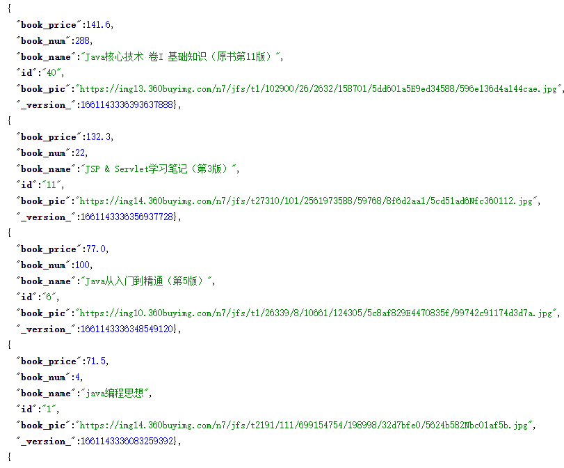

疑问：为什么id为40的文档再最前面？这里面就牵扯到Lucene的相关度排序

相关度排序是查询结果按照与查询关键字的相关性进行排序，越相关的越靠前。比如搜索“java”关键字，与该关键字最相关的文档应该排在前边。

影响相关度排序2个要素

- Term Frequency (tf)：指此Term在此文档中出现了多少次。tf越大说明越重要，词(Term)在文档中出现的次数越多，说明此词(Term)对该文档越重要，如“java”这个词，在文档中出现的次数很多，说明该文档主要就是讲java技术的。


- Document Frequency (df)：指有多少文档包含该Term。df越大说明越不重要。比如，在一篇英语文档中，this出现的次数更多，就说明越重要吗？不是的，有越多的文档包含此词(Term)，说明此词(Term)太普通，不足以区分这些文档，因而重要性越低。


相关度评分：Solr底层会根据一定的算法，对文档进行一个打分。打分比较高的排名靠前，打分比较低的排名靠后。我们也可以设置boost（权重）值影响相关度打分

​	

举例：查询book_name或者book_description域中包含java的文档

book_name中包含java或者book_description域中包含java的文档都会被查询出来。假如我们认为book_name中包含java应该排名靠前，可以给book_name域增加权重值，book_name域中有java的文档就可以靠前。

## 4.3 查询解析器（QueryParser）

之前我们在讲解查询流程的时候，我们说用户输入的查询内容，需要被查询解析器解析，查询解析器QueryParser作用就是对查询的内容进行解析。solr提供了多种查询解析器，为我们使用者提供了极大的灵活性及控制解析器如何解析查询内容

Solr提供的查询解析器包含以下：

- Standard Query Parser：标准查询解析器

- DisMax Query Parser：DisMax 查询解析器

- Extends DisMax Query Parser：扩展DisMax 查询解析器

- Others Query Parser：其他查询解析器


当然Solr也运行用户自定义查询解析器，需要继承QParserPlugin类


1. 默认解析器：lucene（标准查询解析器）

​		solr默认使用的解析器是lucene，即Standard Query Parser。Standard Query Parser支持lucene原生的查询语法，并且进行增强，使你可以方便地构造结构化查询语句。当然，它还有缺点，容错比较差，总是把错误抛出来，而不是像dismax一样消化掉。

2. DisMax 查询解析器

​		只支持lucene查询语法的一个很小的子集：简单的短语查询、+  - 修饰符、AND OR 布尔操作，可以灵活设置各个查询字段的相关性权重，可以灵活增加满足某特定查询文档的相关性权重。

3. 扩展DisMax 查询解析器

​		扩展 DisMax Query Parser 是 Standard Query Parser 和 DisMax Query Parser 的复合，也增加了不少参数来改进disMax，支持的语法很丰富，很好的容错能力，灵活的加权评分设置。

## 4.4 查询语法

​	之前我们查询功能都是通过后台管理界面完成查询的。实际上，底层就是向Solr请求处理器发送了一个查询的请求，传递了查询的参数。

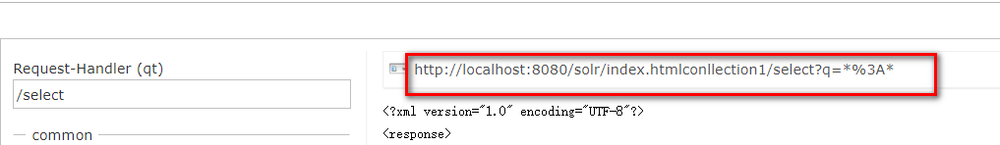

| 地址信息                                                     | 说明         |
| ------------------------------------------------------------ | ------------ |
| http://localhost:8080/solr/collection1/select?q=book_name:java | 查询请求url  |
| http://localhost:8080/solr                                   | solr服务地址 |
| collection1                                                  | solrCore     |
| /select                                                      | 请求处理器   |
| ?q=xxx                                                       | 查询的参数   |

### 4.4.1 基本查询参数

| 参数名 | 描述                                                         |
| ------ | ------------------------------------------------------------ |
| q      | 查询条件，必填项                                             |
| fq     | 过滤查询                                                     |
| start  | 结果集第一条记录的偏移量，用于分页，默认值0（start = “当前页 -1” * 分页的条数） |
| rows   | 返回文档的记录数，用于分页，默认值10                         |
| sort   | 排序，格式：sort=`<field name>+<asc|desc>[,<field name>+<asc|desc>`    默认是相关性降序 |
| fl     | 指定返回的域，多个域用逗号或者空格分隔，默认返回所有域       |
| wt     | 指定响应的格式，例如xml、json等                              |


演示：

​		查询所有文档：

```
http://localhost:8080/solr/collection1/select?q=*:*
```

​		查询book_name域中包含java的文档

```
http://localhost:8080/solr/collection1/select?q=book_name:java
```

​		查询book_description域中包含java，book_name中包含java

```
http://localhost:8080/solr/collection1/select?q=book_description:java&fq=book_name:java
```

​		查询第一页的2个文档

​		查询第二页的2个文档

```
http://localhost:8080/solr/collection1/select?q=*:*&start=0&rows=2
http://localhost:8080/solr/collection1/select?q=*:*&start=2&rows=2
```

​		查询所有文档并且按照book_num升序，降序

```
http://localhost:8080/solr/collection1/select?q=*:*&sort=book_num+asc
http://localhost:8080/solr/collection1/select?q=*:*&sort=book_num+desc
```

​	    查询所有文档并且按照book_num降序，如果数量一样按照价格升序

```
http://localhost:8080/solr/collection1/select?q=*:*&sort=book_num+desc,book_price+asc
```

​	   查询所有数据文档，将id域排除

```
http://localhost:8080/solr/collection1/select?q=*:*&fl=book_name,book_price,book_num,book_pic
```


对于基础查询来说还有其他的一些系统级别的参数，但是一般用的较少

| 描述                                                         | 参数名称 |
| ------------------------------------------------------------ | -------- |
| 选择哪个查询解析器对q中的参数进行解析，默认lucene，还可以使用dismax\|edismax | defType  |
| 覆盖schema.xml的defaultOperator（有空格时用"AND"还是用"OR"操作逻辑）默认为OR | q.op     |
| 默认查询字段                                                 | df       |
| （query type）指定哪个类型来处理查询请求，一般不用指定，默认是standard | qt       |
| 查询结果是否进行缩进，开启，一般调试json,php,phps,ruby输出才有必要用这个参数 | indent   |
| 查询语法的版本，建议不使用它，由服务器指定默认值             | version  |

defType：更改Solr的查询解析器的，一旦查询解析器发生改变，将支持其他的查询参数和语法

q.op：如果我们搜索（query）的关键字可以分出很多的词，到底是基于这些词进行"与"关系还是"或"关系查找，默认"或"

```
q=book_name:java编程 搜索book_name中包含java编程关键字   
java编程query分词为：java 编程
搜索的条件是book_name中既要包含java还要包含编程，还是只要有一个即可
q=book_name&q.op=AND 
q=book_name&q.op=OR
```

df：指定默认搜索的域,一旦我们指定了默认搜索的域，在搜索的时候，我们可以省略域名，仅仅指定搜索的关键字就可以在默认域中搜索

```
q=java&df=book_name
```


### 4.4.2 组合查询

在Solr中提供了运算符，通过运算符可以进行组合查询

| 运算符 | 说明                                                         |
| ------ | ------------------------------------------------------------ |
| ?      | 通配符，替代任意单个字符（不能在检索的项开始使用*或者?符号） |
| *      | 通配符，替代任意多个字符（不能在检索的项开始使用*或者?符号） |
| ~      | 表示相似度查询，如查询类似于"roam"的词，可以这样写："roam~"将找到形如foam和roams的单词（roam~0.8，检索返回相似度在0.8以上的文档）（ 邻近检索，如检索相隔10个单词的"apache"和"jakarta"，"jakarta apache"~10） |
| AND    | 表示且，等同于 “&&”                                          |
| OR     | 表示或，等同于 “\|\|”                                        |
| NOT    | 表示否                                                       |
| ()     | 用于构成子查询                                               |
| []     | 范围查询，包含头尾                                           |
| {}     | 范围查询，不包含头尾                                         |
| +      | 存在运算符，表示文档中必须存在 “+” 号后的项                  |
| -      | 不存在运算符，表示文档中不包含 “-” 号后的项                  |

实例：

?：查询book_name中包含c?的词

```
http://localhost:8080/solr/collection1/select?q=book_name:c?
```

\*：查询book_name总含spring*的词

```
http://localhost:8080/solr/collection1/select?q=book_name:spring*
```

~：模糊查询book_name中包含和java及和java比较像的词，相似度0.75以上

```
http://localhost:8080/solr/collection1/select?q=book_name:java~0.75
java和jave相似度就是0.75.4个字符中3个相同。
```

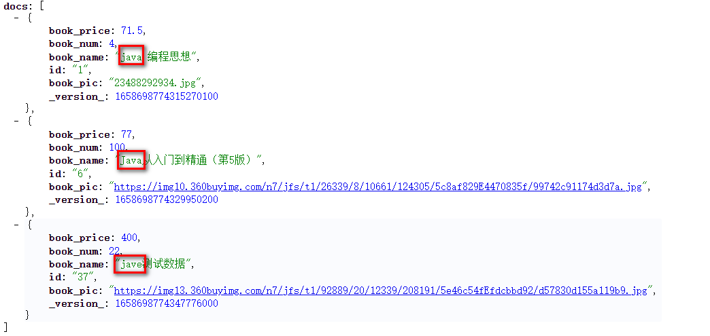

AND：查询book_name域中既包含servlet又包含jsp的文档

​		方式1：使用and

```
q=book_name:servlet AND book_name:jsp
q=book_name:servlet && book_name:jsp
```

​		方式2：使用+

```
q=+book_name:servlet +book_name:jsp
```

OR：查询book_name域中包含servlet或者包含jsp的文档

```
q=book_name:servlet OR book_name:jsp
q=book_name:servlet || book_name:jsp
```

NOT：查询book_name域中包含spring，并且id不是4的文档

```
book_name:spring AND NOT id:4
+book_name:spring -id:4
```

范围查询：

​	查询商品数量>=4并且<=10

```
http://localhost:8080/solr/collection1/select?q=book_num:[4 TO 10]
```

​	查询商品数量>4并且<10

```
http://localhost:8080/solr/collection1/select?q=book_num:{4 TO 10}
```

​	查询商品数量大于125

```
http://localhost:8080/solr/collection1/select?q=book_num:{125 TO *]
```

### 4.4.3 q和fq的区别

​		从使用上：q必须传递参数，fq参数可选，即在执行查询的时候，必须有q，而fq可以有，也可以没有

​		从功能上：q有2项功能

​				第一项：根据用户输入的查询条件，查询符合条件的文档

​				第二项：使用相关性算法，匹配到的文档进行相关度排序

​						fq只有一项功能

​				对匹配到的文档进行过滤，不会进行相关度排序，效率高


演示：

​		需求：查询book_descrption中包含java并且book_name中包含java文档

​		1.单独使用q来完成

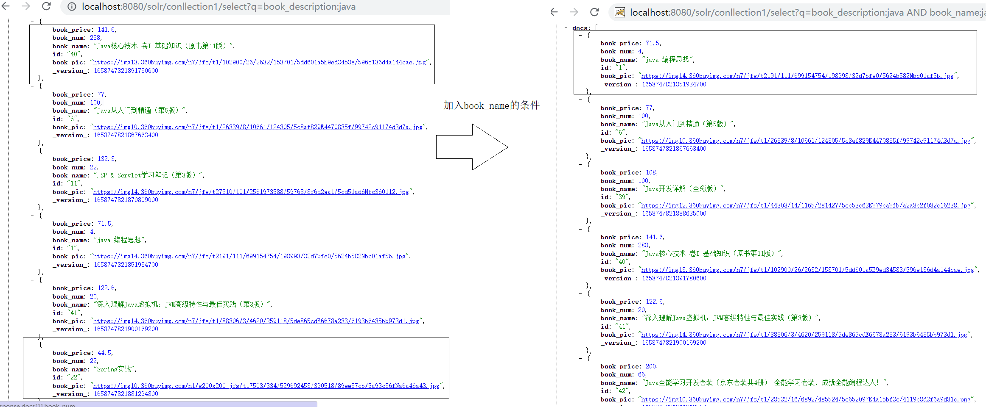

​	由于book_name条件的加入造成排序结果的改变，说明q查询符合条件的文档，也进行相关度排序

​	2.使用q + fq完成

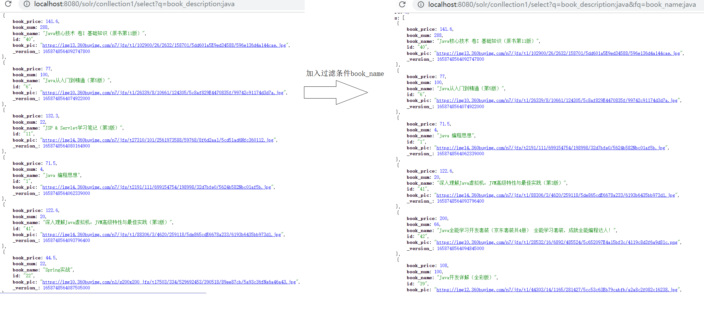	fq仅仅只会进行条件过滤，不会影响相关度排序				

### 4.4.4 Solr返回结果和排序

#### 4.4.4.1 返回结果

**在Solr中默认支持多种返回结果的格式**。分别是XML，JSON，Ruby，Python，Binary Java，PHP，CVS等，下面是Solr支持的响应结果格式以及对应的实现类。

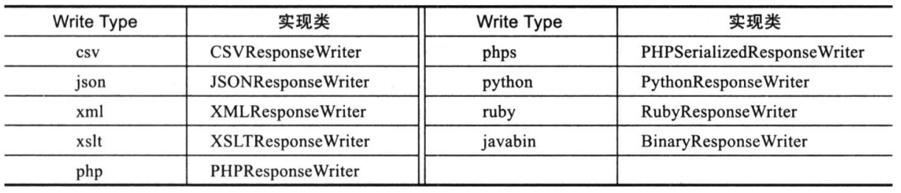

对于使用者来说，只需要指定wt参数即可

```
查询所有数据文档返回xml
http://localhost:8080/solr/collection1/select?q=*:*&wt=xml
```

​	

**返回结果文档包含的域：通过fl指定返回的文档包含哪些域以及返回伪域**		

```
将返回结果中价格转化为分。product是Solr中的一个函数，表示乘法。后面我们会讲解。
http://localhost:8080/solr/collection1/select?q=*:*&fl=*,product(book_price,100)
```

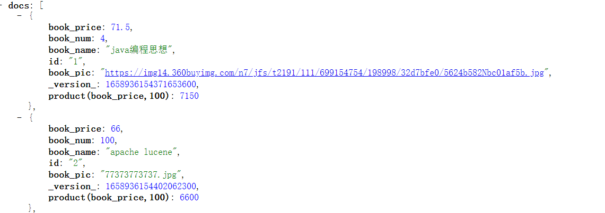

**域指定别名**	

```
上面的查询我们多了一个伪域。可以为伪域起别名fen
http://localhost:8080/solr/collection1/select?q=*:*&fl=*,fen:product(book_price,100)
```

​		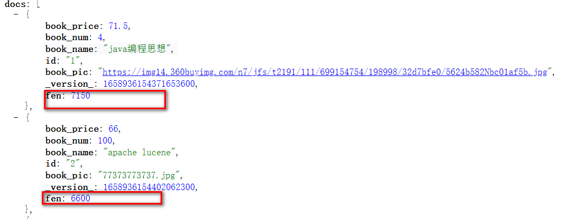

```
同理也可以给原有域起别名
http://localhost:8080/solr/collection1/select?q=*:*&fl=name:book_name,price:book_price
```

​	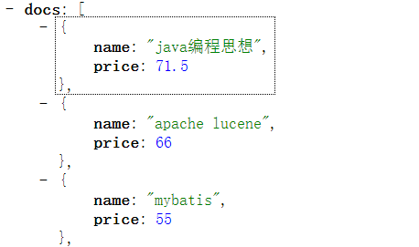

#### 4.4.4.2 排序

在Solr中通过sort参数进行排序

```
http://localhost:8080/solr/collection1/select?q=*:*&sort=book_price+asc&wt=json&rows=50
```

特殊情况：某些文档book_price域值为null，null值排在最前面还是最后面？

方案：定义域类型的时候需要指定2个属性sortMissingLast，sortMissingFirst

```
sortMissingLast=true,无论升序还是降序，null值都排在最后
sortMissingFirst=true,无论升序还是降序，null值都排在最前
<fieldtype name="fieldName" class="xx" sortMissingLast="true" sortMissingFirst="false"/>
```


## 4.5 高级查询-facet查询

### 4.5.1 简单介绍

facet 是 solr 的高级搜索功能之一 , 可以给用户提供更友好的搜索体验 

作用：可以根据用户搜索条件，按照指定域进行分组并统计，类似于关系型数据库中的group by分组查询

eg：查询title中包含手机的商品，按照品牌进行分组，并且统计数量

```
select brand,COUNT(*)from tb_item where title like '%手机%' group by brand
```

适合场景：在电商网站的搜索页面中，我们根据不同的关键字搜索，对应的品牌列表会跟着变化，这个功能就可以基于facet来实现


facet比较适合的域

​	一般代表了实体的某种公共属性的域 , 如商品的品牌，商品的分类 , 商品的制造厂家 , 书籍的出版商等 

facet域的要求

​	facet 的域必须被索引， 一般来说该域无需分词，无需存储，无需分词是因为该域的值代表了一个整体概念， 如商品的品牌 ” 联想 ” 代表了一个整体概念 , 如果拆成 ” 联 ”,” 想 ” 两个字都不具有实际意义。另外该字段的值无需进行大小写转换等处理，保持其原貌即可。无需存储是因为查询到的文档中不需要该域的数据，而是作为对查询结果进行分组的一种手段，用户一般会沿着这个分组进一步深入搜索。

### 4.5.2 数据准备

将商品表数据导入到Solr索引库

```
删除图书相关的数据
<delete>
 <query>*:*</query>
</delete>
<commit/>
```

1. 创建和商品相关的域

```
	<field name="item_title" type="text_ik" indexed="true" stored="true"/>   标题域
	<field name="item_price" type="pfloat" indexed="true" stored="true"/>    价格域
	<field name="item_images" type="string" indexed="false" stored="true"/>   图片域
	<field name="item_createtime" type="pdate" indexed="true" stored="true"/> 创建时间域
	<field name="item_updatetime" type="pdate" indexed="true" stored="true"/> 更新时间域
	<field name="item_category" type="string" indexed="true" stored="true"/>  商品分类域
	<field name="item_brand" type="string" indexed="true" stored="true"/>     品牌域
```

2. 修改solrcore/conf目录中solr-data-config.xml配置文件，使用DataImport进行导入

```
<entity name="item" query="select id,title,price,image,create_time,update_time,category,brand from tb_item">
       
            <field column="id" name="id"/>
            <field column="title" name="item_title"/>
            <field column="price" name="item_price"/>
            <field column="image" name="item_images"/>
            <field column="create_time" name="item_createtime"/>
            <field column="update_time" name="item_updatetime"/>
            <field column="category" name="item_category"/>
            <field column="brand" name="item_brand"/>
 </entity>
```

3. 重启服务，使用DateImport导入

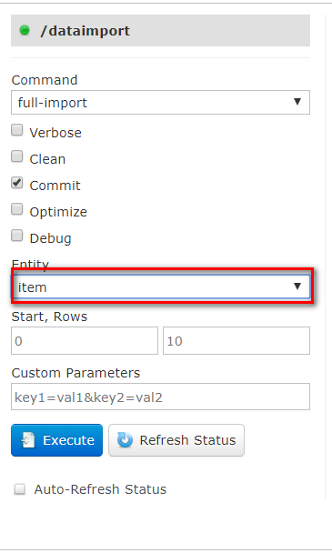


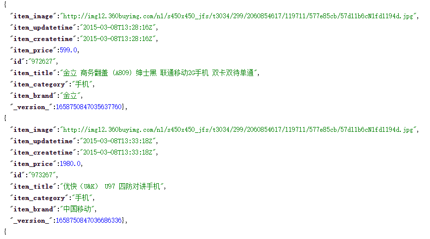

### 4.5.3 facet查询的分类

- facet_queries：表示根据条件进行分组统计查询

- facet_fields：表示根据域进行分组统计查询

- facet_ranges：可以根据时间区间和数字区间进行分组统计查询

- facet_intervals：可以根据时间区间和数字区间进行分组统计查询


### 4.5.4 facet.fields

需求：对item_title中包含手机的文档，按照品牌域进行分组，并且统计数量

1.进行 Facet 查询需要在请求参数中加入 ”facet=on” 或者 ”facet=true” 只有这样 facet 组件才起作用

2.分组的字段通过在请求中加入 ”facet.field” 参数加以声明 

```
http://localhost:8080/solr/collection1/select?q=item_title:手机&facet=on&facet.field=item_brand
```

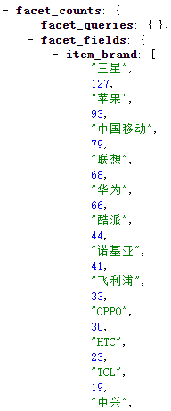

​	


3.如果需要对多个字段进行 facet查询 , 那么将该参数声明多次，各个分组独立互不影响（与数据库中group by加多个参数不同）

```
http://localhost:8080/solr/collection1/select?q=item_title:手机&facet=on&facet.field=item_brand&facet.field=item_category
```

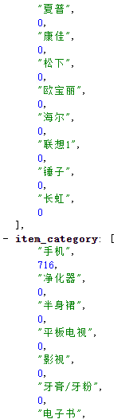


4.其他参数的使用

​	在facet中，还提供的其他的一些参数，可以对分组统计的结果进行优化处理

| 参数           | 说明                                                         |
| -------------- | ------------------------------------------------------------ |
| facet.prefix   | 表示 Facet 域值的前缀 . 比如 ”facet.field=item_brand&facet.prefix=中国”, 那么对 item_brand字段进行 Facet 查询，只会分组统计以中国为前缀的品牌 |
| facet.sort     | 表示 Facet 字段值以哪种顺序返回 . 可接受的值为 true\|false. true表示按照 count 值从大到小排列 . false表示按照域值的自然顺序( 字母 , 数字的顺序 ) 排列 . 默认情况下为 true. |
| facet.limit    | 限制 Facet 域值返回的结果条数 . 默认值为 100. 如果此值为负数 , 表示不限制 . |
| facet.offset   | 返回结果集的偏移量 , 默认为 0. 它与 facet.limit 配合使用可以达到分页的效果 |
| facet.mincount | 限制了 Facet 最小 count, 默认为 0. 合理设置该参数可以将用户的关注点集中在少数比较热门的领域 . |
| facet.missing  | 默认为 ””, 如果设置为 true 或者 on, 那么将统计那些该 Facet 字段值为 null 的记录. |
| facet.method   | 取值为 enum 或 fc, 默认为 fc. 该参数表示了两种 Facet 的算法 , 与执行效率相关 .enum 适用于域值种类较少的情况 , 比如域类型为布尔型 .fc适合于域值种类较多的情况。 |

facet.prefix：分组统计以中国前缀的品牌

```
&facet=on
&facet.field=item_brand
&facet.prefix=中国
```

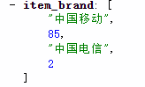

facet.sort：按照品牌名字进行字典排序

```
&facet=on
&facet.field=item_brand
&facet.sort=false
```

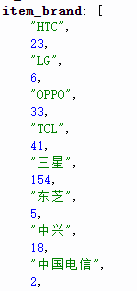

facet.limit：限制分组统计的条数为10

```
&facet=on
&facet.field=item_brand
&facet.limit=10
```

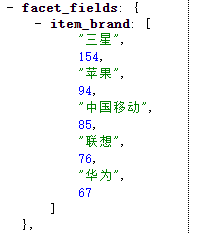

facet.offset：结合facet.limit对分组结果进行分页

```
&facet=on
&facet.field=item_brand
&facet.offset=5
&facet.limit=5
```

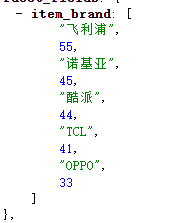

facet.mincount：搜索标题中有手机的商品，并且对品牌进行分组统计查询，排除统计数量为0的品牌

```
q=item_title:手机
&facet=on
&facet.field=item_brand
&facet.mincount=1
```

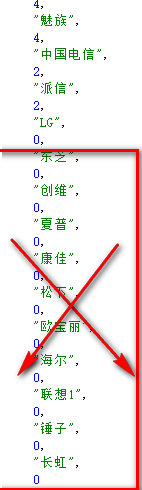

### 4.5.5 facet.ranges

除了字段分组查询外，还有日期区间，数字区间分组查询

作用：将某一个时间区间(数字区间)，按照指定大小分割，统计数量

需求：分组查询2015年，每一个月添加的商品数量

| 参数                | 说明                                                         |
| ------------------- | ------------------------------------------------------------ |
| facet.range         | 该参数表示需要进行分组的字段名 , 与 facet.field 一样 , 该参数可以被设置多次 , 表示对多个字段进行分组。 |
| facet.range.start   | 起始时间/数字 , 时间的一般格式为“1995-12-31T23:59:59Z”, 另外可以使用 ”NOW”,”YEAR”,”MONTH” 等等 , 具体格式可以参考 org.apache.solr.schema. DateField 的 java doc. |
| facet.range.end     | 结束时间 数字                                                |
| facet.range.gap     | 时间间隔 . 如果 start 为 2019-1-1,end 为 2020-1-1.gap 设置为 ”+1MONTH” 表示间隔1 个月 , 那么将会把这段时间划分为 12 个间隔段 . 注意 ”+” 因为是特殊字符所以应该用 ”%2B” 代替 .<br> |
| facet.range.hardend | 取值可以为 true\|false它表示 gap 迭代到 end 处采用何种处理 . 举例说明 start 为 2019-1-1,end 为 2019-12-25,gap 为 ”+1MONTH”,hardend 为 false 的话最后一个时间段为 2009-12-1 至 2010-1-1;hardend 为 true 的话最后一个时间段为 2009-12-1 至 2009-12-25<br>举例start为0，end为1200，gap为500，hardend为false,最后一个数字区间[1000,1200] ,hardend为true最后一个数字区间[1000,1500] |
| facet.range.other   | 取值范围为 before\|after\|between\|none\|all, 默认为 none.<br/>before 会对 start 之前的值做统计 .<br/>after 会对 end 之后的值做统计 .<br/>between 会对 start 至 end 之间所有值做统计 . 如果 hardend 为 true 的话 , 那么该值就是各个时间段统计值的和 .<br/>none 表示该项禁用 .<br/>all 表示 before,after,between都会统计 . |

```
q=*:*&
facet=on&
facet.range=item_createtime&
facet.range.start=2015-01-01T00:00:00Z&
facet.range.end=2016-01-01T00:00:00Z&
facet.range.gap=%2B1MONTH
&facet.range.other=all
```


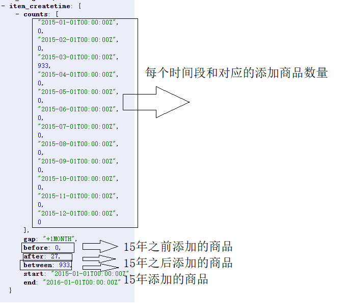

需求：分组统计价格在0~1000,1000~2000，2000~3000... 19000~20000及20000以上每个价格区间商品数量

```
q=*:*&
facet=on&
facet.range=item_price&
facet.range.start=0&
facet.range.end=20000&
facet.range.gap=1000&
facet.range.hardend=true&
facet.range.other=all
```

​	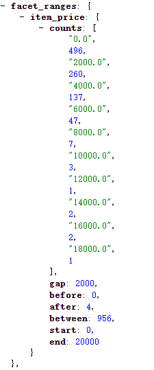

### 4.5.6 facet.queries

在facet中还提供了第三种分组查询的方式facet.query，提供了类似 filter query (fq)的语法可以更为灵活的对任意字段进行分组统计查询 

需求：查询分类是平板电视的商品数量 品牌是华为以及三星的商品数量

```
q=*:*&
facet=on&
facet.query=item_category:平板电视&
facet.query=item_brand:华为&
facet.query=item_brand:三星
```

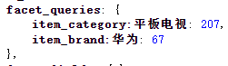

​	

另外，我们也可以起别名

```
q=*:*&
facet=on&
facet.query={!key=平板电视}item_category:平板电视&
facet.query={!key=华为品牌}item_brand:华为&
facet.query={!key=三星品牌}item_brand:三星
这样可以让字段名统一起来，方便我们拿到请求数据后，封装成自己的对象;


在浏览器输入参数需要对{}进行url编码 {-->%7B   }-->%7D
q=*:*&
facet=on&
facet.query=%7B!key=平板电视%7Ditem_category:平板电视&
facet.query=%7B!key=华为品牌%7Ditem_brand:华为&
facet.query=%7B!key=三星品牌%7Ditem_brand:三星
```

​	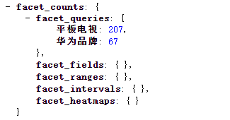

### 4.5.7 facet.interval

facet中还提供了一种分组查询方式facet.nterval。功能类似于facet.ranges。facet.interval通过设置一个区间及域名，可以统计可变区间对应的文档数量；

通过facet_ranges和facet_interval都可以实现范围查询功能，但是底层实现不同，性能也不同.

| 参数名             | 说明                                                         |
| ------------------ | ------------------------------------------------------------ |
| facet.interval     | 此参数指定统计查询的域。它可以在同一请求中多次使用以指示多个字段。 |
| facet.interval.set | 1.指定区间：如果统计的域有多个，可以通过f.\<fieldname\>.facet.interval.set语法指定不同域的区间。<br>2. 区间语法：( , ) 或 [ , ]<br>例如：<br>(1,10)   大于1且小于10<br>[1,10)   大于或等于1且小于10<br>[1,10]   大于等于1且小于等于10 |

​	需求：统计item_price在[0-10]及[1000-2000]的商品数量和item_createtime在2019年~现在添加的商品数量

```
&facet=on
&facet.interval=item_price
&f.item_price.facet.interval.set=[0,10]
&f.item_price.facet.interval.set=[1000,2000]
&facet.interval=item_createtime
&f.item_createtime.facet.interval.set=[2019-01-01T0:0:0Z,NOW]

由于有特殊符号需要进行URL编码[-->%5B   ]-->%5D
http://localhost:8080/solr/collection1/select?q=*:*&facet=on
&facet.interval=item_price
&f.item_price.facet.interval.set=%5B0,10%5D
&f.item_price.facet.interval.set=%5B1000,2000%5D
&facet.interval=item_createtime
&f.item_createtime.facet.interval.set=%5B2019-01-01T0:0:0Z,NOW%5D
```

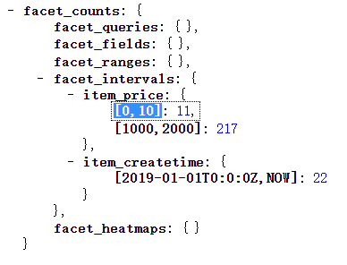


### 4.5.8 facet中其他的用法

#### tag操作符和ex操作符

当查询使用q或者fq指定查询条件的时候，查询条件的域刚好是facet的域，分组的结果就会被限制，其他的分组数据就没有意义。

```
q=item_title:手机
&fq=item_brand:三星 
&facet=on
&facet.field=item_brand

导致分组结果中只有三星品牌有数量，其他品牌都没有数量
```

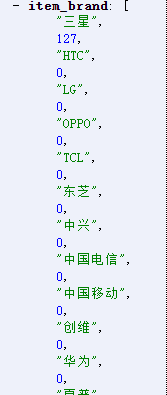

如果想查看其他品牌手机的数量，需要给过滤条件定义标记，在分组统计的时候，忽略过滤条件

查询文档是2个条件，分组统计只有一个条件

```
q=item_title:手机
&fq={!tag=brandTag}item_brand:三星   
&facet=on
&facet.field={!ex=brandTag}item_brand


&q=item_title:手机
&fq=%7B!tag=brandTag%7Ditem_brand:三星   
&facet=on
&facet.field=%7B!ex=brandTag%7Ditem_brand
```

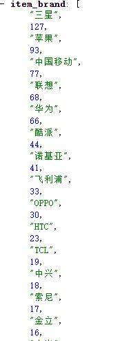


### 4.5.9 facet.pivot

多维度分组查询

举例：统计每一个品牌和其不同分类商品对应的数量

| 品牌 | 分类     | 数量   |
| ---- | -------- | ------ |
| 华为 | 手机     | 200    |
| 华为 | 电脑     | 300    |
| 三星 | 手机     | 200    |
| 三星 | 电脑     | 20     |
| 三星 | 平板电视 | 200    |
|      | 。。。   | 。。。 |

这种需求就可以使用维度查询完成

```
q=*:*
&facet=on
&facet.pivot=item_brand,item_category
```

​			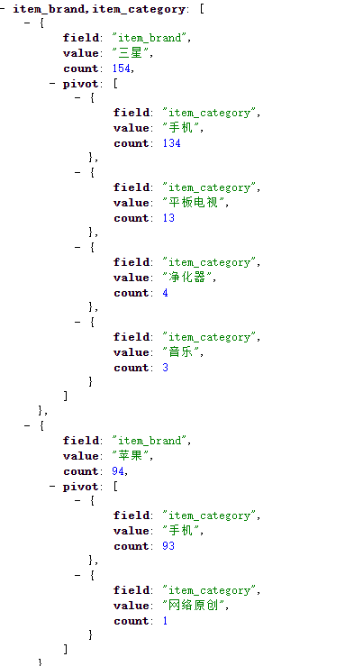


## 4.6  高级查询-group查询

### 4.6.1 group介绍和入门

作用：将具有相同字段值的文档分组，并返回每个组的顶部文档。 Group和Facet的概念很像，都是用来分组，但是分组的结果是不同

| 参数                | 类型           | 说明                                                         |
| ------------------- | -------------- | ------------------------------------------------------------ |
| group               | 布尔值         | 设为true，表示结果需要分组                                   |
| group.field         | 字符串         | 需要分组的字段，字段类型需要是StrField或TextField            |
| group.func          | 查询语句       | 可以指定查询函数                                             |
| group.query         | 查询语句       | 可以指定查询语句                                             |
| rows                | 整数           | 返回多少组结果，默认10                                       |
| start               | 整数           | 指定结果开始位置/偏移量                                      |
| group.limit         | 整数           | 每组返回多数条结果,默认1                                     |
| group.offset        | 整数           | 指定每组结果开始位置/偏移量                                  |
| sort                | 排序算法       | 控制各个组的返回顺序                                         |
| group.sort          | 排序算法       | 控制每一分组内部的顺序                                       |
| group.format        | grouped/simple | 设置为simple可以使得结果以单一列表形式返回                   |
| group.main          | 布尔值         | 设为true时，结果将主要由第一个字段的分组命令决定             |
| group.ngroups       | 布尔值         | 设为true时，Solr将返回分组数量，默认fasle                    |
| group.truncate      | 布尔值         | 设为true时，facet数量将基于group分组中匹相关性高的文档，默认fasle |
| group.cache.percent | 整数0-100      | 设为大于0时，表示缓存结果，默认为0。该项对于布尔查询，通配符查询，模糊查询有改善，却会减慢普通词查询。 |

需求：查询Item_title中包含手机的文档，按照品牌对文档进行分组；

```
q=item_title:手机
&group=true
&group.field=item_brand
group分组结果和facet分组查询的结果完全不同，他把同组的文档放在一起，显示该组文档数量，并且展示了第一个文档
```

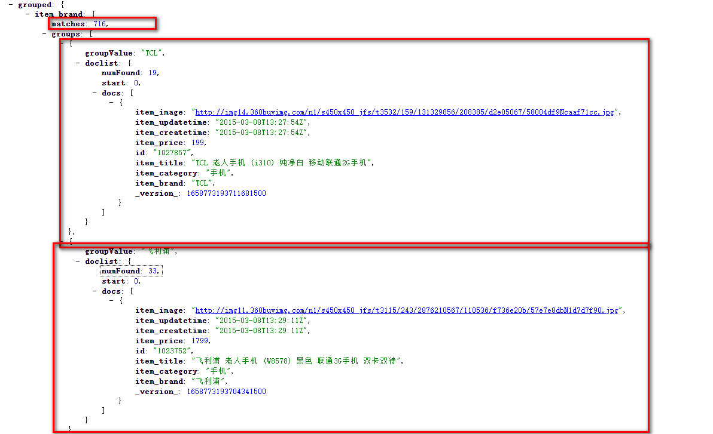


### 4.6.2 group参数-分页参数

首先我们先来观察一下入门的分组结果，只返回10个组结果。

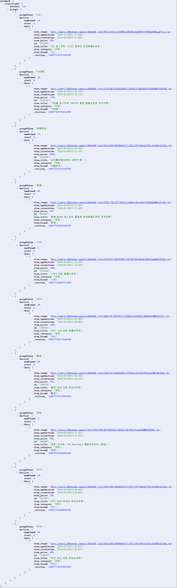

**rows**：通过rows参数设置返回组的个数

```
q=item_title:手机&group=true&group.field=item_brand&rows=13
比上面分组结果多了三个组
```

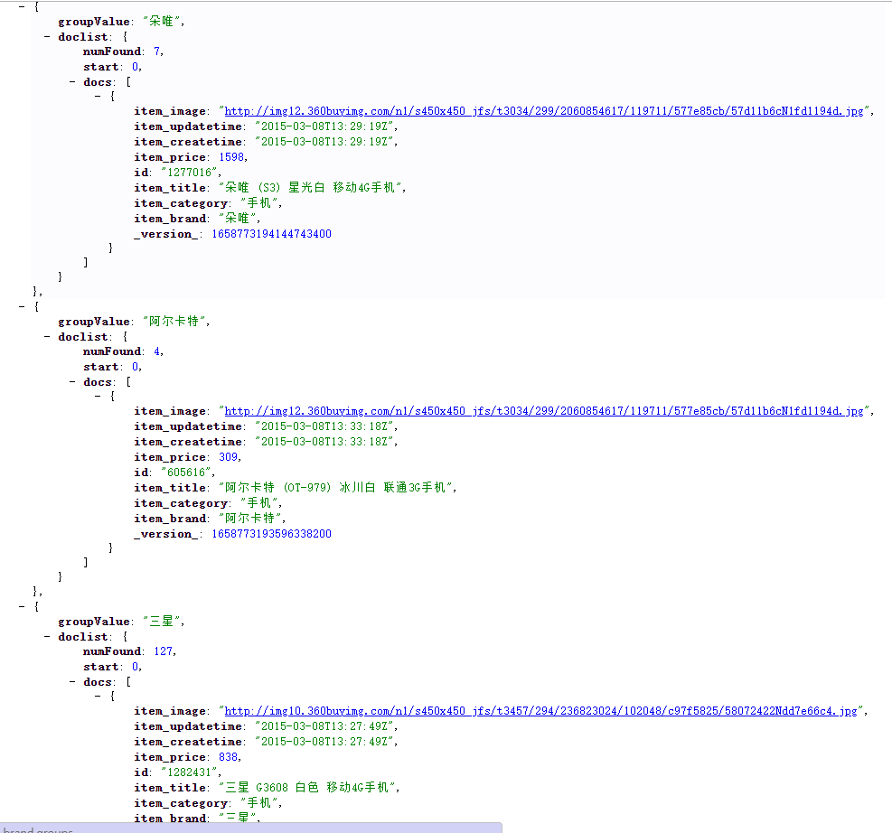

通过**start和rows**参数结合使用可以对分组结果分页，查询第一页3个分组结果

```
q=item_title:手机&group=true&group.field=item_brand&start=0&rows=3
```

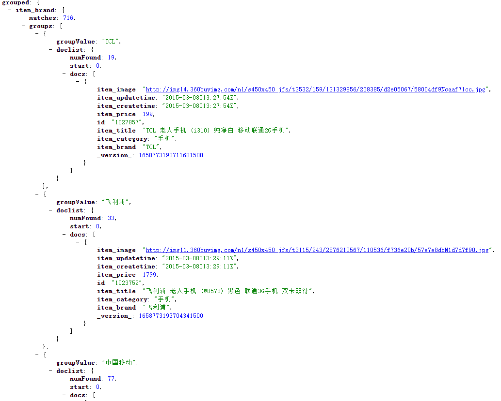

​	

除了可以对分组结果进行分页，可以使用**group.limit和group.offset**对组内文档进行分页，默认情况下只展示该组顶部文档

需求：展示每组前5个文档。

```
q=item_title:手机&group=true&group.field=item_brand&start=0&rows=3
&group.limit=5&group.offset=0
```

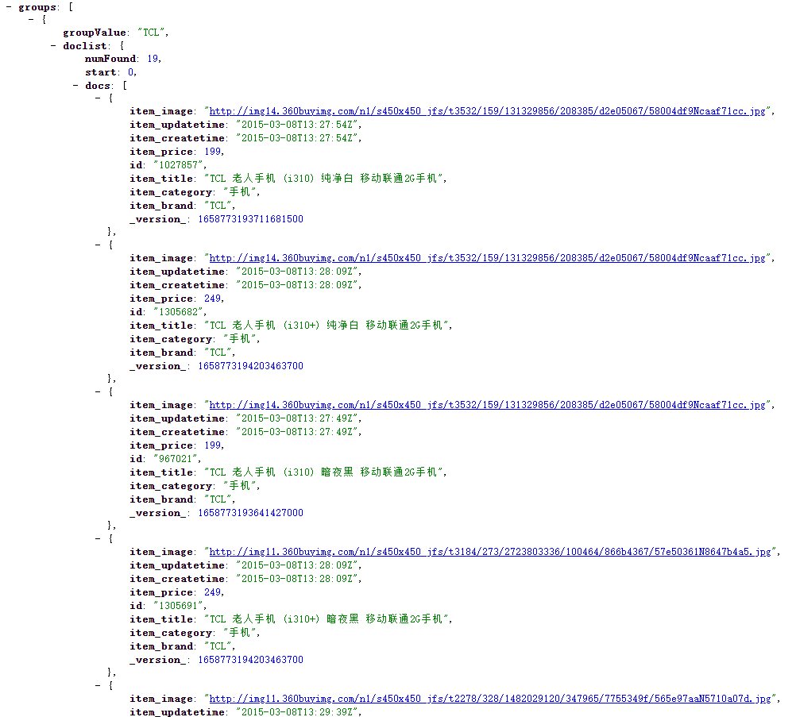


### 4.6.3 group参数-排序参数

​			排序参数分为分组排序和组内文档排序；

​			[sort]分组进行排序

​				需求：按照品牌名称进行字典排序

```
q=item_title:手机&group=true&group.field=item_brand&start=0&rows=5
&group.limit=5&group.offset=0
&sort=item_brand asc
```

​			[group.sort]组内文档进行排序

​				需求：组内文档按照价格降序；

```
q=item_title:手机&group=true&group.field=item_brand&start=0&rows=5
&group.limit=5&group.offset=0
&group.sort=item_price+desc
```

##### 4.6.4 group查询结果分组

​		在group中除了支持根据Field进行分组，还支持查询条件分组。

​		需求：对item_brand是华为，三星，TCL的三个品牌,分组展示对应的文档信息。

```
q=item_title:手机
&group=true
&group.query=item_brand:华为
&group.query=item_brand:三星
&group.query=item_brand:TCL
```


##### 4.6.5 group 函数分组（了解）

​			在group查询中除了支持Field分组，Query分组。还支持函数分组。

​	按照价格范围对商品进行分组。0~1000属于第1组，1000~2000属于第二组，否则属于第3组。

```
q=*:*&
group=true&
group.func=map(item_price,0,1000,1,map(item_price,1000,2000,2,3))
```

```
map(x,10,100,1,2) 在函数参数中的x如果落在[10,100)之间，则将x的值映射为1，否则将其值映射为2
```

​	

##### 4.6.7 group其他参数

​	group.ngroups:是否统计组数量

```
q=item_title:手机
&group=true
&group.field=item_brand
&group.ngroups=true
```

​	

​	group.cache.percent

​	Solr Group查询相比Solr的标准查询来说，速度相对要慢很多。

​	可以通过group.cache.percent参数来开启group查询缓存。该参数默认值为0.可以设置为0-100之间的数字

该值设置的越大，越占用系统内存。对于布尔类型等分组查询。效果比较明显。


​	group.main

​	获取每一个分组中相关度最高的文档即顶层文档，构成一个文档列表。

```
q=item_title:手机
&group.field=item_brand
&group=true
&group.main=true
```

​	

group.truncate(了解)

​	按照品牌分组展示相关的商品；

```
q=*:*&group=true&group.field=item_brand
```

​	在次基础上使用facet，按照分类分组统计；统计的结果，基于q中的条件进行的facet分组。

```
q=*：*&group=true&group.field=item_brand
&facet=true
&facet.field=item_category
```

 	如果我们想基于每个分组中匹配度高的文档进行Facet分组统计

```
q=*:*&group=true&group.field=item_brand
&facet=true
&facet.field=item_category
&group.truncate=true
```

## 4.7  高级查询-高亮查询

##### 4.7.1 高亮的概述

​		高亮显示是指根据关键字搜索文档的时候，显示的页面对关键字给定了特殊样式， 让它显示更加突出，如下面商品搜索中，关键字变成了红色，其实就是给定了红色样 ；

​		

​	高亮的本质，是对域中包含关键字前后加标签


##### 4.7.2 Solr高亮分类和高亮基本使用

​			上一节我们简单阐述了什么是高亮，接下来我们来讲解Solr中高亮的实现方案；

​	在Solr中提供了常用的3种高亮的组件（Highlighter）也称为高亮器，来支持高亮查询。

​			Unified Highlighter

​			Unified Highlighter是最新的Highlighter（从Solr6.4开始），它是最性能最突出和最精确的选择。它可以通过插件/扩展来处理特定的需求和其他需求。官方建议使用该Highlighter，即使它不是默认值。

​			Original Highlighter

​			Original Highlighter，有时被称为"Standard Highlighter" or "Default Highlighter"，是Solr最初的Highlighter，提供了一些定制选项，曾经一度被选择。它的查询精度足以满足大多数需求，尽管它不如统一的Highlighter完美；

​			FastVector Highlighter

​			FastVector Highlighter特别支持多色高亮显示，一个域中不同的词采用不同的html标签作为前后缀。

​	

​		接下来我们来说一下Highlighter公共的一些参数，先来认识一下其中重要的一些参数；

| 参数                        | 值                            | 描述                                                         |
| --------------------------- | ----------------------------- | ------------------------------------------------------------ |
| **hl**                      | true\|false                   | 通过此参数值用来开启或者禁用高亮.默认值是false.如果你想使用高亮，必须设置成true |
| **hl.method**               | unified\|original\|fastVector | 使用哪种哪种高亮组件. 接收的值有: `unified`, `original`, `fastVector`. 默认值是 `original`. |
| **hl.fl**                   | filed1,filed2...              | 指定高亮字段列表.多个字段之间以逗号或空格分开.表示那个字段要参与高亮。默认值为空字符串。 |
| **hl.q**                    | item_title:三星               | 高亮查询条件，此参数运行高亮的查询条件和q中的查询条件不同。如果你设置了它, 你需要设置 `hl.qparser`.默认值和q中的查询条件一致 |
| **hl.tag.pre**              | `<em>`                        | 高亮词开头添加的标签，可以是任意字符串，一般设置为HTML标签，默认值为<em>.对于Original Highlighter需要指定hl.simple.pre |
| **hl.tag.post**             | `</em>`                       | 高亮词后面添加的标签，可以是任意字符串，一般设置为HTML标签，默认值`</em>`.对于Original Highlighter需要指定hl.simple.post |
| **hl.qparser**              | lucene\|dismax\|edismax       | 用于hl.q查询的查询解析器。仅当hl.q设置时适用。默认值是defType参数的值，而defType参数又默认为lucene。 |
| **hl.requireFieldMatch**    | true\|false                   | 默认为fasle. 如果置为true，除非该字段的查询结果不为空才会被高亮。它的默认值是false，意味 着它可能匹配某个字段却高亮一个不同的字段。如果hl.fl使用了通配符，那么就要启用该参数 |
| **hl.usePhraseHighlighter** | true\|false                   | 默认true．如果一个查询中含有短语（引号框起来的）那么会保证一定要完全匹配短语的才会被高亮 |
| **hl.highlightMultiTerm**   | true\|false                   | 默认true.如果设置为true,solr将会高亮出现在多terms查询中的短语。 |
| **hl.snippets**             | 数值                          | 默认为1.指定每个字段生成的高亮字段的最大数量.                |
| **hl.fragsize**             | 数值                          | 每个snippet返回的最大字符数。默认是100.如果为0，那么该字段不会被fragmented且整个字段的值会被返回 |
| **hl.encoder**              | html                          | 如果为空（默认值），则存储的文本将返回，而不使用highlighter执行任何转义/编码。如果设置为html，则将对特殊的html/XML字符进行编码； |
| **hl.maxAnalyzedChars**     | 数值                          | 默认10000. 搜索高亮的最大字符,对一个大字段使用一个复杂的正则表达式是非常昂贵的。 |

​	高亮的入门案例：

​	查询item_title中包含手机的文档，并且对item_title中的手机关键字进行高亮；

```
q=item_title:手机
&hl=true
&hl.fl=item_title
&hl.simple.pre=<font>
&hl.simple.post=</font>
```


​	关于高亮最基本的用法先介绍到这里。

##### 4.7.3 Solr高亮中其他的参数介绍		

​		[hl.fl]指定高亮的域，表示哪些域要参于高亮；

​	需求：查询Item_title:手机的文档， Item_title,item_category为高亮域

```
q=item_title:手机
&hl=true
&hl.fl=item_title,item_category
&hl.simple.pre=<font>
&hl.simple.post=</font>
```

​	结果中item_title手机产生了高亮，item_category中手机也产生了高亮.


​	这种高亮肯对我们来说是不合理的。可以使用hl.requireFieldMatch参数解决。

[hl.requireFieldMatch]只有符合对应查询条件的域中参数才进行高亮；只有item_title手机才会高亮。

```
q=item_title:手机
&hl=true
&hl.fl=item_title,item_category
&hl.simple.pre=<font>
&hl.simple.post=</font>
&hl.requireFieldMatch=true
```


​	[hl.q] 默认情况下高亮是基于q中的条件参数。  使用fl.q让高亮的条件参数和q的条件参数不一致。比较少见。但是solr提供了这种功能。

​	需求：查询Item_tile中包含三星的文档，对item_category为手机的进行高亮；

```
q=item_title:三星
&hl=true
&hl.q=item_category:手机
&hl.fl=item_category
&hl.simple.pre=<em>
&hl.simple.post=</em>

```

​						

[hl.highlightMultiTerm]默认为true，如果为true，Solr将对通配符查询进行高亮。如果为false，则根本不会高亮显示它们。

```
q=item_title:micro* OR item_title:panda
&hl=true
&hl.fl=item_title
&hl.simple.pre=<em>
&hl.simple.post=</em>
```


对应基于通配符查询的结果不进行高亮；

```
q=item_title:micro* OR item_title:panda
&hl=true
&hl.fl=item_title
&hl.simple.pre=<em>
&hl.simple.post=</em>
&hl.highlightMultiTerm=false
```


[hl.usePhraseHighlighter]为true时，将来我们基于短语进行搜索的时候，短语做为一个整体被高亮。为false时，短语中的每个单词都会被单独高亮。在Solr中短语需要用引号引起来；

```
q=item_title:"老人手机"
&hl=true
&hl.fl=item_title
&hl.simple.pre=<font>
&hl.simple.post=</font>
```


关闭hl.usePhraseHighlighter=false;


```
q=item_title:"老人手机"
&hl=true
&hl.fl=item_title
&hl.simple.pre=<font>
&hl.simple.post=</font>
&hl.usePhraseHighlighter=false;
```


##### 4.7.4 Highlighter的切换

​	之前我们已经讲解完毕Highlighter中的通用参数，所有Highlighter都有的。接下来我们要讲解的是Highlighter的切换和特有参数。

​	如何切换到unified (`hl.method=unified`),切换完毕后，其实我们是看不出他和original有什么区别。因为unified Highlighter比original Highlighter只是性能提高。精确度提高。

​	区别不是很大，unified 相比original 的粒度更细；

```
q=item_title:三星平板电视
&hl=true
&hl.fl=item_title
&hl.simple.pre=<font>
&hl.simple.post=</font>
&hl.method=unified
```


​	如何切换到fastVector

​		优势：使用fastVector最大的好处，就是可以为域中不同的词使用不同的颜色，第一个词使用黄色，第二个使用红色。而且fastVector和orignal可以混合使用，不同的域使用不同的Highlighter；

​		使用fastVector的要求：使用FastVector Highlighter需要在高亮域上设置三个属性（termVectors、termPositions和termOffset）；


​		需求：查询item_title中包含三星平板电视，item_category是平板电视的文档。

​	item_title中的高亮词要显示不同的颜色。

```
<field name="item_title" type="text_ik" indexed="true" stored="true" termVectors="true" termPositions="true" termOffsets="true" />
```

```
重启Solr,重写生成索引；
<delete>
 <query>*:*</query>
</delete>
<commit/>
```


修改solrcofig.xml配置文件指定fastVector高亮器的前后缀

```
官方给的一个例子
      <fragmentsBuilder name="colored"
                        class="solr.highlight.ScoreOrderFragmentsBuilder">
        <lst name="defaults">
          <str name="hl.tag.pre"><![CDATA[
               <b style="background:yellow">,<b style="background:lawgreen">,
               <b style="background:aquamarine">,<b style="background:magenta">,
               <b style="background:palegreen">,<b style="background:coral">,
               <b style="background:wheat">,<b style="background:khaki">,
               <b style="background:lime">,<b style="background:deepskyblue">]]></str>
          <str name="hl.tag.post"><![CDATA[</b>]]></str>

        </lst>
      </fragmentsBuilder>
```

需要请求处理器中配置使用colored这一套fastVector的前后缀；

```
   <str name="hl.fragmentsBuilder">colored</str>
```

```
q=item_title:三星平板电视 AND item_category:平板电视
&hl=true
&hl.fl=item_title,item_category
&hl.method=original
&f.item_title.hl.method=fastVector
```

测试


到这关于Highlighter的切换我们就讲解完毕了。不同的Highlighter也有自己特有的参数，这些参数大多是性能参数。大家可以参考官方文档。http://lucene.apache.org/solr/guide/8_1/highlighting.html#the-fastvector-highlighter


## 4.8  Solr Query Suggest

##### 4.8.1 Solr Query Suggest简介

​	Solr从1.4开始便提供了Query Suggest，Query Suggest目前是各大搜索应用的标配，主要作用是避免用户输入错误的搜索词，同时将用户引导到相应的关键词上进行搜索。Solr内置了Query Suggest的功能，它在Solr里叫做Suggest模块. 使用该模块.我们通常可以实现2种功能。拼写检查(Spell-Checking)，再一个就是自动建议(AutoSuggest)。

​	什么是拼写检查(Spell-Checking)	

​	比如说用户搜索的是sorl,搜索应用可能会提示你，你是不是想搜索solr.百度就有这个功能。

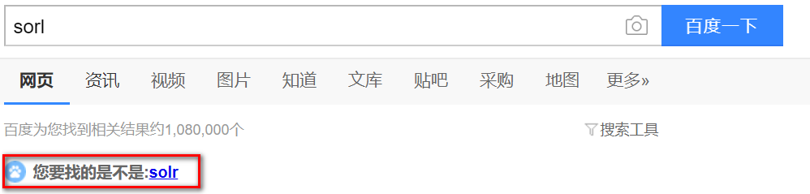


​	这就是拼写检查(Spell Checking)的功能。

​	什么又是自动建议(AutoSuggest)

​		AutoSuggest是指用户在搜索的时候，给用户一些提示建议，可以帮助用户快速构建自己的查询。

比如我们搜索java.

​	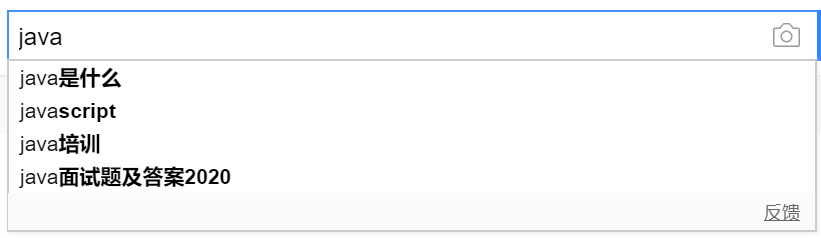

关于Query Suggest的简介，我们先暂时说道这里。


##### 4.8.2 Spell-Checking的使用

​		要想使用Spell-Checking首先要做的事情，就是在SolrConfig.xml文件中配置SpellCheckComponent；并且要指定拼接检查器，Solr一共提供了4种拼写检查器IndexBasedSpellChecker，DirectSolrSpellChecker,FileBasedSpellChecker和WordBreakSolrSpellChecker。这4种拼写检查的组件，我们通常使用的都是第二种。

​		IndexBasedSpellChecker（了解）

​		IndexBasedSpellChecker 使用 Solr 索引作为拼写检查的基础。它要求定义一个域作为拼接检查term的基础域。

​		需求：对item_title域,item_brand域,item_category域进行拼接检查。

1. 定义一个域作为拼接检查term 的基础域item_title_spell，将item_title，item_brand，item_category域复制到item_title_spell；

   ```
      <field name="item_title_spell" type="text_ik" indexed="true" stored="false" multiValued="true"/>
       <copyField source="item_title" dest="item_title_spell"/>
       <copyField source="item_brand" dest="item_title_spell"/>
       <copyField source="item_category" dest="item_title_spell"/>
   ```

   2.在SolrConfig.xml中配置IndexBasedSpellChecker作为拼写检查的组件

```
<searchComponent name="indexspellcheck" class="solr.SpellCheckComponent">
  <lst name="spellchecker">
    <str name="classname">solr.IndexBasedSpellChecker</str> <!--组件的实现类-->
    <str name="spellcheckIndexDir">./spellchecker</str> <!--拼写检查索引生成目录-->
    <str name="field">item_title_spell</str> <!--拼写检查的域-->
    <str name="buildOnCommit">true</str><!--是否每次提交文档的时候，都生成拼写检查的索引-->
    <!-- optional elements with defaults
    <str name="distanceMeasure">org.apache.lucene.search.spell.LevensteinDistance</str>
    <str name="accuracy">0.5</str>
    -->
 </lst>
</searchComponent>
```

​	3.在请求处理器中配置拼写检查的组件；

```
<arr name="last-components">
	<str>indexspellcheck</str>
</arr>
```

```
 q=item_title:meta
 &spellcheck=true
```

​	 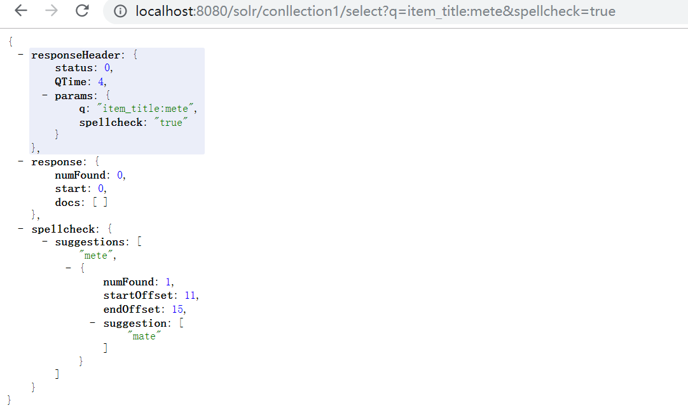


DirectSolrSpellChecker 

​	需求：基于item_title域,item_brand域,item_category域进行搜索的时候，需要进行拼接检查。

​	使用流程：

​		首先要定义一个词典域，拼写检查是需要根据错误词--->正确的词，正确的词构成的域；

​	1.由于我们在进行拼写检查的时候，可能会有中文，所以需要首先创建一个词典域的域类型。

```
<!-- 说明 这里spell 单独定义一个类型 是为了屏蔽搜索分词对中文拼写检测的影响,分词后查询结果过多不会给出建议词 -->
	<fieldType name="spell_text_ik" class="solr.TextField">
		<analyzer type="index" class="org.wltea.analyzer.lucene.IKAnalyzer"/>
		<analyzer type="query">
			  <tokenizer class="solr.WhitespaceTokenizerFactory"/>
		</analyzer>
	</fieldType>
```

​	2.定义一个词典的域，将需要进行拼写检查的域复制到该域；

```
	<field name="spell" type="spell_text_ik" multiValued="true" indexed="true" stored="false"/>
   <copyField source="item_title" dest="spell"/>
   <copyField source="item_brand" dest="spell"/>
   <copyField source="item_category" dest="spell"/>
```

​	3.修改SolrConfig.xml中的配置文件中的拼写检查器组件。指定拼写词典域的类型，词典域

​	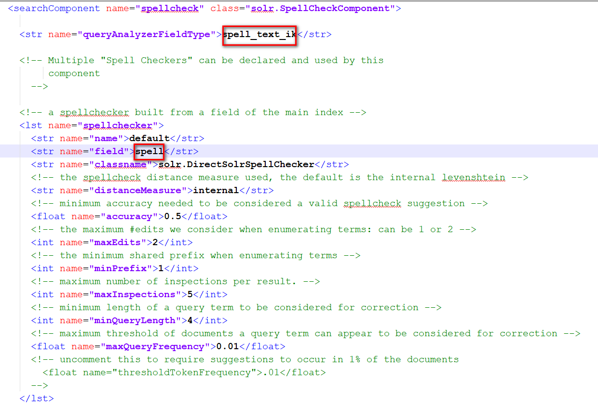

​	


​	4.在Request Handler中配置拼写检查组件

```
<arr name="last-components">
	<str>spellcheck</str>
</arr>
```

​	5.重启，重新创建索引。

测试，spellcheck=true参数表示是否开启拼写检查，搜索内容一定大于等于4个字符。

```
http://localhost:8080/solr/collection1/select?q=item_title:iphono&spellcheck=true
http://localhost:8080/solr/collection1/select?q=item_title:galax&spellcheck=true
http://localhost:8080/solr/collection1/select?q=item_brand:中国移走&spellcheck=true
```

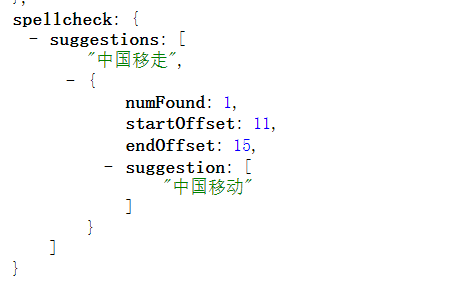

到这关于DirectSolrSpellChecker我们就讲解完毕了。	


FileBasedSpellChecker 

​		使用外部文件作为拼写检查字的词典，基于词典中的词进行拼写检查。

​	1.在solrconfig.xml中配置拼写检查的组件。

```
<searchComponent name="fileChecker" class="solr.SpellCheckComponent">
  <lst name="spellchecker">
    <str name="classname">solr.FileBasedSpellChecker</str>
    <str name="name">fileChecker</str>
    <str name="sourceLocation">spellings.txt</str>
    <str name="characterEncoding">UTF-8</str>
    <!-- optional elements with defaults-->
    <str name="distanceMeasure">org.apache.lucene.search.spell.LevensteinDistance</str>
    
      <!--精确度，介于0和1之间的值。值越大，匹配的结果数越少。假设对 helle进行拼写检查，
         如果此值设置够小的话，" hellcat"，"hello"都会被认为是"helle"的正确的拼写。如果此值设置够大，则"hello"会被认为是正确的拼写 -->
    <str name="accuracy">0.5</str>
    
  <!--表示最多有几个字母变动。比如：对"manag"进行拼写检查，则会找到"manager"做为正确的拼写检查；如果对"mana"进行拼写检查，因为"mana"到"manager"，需有3个字母的变动，所以"manager"会被遗弃  -->
    <int name="maxEdits">2</int>
  
	<!-- 最小的前辍数。如设置为1，意思是指第一个字母不能错。比如：输入"cinner",虽然和"dinner"只有一个字母的编辑距离，但是变动的是第一个字母，所以"dinner"不是"cinner"的正确拼写 -->
    <int name="minPrefix">1</int>
   <!-- 进行拼写检查所需要的最小的字符数。此处设置为4，表示如果只输入了3个以下字符，则不会进行拼写检查(3个以下的字符用户基本) -->
    <int name="minQueryLength">4</int>
  
  
  <!-- 被推荐的词在文档中出现的最小频率。整数表示在文档中出现的次数，百分比数表示有百分之多少的文档出现了该推荐词-->
    <float name="maxQueryFrequency">0.01</float>
 </lst>
</searchComponent>
```

​	2.在SolrCore/conf目录下，创建一个拼写检查词典文件，该文件已经存在。

​	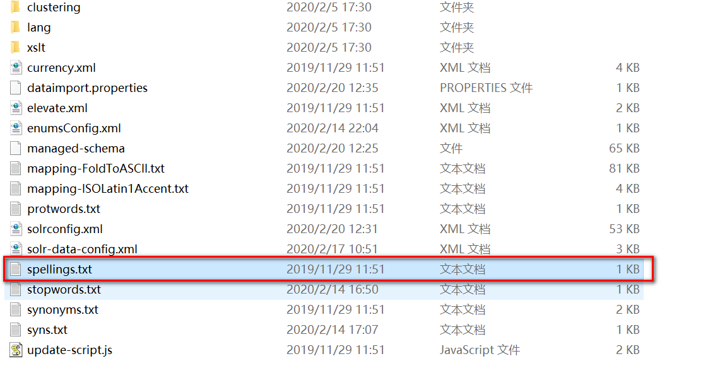

3.加入拼写检查的词；

```
pizza
history
传智播客
```

4.在请求处理器中配置拼写检查组件

```
<arr name="last-components">
      <str>fileChecker</str>
 </arr>
```

```
http://localhost:8080/solr/collection1/select?q=item_title:pizzaaa&spellcheck=true&spellcheck.dictionary=fileChecker&spellcheck.build=true
```

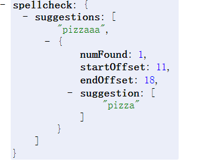

WordBreakSolrSpellChecker

​	WordBreakSolrSpellChecker可以通过组合相邻的查询词/或将查询词分解成多个词来提供建议。是对SpellCheckComponent增强，通常WordBreakSolrSpellChecker拼写检查器可以配合一个传统的检查器（即：DirectSolrSpellChecker）。


```
    <lst name="spellchecker">
      <str name="name">wordbreak</str>
      <str name="classname">solr.WordBreakSolrSpellChecker</str>
      <str name="field">sepll</str>
      <str name="combineWords">true</str>
      <str name="breakWords">true</str>
      <int name="maxChanges">10</int>
    </lst>
```

​	

```
http://localhost:8080/solr/collection1/select?
q=item_title:ip hone&spellcheck=true
&spellcheck.dictionary=default&spellcheck.dictionary=wordbreak
```


##### 4.8.3 拼写检查相关的参数

| 参数                  | 值                     | 描述                                                         |
| --------------------- | ---------------------- | ------------------------------------------------------------ |
| spellcheck            | true\|false            | 此参数为请求打开拼写检查建议。如果`true`，则会生成拼写建议。如果需要拼写检查，则这是必需的。 |
| spellcheck.build      | true\|false            | 如果设置为`true`，则此参数将创建用于拼写检查的字典。在典型的搜索应用程序中，您需要在使用拼写检查之前构建字典。但是，并不总是需要先建立一个字典。例如，您可以将拼写检查器配置为使用已存在的字典。 |
| spellcheck.count      | 数值                   | 此参数指定拼写检查器应为某个术语返回的最大建议数。如果未设置此参数，则该值默认为`1`。如果参数已设置但未分配一个数字，则该值默认为`5`。如果参数设置为正整数，则该数字将成为拼写检查程序返回的建议的最大数量。 |
| spellcheck.dictionary | 指定要使用的拼写检查器 | 默认值defualt                                                |

其他参数参考http://lucene.apache.org/solr/guide/8_1/spell-checking.html


##### 4.8.4 AutoSuggest 入门

​	AutoSuggest 是搜索应用一个方便的功能，对用户输入的关键字进行预测和建议，减少了用户的输入。首先我们先来讲解一下suggest的入门流程；

​	1.在solrconfig.xml中配置suggsetComponent,并且要在组件中配置自动建议器,配置文件已经配置过。

```
<searchComponent name="suggest" class="solr.SuggestComponent">
  <lst name="suggester">
    <str name="name">mySuggester</str> 自动建议器名称，需要在查询的时候指定
    <str name="lookupImpl">FuzzyLookupFactory</str>  查找器工厂类，确定如何从字典索引中查找词
    <str name="dictionaryImpl">DocumentDictionaryFactory</str>决定如何将词存入到索引。
    <str name="field">item_title</str>  词典域。一般指定查询的域/或者复制域。
    <str name="weightField">item_price</str>   
    <str name="suggestAnalyzerFieldType">text_ik</str>
  </lst>
</searchComponent>
```

​	2.修改组件参数

​	3.在请求处理器中配置suggest组件，sugges名称要和SearchComponent的name一致。

```
   <arr name="components">
      <str>suggest</str>
   </arr>
   补充：在solrConfig.xml中已经定义了一个请求处理器,并且已经配置了查询建议组件
<requestHandler name="/suggest" class="solr.SearchHandler" startup="lazy">
    <lst name="defaults">
      <str name="suggest">true</str>
      <str name="suggest.count">10</str>
    </lst>
    <arr name="components">
      <str>suggest</str>
    </arr>
  </requestHandler>
   
```

​	4.执行查询，指定suggest参数

```
http://localhost:8080/solr/collection1/suggest?q=三星
```

```
http://localhost:8080/solr/collection1/select?q=三星&suggest=true&suggest.dictionary=mySuggester
```

​	5.结果

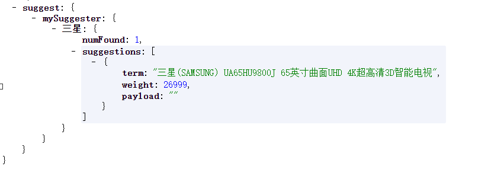

##### 4.8.5  AutoSuggest中相关的参数。

```
<searchComponent name="suggest" class="solr.SuggestComponent">
  <lst name="suggester">
   <str name="name">mySuggester</str> 自动建议器名称，需要在查询的时候指定
   <str name="field">item_title</str>  表示自动建议的内容是基于哪个域的
   <str name="dictionaryImpl">DocumentDictionaryFactory</str>词典实现类，表示分词（Term）是如何存储Suggestion字典的。 DocumentDictionaryFactory一个基于词，权重,创建词典;
   <str name="lookupImpl">FuzzyLookupFactory</str>  查询实现类，表示如何在Suggestion词典中找到分词（Term）
    <str name="weightField">item_price</str>   权重域。
    <str name="suggestAnalyzerFieldType">text_ik</str> 域类型
    <str name="buildOnCommit">true</str>
  </lst>
</searchComponent>
```


##### 4.8.6 AutoSuggest查询相关参数

```
http://localhost:8080/solr/collection1/select?q=三星&suggest=true&suggest.dictionary=mySuggester
```


| 参数               | 值          | 描述                                                         |
| ------------------ | ----------- | ------------------------------------------------------------ |
| suggest            | true\|false | 是否开启suggest                                              |
| suggest.dictionary | 字符串      | 指定使用的suggest器名称                                      |
| suggest.count      | 数值        | 默认值是1                                                    |
| suggest.build      | true\|false | 如果设置为true，这个请求会导致重建suggest索引。这个字段一般用于初始化的操作中，在线上环境，一般不会每个请求都重建索引，如果线上你希望保持字典最新，最好使用buildOnCommit或者buildOnOptimize来操作。 |

##### 4.8.7 其他lookupImpl,dictionaryImpl.

​	其他的实现大家可以参考。

​	http://lucene.apache.org/solr/guide/8_1/suggester.html

​	


​	

# 5.SolrJ

## 5.1 SolrJ的引入

​	使用java如何操作Solr；

​	第一种方式Rest API


​		流程：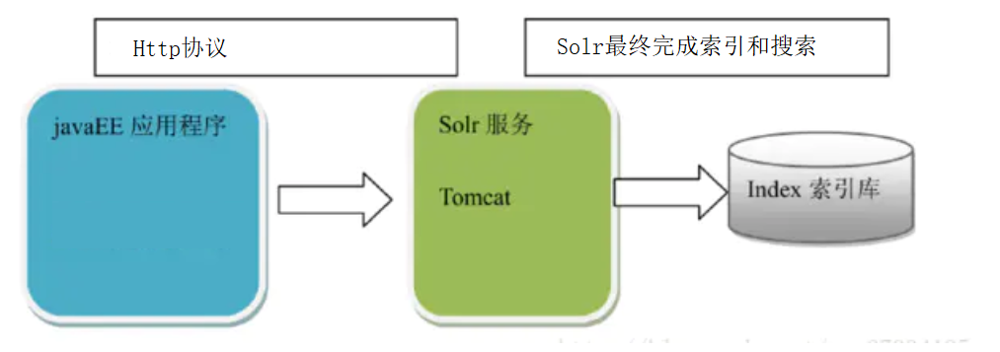

​			使用Rest API的好处，我们只需要通过Http协议连接到Solr，即可完成全文检索的功能。

​	

​	在java中可以发送Http请求的工具包比较多。

​			Apache：HttpClient 

​			Square: OKHttpClient 

​			JDK : URLConnection

​			Spring: 以上的API提供的发送Http请求的方式都是不同，所以Spring提供了一个模板RestTemplate，可以对以上Http请求工具类进行封装从而统一API。

​	演示：

​		通过RestTemplate发送http请求，请求Solr服务完成查询item_title:手机的文档。并且需要完成结果封装。

​	

​	开发步骤：

​			1.创建服务，引入spring-boot-stater-web的依赖（包含了RestTemplate）

```
	<parent>
        <groupId>org.springframework.boot</groupId>
        <artifactId>spring-boot-starter-parent</artifactId>
        <version>2.1.10.RELEASE</version>
    </parent>
    <dependencies>
        <dependency>
            <groupId>org.springframework.boot</groupId>
            <artifactId>spring-boot-starter-web</artifactId>
        </dependency>
        <dependency>
            <groupId>org.springframework.boot</groupId>
            <artifactId>spring-boot-starter-test</artifactId>
        </dependency>
    </dependencies>
```

​			2.编写启动类和yml配置文件

```
@SpringBootApplication
public class Application {
    public static void main(String[] args) {
        SpringApplication.run(Application.class, args);
    }

}
```

​			3.将RestTemplate交由spring管理

```
    @Bean
    public RestTemplate restTemplate() {
        return new RestTemplate(); //底层封装URLConnection
    }
```

​			4. 使用RestTemplate，向Solr发送请求，获取结果并进行解析。

```
	@Test
    public void test01() {
        //定义请求的url
        String url = "http://localhost:8080/solr/collection1/select?q=item_title:手机";
        //发送请求，指定响应结果类型，由于响应的结果是JSON，指定Pojo/Map
        ResponseEntity<Map> resp = restTemplate.getForEntity(url, Map.class);
        //获取响应体结果
        Map<String,Object> body = resp.getBody();
        //获取Map中--->response
        Map<String,Object> response = (Map<String, Object>) body.get("response");
        //获取总记录数
        System.out.println(response.get("numFound"));
        //获取起始下标
        System.out.println(response.get("start"));
        //获取文档
        List<Map<String,Object>> docs = (List<Map<String, Object>>) response.get("docs");
        for (Map<String, Object> doc : docs) {
            System.out.println(doc.get("id"));
            System.out.println(doc.get("item_title"));
            System.out.println(doc.get("item_price"));
            System.out.println(doc.get("item_image"));
            System.out.println("=====================");
        }
    }
```

​		到这使用Solr RestAPI的方式我们就讲解完毕了。


## 5.2 SolrJ 介绍


​	Solr官方就推出了一套专门操作Solr的java API，叫SolrJ。

​	使用SolrJ操作Solr会比利用RestTemplate来操作Solr要简单。SolrJ底层还是通过使用httpClient中的方法来完成Solr的操作.

​	SolrJ核心的API

​		SolrClient

​		HttpSolrClient：适合于单节点的情况下和Solr进行交互。

​		CloudSolrClient：适合于集群的情况下和Solr进行交互。

​	由于当前我们Solr未搭建集群，所以我们使用HttpSolrClient即可。要想使用SolrJ，需要在项目中引入SorlJ的依赖，建议Solr的版本一致.

```
<dependency>
    <groupId>org.apache.solr</groupId>
    <artifactId>solr-solrj</artifactId>
    <version>7.7.2</version>
</dependency>
```

​	将HttpSolrClient交由spring管理。

​		1.在yml配置文件中配置Solr服务·	`

```
url: http://localhost:8080/solr/collection1
```

​		2.在启动类中配置HttpSolrClient

```
    @Value("${url}")
    private String url;
    @Bean
    public HttpSolrClient httpSolrClient() {
        HttpSolrClient.Builder builder = new HttpSolrClient.Builder(url);
        return builder.build();
    }
```

准备工作到此就准备完毕。

## 5.3 HttpSolrClient

##### 5.3.1 索引

###### 5.3.1.1添加

​		需求：添加一个图书文档。

​		添加有很多重载方法，SolrJ中支持添加一个文档，也支持一次添加文档集合。

```
@Test
    public void testAddDocument() throws IOException, SolrServerException {
        //创建文档
        SolrInputDocument document = new SolrInputDocument();
        //指定文档中的域
        document.setField("id", "889922");
        document.setField("item_title","华为 Meta30 高清手机");
        document.setField("item_price", 20);
        document.setField("item_images", "21312312.jpg");
        document.setField("item_createtime", new Date());
        document.setField("item_updatetime", new Date());
        document.setField("item_category", "手机");
        document.setField("item_brand","华为");
        //添加文档
        httpSolrClient.add(document);
        httpSolrClient.commit();
    }
```

###### 5.3.1.2 修改

​				如果文档id相同就是修改；

```
@Test
    public void testAddDocument() throws IOException, SolrServerException {

        //创建文档
        SolrInputDocument document = new SolrInputDocument();
        //指定文档中的域
        document.setField("id", "889922");
        document.setField("book_name","SolrJ是Solr提供的操作Solr的javaAPI,挺好用");
        document.setField("book_num", 20);
        document.setField("book_pic", "21312312.jpg");
        document.setField("book_price", 20.0);
        //添加文档
        httpSolrClient.add(document);
        httpSolrClient.commit();
    }
```

###### 5.3.1.3 删除

​	支持基于id删除，支持基于条件删除。

​	基于id删除

```
   @Test
    public void testDeleteDocument() throws IOException, SolrServerException {
        httpSolrClient.deleteById("889922");
        httpSolrClient.commit();
    }
```

​	支持基于条件删除，删除所有数据要慎重

```
    @Test
    public void testDeleteQuery() throws IOException, SolrServerException {
        httpSolrClient.deleteByQuery("book_name:java"); //*:*删除所有
        httpSolrClient.commit();
    }
```

到这关于使用SolrJ完成索引相关的操讲解完毕。下面讲解查询。

##### 5.3.2 基本查询

###### 5.3.2.1 主查询+过滤查询

​		查询的操作分为很多种下面我们讲解基本查询。

​	核心的API方法：

​		solrClient.query(SolrParams)；

​		SolrParams是一个抽象类，通常使用其子类SolrQuery封装查询条件；		

​		查询item_title中包含手机的商品

```
@Test
    public void testBaseQuery() throws IOException, SolrServerException {
        //封装查询条件
        SolrQuery params = new SolrQuery();
        //设置查询条件,参数1：查询参数,q,fq...
        params.setQuery("item_title:手机");
        //执行查询,获取结果
        QueryResponse resp = httpSolrClient.query(params);
        //满足条件的文档
        SolrDocumentList results = resp.getResults();
        //迭代results
        for (SolrDocument result : results) {
            System.out.println(result.get("id") + "--" + result.get("item_title"));
        }
        //获取总记录
        long numFound = results.getNumFound();
        System.out.println(numFound);
    }
```

​		

​		这是关于我们这一块核心API，接下来我们在这个基础上。我们做一些其他操作。添加过滤条件:品牌是华为。

价格在[1000-2000].

​		注意：过滤条件可以添加多个，所以使用的是SolrQuery的add方法。如果使用set后面过滤条件会将前面的覆盖.

```
 @Test
    public void testBaseFilterQuery() throws IOException, SolrServerException {
        //封装查询条件
        SolrQuery params = new SolrQuery();
        //设置查询条件,参数1：查询参数,q,fq...
        params.setQuery("item_title:手机");
        params.addFilterQuery("item_brand:华为");
        params.addFilterQuery("item_price:[1000 TO 2000]");
        //执行查询,获取结果
        QueryResponse resp = httpSolrClient.query(params);
        //满足条件的文档
        SolrDocumentList results = resp.getResults();
        //迭代results
        for (SolrDocument result : results) {
            System.out.println(result.get("id") + "--" + result.get("item_title") + "---" + result.get("item_brand") + "---" + result.get("item_price"));
        }
        //获取总记录
        long numFound = results.getNumFound();
        System.out.println(numFound);
    }
```

###### 5.3.2.1 分页

​	接下来我们要完成的是分页，需求：在以上查询的条件查询，查询第1页的20条数据。

```
params.setStart(10);
params.setRows(10);
```

###### 5.3.2.1 排序

​	除了分页外，还有排序。需求：按照价格升序。如果价格相同，按照id降序。

```
params.addSort("item_price,",Order.desc);
params.addSort("id",Order.asc);
```

###### 5.3.2.2 域名起别名

​	到这基本查询就基本讲解完毕。有时候我们需要对查询结果文档的字段起别名。

​	需求：将域名中的item_去掉。

```
  //指定查询结果的字段列表，并且指定别名
  params.setFields("id,price:item_price,title:item_title,brand:item_brand,category:item_category,image:item_image");
 System.out.println(result.get("id") + "--" + result.get("title") + "---" + result.get("brand") + "---" + result.get("category"));
```

​	别名指定完毕后，便于我们后期进行封装；到这关于基本查询讲解完毕，下面讲解组合查询。

##### 5.3.3 组合查询

​	需求：查询Item_title中包含手机或者平板电视的文档。

```
params.setQuery("q","item_title:手机 OR item_title:平板电视");
```

​	需求：查询Item_title中包含手机 并且包含三星的文档

```
params.setQuery("item_title:手机 AND item_title:三星");
params.setQuery(,"+item_title:手机  +item_title:三星");
```

​	需求: 查询item_title中包含手机但是不包含三星的文档

```
params.setQuery("item_title:手机  NOT item_title:三星");
params.setQuery("+item_title:手机  -item_title:三星");
```

​	需求：查询item_title中包含iphone开头的词的文档，使用通配符。；

```
params.setQuery("item_title:iphone*");
```

到这关于SolrJ中组合查询我们就讲解完毕了。

##### 	

