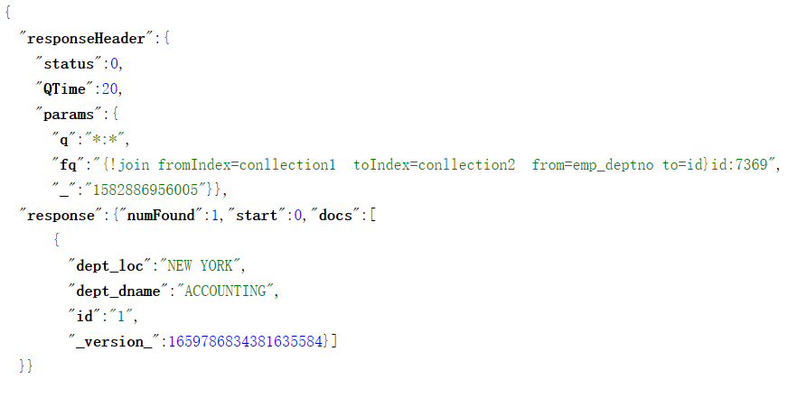

#  Solr高级（下）

# 4.Solr查询进阶

### 4.1 深度分页

​			在Solr中 默认分页中，我们需要使用 start和 rows 参数。一般情况下使用start和rows进行分页不会有什么问题。但是在极端情况下，假如希望查询第 10000 页且每页显示10条，意味着 Solr 需要提取前 10000 × 10 = 100000 条数据，并将这100000 条数据缓存在内存中，然后返回最后10条即用户想要的第10000页数据。

​			引发问题：将这100000条数据缓存到内存中，会占用很多内存。页码越靠后，分页查询性能越差。多数情况下，用户也不会查询第10000页的数据，但是不排除用户直接修改url的参数，查询第10000页的数据。

​		解决方案：

​			为此Solr 提供了一种全新的分页方式， 被称为游标。游标可以返回下一页数据的起始标识。该标识记录着下一页数据在索引库中绝对的索引位置。一旦我们使用了游标，Solr就不会采用之前的分页方式。而是根据每一页数据在索引库中绝对索引位置来获取分页数据。

​		使用流程：

​			1.查询数据的时候需要指定一个参数cursorMark=*,可以理解为start=0，通过该参数就可以获取第一页数据。在返回的结果中包含另外一个参数nextCursorMark

​			2.nextCursorMark是下一页数据开始位置。

​			3.将下一页数据的开始位置作为cursorMark的值来查询下一页数据。

​			4.如果返回nextCursorMark和cursorMark相同，表示没有下一页数据

​		注意点：

​				1.cursorMark在进行分页的时候，是不能再指定start这个参数。

​				2.使用cursorMark在进行分页的时候，必须使用排序，而且排序字段中必须包含主键。

​				eg: id asc       

​				eg: id asc  name desc

​		演示：

​			需求：查询item_title中包含LED的第一页的50条数据

```
http://localhost:8080/solr/collection1/select?
q=item_title:LED&
cursorMark=*&
rows=50&
sort=id asc
```

​		

​			利用下一页数据的起始标识查询下一页数据，将cursorMark改为下一页数据的起始标识

```
q=item_title:LED&
cursorMark=AoEnMTEzNjY5NQ==&
rows=50&
sort=id asc
```

​			如果发现cursorMark和返回的nextCursorMark相同，表示没有下一页数据


### 4.2  Solr Join查询

##### 4.2.1 Join查询简介

​		在Solr 中的索引文档一般建议扁平化、非关系化,所谓扁平化即每个文档包含的域个数和类型可以不同，而非关系型化则表示每个文档之间没有任何关联，是相互独立 。不像关系型数据库中两张表之间可以通过外键建立联系。

​		案例场景：

​			需求：需要将员工表和部门表的数据导入到Solr中进行搜索。

​			通常我们的设计原则。将员工表和部门表的字段冗余到一个文档中。将来查询出来的文档中包含员工和部门信息。

​		但是在Solr中他也提供了Join查询，类似于SQL中子查询，有时候我们利用Join查询也可以完成类似子查询的功能。

##### 4.2.2 join查询的数据准备

​		1.将部门表的数据导入到Solr中。

​			 业务域

```
  	<field name="dept_dname" type="text_ik" indexed="true" stored="true"/>
	<field name="dept_loc" type="text_ik" indexed="true" stored="true"/>
	
	<fieldType name ="text_ik" class ="solr.TextField">
		<analyzer class="org.wltea.analyzer.lucene.IKAnalyzer"/>
	</fieldType>
```

​			DataImport配置文件

```
<dataConfig>
    <!-- 首先配置数据源指定数据库的连接信息 -->
    <dataSource type="JdbcDataSource"
                driver="com.mysql.jdbc.Driver"
                url="jdbc:mysql://localhost:3306/lucene"
                user="root"
                password="123"/>
    <document>
		<entity name="dept" query="select * from dept">
            <!-- 每一个field映射着数据库中列与文档中的域，column是数据库列，name是solr的域(必须是在managed-schema文件中配置过的域才行) -->
            <field column="deptno" name="id"/>
            <field column="dname" name="dept_dname"/>
            <field column="loc" name="dept_loc"/>
        </entity>
    </document>
</dataConfig>
```

​		 在collection2中导入部门数据


##### 4.2.3 Join查询的案例使用场景

需求：查询部门名称为SALES下的员工信息。

```
sql子查询：
	1.查询SALES部门名称对应的部门id
		select depno from dept where dname = 'SALES'
	2.查询部门id下员工信息
		select * from emp where deptno in (select depno from dept where dname = 'SALES')
```

​	

​	类比sql中的子查询，来完成Solr中Join查询。

```
q=*:*&  //主查询条件------->查询所有员工
//过滤条件collection2中dept_dname:SALES
fq=dept_dname:SALES

建立连接关系
{!join fromIndex=collection2 toIndex=collection1 from=id to=emp_deptno}

fromIndex:被连接的collection
toIndex:主collection
from:部门号
to:外键

最终：
	q=*:*&
	fq={!join fromIndex=collection2 toIndex=collection1 from=id to=emp_deptno}dept_dname:SALES
```

​	

需求：查询7369员工的部门信息。

```
sql子查询
	查询7369员工的部门号。
	select deptno from emp where empno = 7369
	根据上面部门号查询部门信息
	select * from dept where deptno = (
			select deptno from emp where empno = 7369
	)
```

​	

类比sql中的子查询，来完成Solr中Join查询。

```
主查询条件------->查询所有部门
q=*:*&
fq=id:7369
--------->子查询条件员工id为7369
使用join进行连接
{!join fromIndex=collection1  toIndex=collection2  from=emp_deptno to=id}
```



分析：


需求：查询7369员工的领导的信息。

```
sql子查询
1.查询7369员工的领导的编号。
	select mgr from emp where empno = 7369
2.根据领导的编号，查询领导信息
	select * from emp where empno = (
	  select mgr from emp where empno = 7369
	)
```

​	类比sql中的子查询，来完成Solr中Join查询。

```
主查询条件
q=*:*------->主查询条件
fq={!join fromIndex=collection1 toIndex=collection1 from=emp_mgr to=id}id:7369

```

结果：


分析：

​	


​	需求：统计SALES部门下，薪水最高的员工

​			步骤1：查询SALES部门下的所有员工。

```
q=*:*&  //主查询条件------->查询所有员工
//过滤条件collection2中dept_dname:SALES
fq={!join fromIndex=collection2 toIndex=collection1 from=id to=emp_deptno}dept_dname:SALES
```

​			步骤2：使用Facet的函数查询最高的薪水;

```
q=*:*&  //主查询条件------->查询所有员工
//过滤条件collection2中dept_dname:SALES
fq={!join fromIndex=collection2 toIndex=collection1 from=id to=emp_deptno}dept_dname:SALES&
json.facet={
	x:"max(emp_sal)"
}
http://localhost:8080/solr/collection1/select?q=*:*&
fq=%7B!join fromIndex=collection2 toIndex=collection1 from=id to=emp_deptno%7Ddept_dname:SALES&
json.facet=%7B
	x:"max(emp_sal)"
%7D
```

​		


##### 4.2.4 Block Join

​			在Solr中还支持一种Join查询，我们称为Block Join。但前提是我们的 Document 必须是 Nested Document （内嵌的Document）;

###### 4.2.4.1什么是内嵌的Document

 	 	内嵌的Document 就是我们可以在 Document 内部再添加一个Document ，形成父子关系，就好比HTML中的 div标签内部能够嵌套其他div标签，形成多层级的父子关系，以员工和部门为例，如果我们采用内嵌 Document 来进行索引，我们使用一个collection来存储部门和员工的信息。此时我们的索引数据结构应该是类似这样的： 

```
<add>  
	 	<doc>         
			<field name="id">1</field>  
			<field name="dept_dname">ACCOUNTING</field> 
			<field name="dept_loc">NEW YORK</field> 
			<doc>
                <field name="id">7369</field>  
                <field name="emp_ename">SMITH COCO</field> 
                <field name="emp_job">CLERK</field> 
                <field name="emp_hiredate">1980-12-17</field
                ...
                <field name="emp_deptno">1</field> 
			</doc>
			<doc>
                <field name="id">7566</field>  
                <field name="emp_ename">JONES</field> 
                <field name="emp_job">MANAGER</field> 
                <field name="emp_hiredate">1981-04-02</field
                ...
                <field name="emp_deptno">1</field> 
			</doc>
		</doc>
 
</add>
```

###### 4.2.4.1内嵌Document相关域创建

```
	<!--员工相关的域-->
    <field name="emp_ename" type="text_ik" indexed="true" stored="true"/>
    <field name="emp_job" type="text_ik" indexed="true" stored="true"/>
    <field name="emp_mgr" type="string" indexed="true" stored="true"/>
    <field name="emp_hiredate" type="pdate" indexed="true" stored="true"/>
    <field name="emp_sal" type="pfloat" indexed="true" stored="true"/>
    <field name="emp_comm" type="pfloat" indexed="true" stored="true"/>
	<field name="emp_cv" type="text_ik" indexed="true" stored="false"/>


	<!--部门表的业务域-->
	<field name="dept_dname" type="text_ik" indexed="true" stored="true"/>
	<field name="dept_loc" type="text_ik" indexed="true" stored="true"/>
	<!--标识那个是父节点-->
	<field name="docParent" type="string" indexed="true" stored="true"/>
	<!--创建内嵌的document必须有_root_域，该域在schema文件中已经有了，不需要额外添加-->
	<field name="_root_" type="string" indexed="true" stored="true"/>
```

###### 4.2.4.2 使用solrJ/spring data solr将部门和员工信息以内嵌Document的形式进行索引

​		SolrJ核心的API

```
SolrInputDocument doc = new SolrInputDocument()
SolrInputDocument subDoc = new SolrInputDocument()
doc.addChildDocument(subDoc); //建立父子关系的API方法。
```

​	Spring Data Solr

```
如果学习了Spring Data Solr可以使用@Field注解和@ChildDocument注解
```

​	思路

```
使用mybatis查询部门表的所有信息。
迭代每一个部门-------->部门Doucment
根据部门号查询该部门下所有的员工------->员工Document集合
建立部门Doucment和其员工Document的父子关系
```

​	 引入依赖

```
 	 <parent>
        <groupId>org.springframework.boot</groupId>
        <artifactId>spring-boot-starter-parent</artifactId>
        <version>2.1.4.RELEASE</version>
    </parent>
 	   <dependency>
            <groupId>org.springframework.boot</groupId>
            <artifactId>spring-boot-starter-web</artifactId>
        </dependency>

        <dependency>
            <groupId>org.springframework.boot</groupId>
            <artifactId>spring-boot-starter-test</artifactId>
        </dependency>

        <dependency>
            <groupId>org.apache.solr</groupId>
            <artifactId>solr-solrj</artifactId>
            <version>7.7.2</version>
        </dependency>


        <dependency>
            <groupId>org.projectlombok</groupId>
            <artifactId>lombok</artifactId>
        </dependency>


        <!--通用mapper起步依赖-->
        <dependency>
            <groupId>tk.mybatis</groupId>
            <artifactId>mapper-spring-boot-starter</artifactId>
            <version>2.0.4</version>
        </dependency>
        <!--MySQL数据库驱动-->
        <dependency>
            <groupId>mysql</groupId>
            <artifactId>mysql-connector-java</artifactId>
        </dependency>
        
```

​	编写yml文件

```
#数据库的连接信息
spring:
  datasource:
    driver-class-name: com.mysql.jdbc.Driver
    url: jdbc:mysql://localhost:3306/lucene?useUnicode=true&characterEncoding=UTF-8&serverTimezone=UTC
    username: root
    password: 123

#solr collection1地址
url: http://localhost:8080/solr/collection1
```

​	编写启动类

```
@SpringBootApplication
@MapperScan("cn.itcast.dao")
public class Application {
    public static void main(String[] args) {
        SpringApplication.run(Application.class, args);
    }

    @Value("${url}")
    private String url;
    @Bean
    public HttpSolrClient httpSolrClient() {
        HttpSolrClient.Builder builder = new HttpSolrClient.Builder(url);
        return builder.build();
    }

}
```

​	编写实体类

```
@Data
@Table(name = "emp")
public class Emp {
    @Id
    private String empno;
    private String ename;
    private String job;
    private String mgr;
    private Date hiredate;
    private Double sal;
    private Double comm;
    private String cv;
    private String deptno;
}

@Data
@Table(name = "dept")
public class Dept {
    @Id
    private String deptno;
    private String dname;
    private String loc;
}
```

​	Dao接口的编写

```
public interface DeptDao extends Mapper<Dept> {
}
public interface EmpDao extends Mapper<Emp> {
}
```

​	编写测试方法，导入数据

```
@RunWith(SpringRunner.class)
@SpringBootTest(classes=Application.class)
public class AppTest {
    @Autowired
    private DeptDao deptDao;

    @Autowired
    private EmpDao empDao;

    @Autowired
    private SolrClient solrClient;

    @Test
    public void test01() throws IOException, SolrServerException {
        List<Dept> depts = deptDao.selectAll();
        //迭代每一个部门
        for (Dept dept : depts) {
            //每个部门转化为一个Document
            System.out.println(dept);
            SolrInputDocument deptDocument = new SolrInputDocument();
            deptDocument.setField("id", dept.getDeptno());
            deptDocument.setField("dept_dname", dept.getDname());
            deptDocument.setField("dept_loc", dept.getLoc());
            deptDocument.setField("docParent", "isParent");

            //获取每个部门的员工。
            List<SolrInputDocument> emps = findEmpsByDeptno(dept.getDeptno());
            deptDocument.addChildDocuments(emps);

            solrClient.add(deptDocument);
            solrClient.commit();
        }
    }

    private List<SolrInputDocument> findEmpsByDeptno(String deptno) {
        Example example = new Example(Emp.class) ;
        Example.Criteria criteria = example.createCriteria();
        criteria.andEqualTo("deptno", deptno);
        List<Emp> emps = empDao.selectByExample(example);
        System.out.println(emps);
        List<SolrInputDocument> solrInputDocuments = new ArrayList<>();
        for (Emp emp : emps) {
            SolrInputDocument document = emp2SolrInputDocument(emp);
            solrInputDocuments.add(document);
        }
        return solrInputDocuments;
    }

    private SolrInputDocument emp2SolrInputDocument(Emp emp) {
        SolrInputDocument document = new SolrInputDocument();
        document.setField("id", emp.getEmpno());
        document.setField("emp_ename", emp.getEname());
        document.setField("emp_job", emp.getJob());
        document.setField("emp_mgr", emp.getMgr());
        document.setField("emp_hiredate", emp.getHiredate());
        document.setField("emp_sal", emp.getSal());
        document.setField("emp_comm", emp.getComm());
        document.setField("emp_cv", emp.getCv());
        return document;
    }

}
```

​	测试：

​	

###### 4.2.4.3 基于内嵌的document查询

​		语法：用来查询子文档

​		allParents：查询所有父文档的条件，someParents过滤条件

```
q={!child of=<allParents>}<someParents>
```

​		语法：用来查询父文档

​		allParents：查询所有父文档的条件，someChildren子文档的过滤条件

```
q={!parent which=<allParents>}<someChildren>
```

​		需求：查询ACCOUNTING部门下面所有的员工。

```
q={!child of=docParent:isParent}dept_dname:ACCOUNTING
```

​		需求：查询CLARK员工所属的部门

```
q={!parent which=docParent:isParent}emp_ename:CLARK
```


### 4.3  相关度排序

###### 4.3.1 Field权重

​				比如我们有图书相关的文档，需要根据book_name或者book_description搜索图书文档。我们可能认为book_name域的权重可能要比book_description域的权重要高。我们就可以在搜索的时候给指定的域设置权重。

演示：默认的相关度排序

```
q=book_name:java OR book_description:java
http://localhost:8080/solr/collection1/select?q=book_name:java OR book_description:java
```

​	

​	演示：设置域的权重

​			方式1：在schema文件中给指定field指定boost属性值。	

​			boost默认值1.0

​			此方式不建议：原因是需要重新对数据进行索引。

```
	<field name="book_name" type="text_ik" indexed="true" stored="true" boost="10.0"/>
```

​			方式2：

​			使用edismax查询解析器。

```
defType=edismax
&q=java
&qf=book_name book_description^10
http://localhost:8080/solr/collection1/select?
defType=edismax&q=java
&qf=book_name book_description%5E10
```

###### 4.3.2 Term权重

​			有时候我们查询的时候希望为某个域中的词设置权重。

​			查询book_name中包含 java或者spring的，我们希望包含java这个词的权重高一些。

```
book_name:java OR book_name:spring
book_name:java^10 OR book_name:spring
```

###### 4.3.3 Function权重

​			function权重，我们在之前讲解函数查询的时候，讲解过。

###### 4.3.4 临近词权重

​			有时候我们有这种需求，比如搜索iphone  plus将来包含iphone  或者 plus的文档都会被返回，但是我们希望包含iphone  plus完整短语的文档权重高一些。

​			第一种方式：使用edismax查询解析器

```
http://localhost:8080/solr/collection1/select?defType=edismax& 
q=iphone plus&qf=book_name
```

​	


```
可以添加一个参数
pf=域名~slop^boost

http://localhost:8080/solr/collection1/select?
defType=edismax& 
q=iphone plus&
qf=book_name&
pf=book_name~0^10 
				0^10	book_name中包含iphone 没有任何词 plus文档权重是10
				1^10	book_name中包含iphone 一个词/没有词 plus文档权重是10
				2^10	book_name中包含”iphone 2个及2个以下词 plus"文档权重是10
%5E
```

​		第二种方式：使用标准解析器中也可以完成临近词的加权

```

/select?q=iphone plus OR "iphone plus"~0^10 &df=book_name
```

###### 4.3.5 Document权重

​		除了上面的修改相关度评分的操作外，我们也可以在索引的时候，设置文档的权重。使用SolrJ或者Spring DataSolr完成索引操作的时候调用相关方法来设置文档的权重。在Solr7以后已经废弃。

```
  
  @Deprecated
  public void setDocumentBoost(float documentBoost) {
    _documentBoost = documentBoost;
  }
```


# 5.Solr性能优化 

### 5.1 Schema文件设计的注意事项（理解）

​		

​			indexed属性（重要）：设置了indexed=true的域要比indxed=false的域，索引时占用更多的内存空间。而且设置了index=true的域所占用磁盘空间也比较大，所以对于一些不需要搜索的域，我们需要将其indexed属性设置为false。比如:图片地址。

​			omitNorms属性选择：如果我们不关心词在文档中出现总的次数，影响最终的相关度评分。可以设置omitNorms=true。它可以减少磁盘和内存的占用，也可以加快索引时间。

​			omitPosition属性选择：如果我们不需要根据该域进行高亮，可以设置成true，也可以减少索引体积。

​			omitTermFreqAndPositions属性：如果我们只需要利用倒排索引结构根据指定Term找到相应Document，不需要考虑词的频率，词的位置信息，可以将该属性设置为true，也可以减少索引体积。

​			stored属性（重要）：如果某个域的值很长，比如想要存储一本书的信息，首先我们要考虑该域要不要存储。如果我们确实想要在Solr 查询中能够返回该域值，此时可以考虑使用 ExtemalFileField 域类型。

​			如果我们存储的域值长度不是很大，但是希望降低磁盘的IO。可以设置 compressed=true 即启用域值数据 压缩，域值数据压缩可以降低磁盘 IO ，同时会增加 CPU 执行开销。

​			如果你的域值很大很大，比如是一个几十MB PDF 文件的内容 ，此时如果你将域的 stored 属性设置为 true 存储在 Solr中，它不仅会影响你的索引创建性能，还会影响我们的查询性能，如果查询时，fl参数里返回该域，那对系统性能打击会很大，如果了使用 ExtemalFileField 域类型，该域是不支持查询的，只支持显示。通常我们的做法是将该域的信息存储到Redis,Memcached缓存数据库。当我们需要该域的数据时，我们可以根据solr中文档的主键在缓存数据库中查询。

​			

​			multiValued属性：如果我们某个域的数据有多个时，通常可以使用multiValued属性。eg:鞋子的尺码，鞋子的尺码可能会有多个36，38，39，40，41...。就可以设置multiValued属性为true。

​			但是有些域类型是不支持multiValued属性，eg:地理位置查询LatLonType;

​			Group查询也不支持multiValued属性为true的域。

​			我们可以考虑使用内嵌的Document来解决次问题。可以为该文档添加多个子文档。


​			对于日期类型的数据，在Solr中我们强烈建议使用solr中提供的日期类型域类来存储。不建议使用string域类型来存储。否则是无法根据范围进行查询。

​			Solr官方提供的schema示例文件中定义了很多`<dynamicField>`、`<copyField>`以及 

`<fieldType>`，上线后这里建议你将它们都清理掉， `<fieldType>`只保留一些基本的域类型string、 boolean 

pint plong pfloat pdate 即可，一定保留内置的`_version_`,`_root_` 域，否则一些功能就不能使用。


比如删除`_root_`就无法创建内嵌的document；

### 5.2 索引更新和提交的建议

​			在Solr中我们在进行索引更新的时候，一般不建议显式的调用 commit()进行硬提交，建议我们 solrconfig. xml 中配置自动提交和软提交；

​			硬提交: 所谓硬提交是将没有提交的数据flush到硬盘中，并且能够查询到这条数据。如果我们每次都进行硬提交的话，频繁的和磁盘IO进行交互，会影响索引的性能。

​			软提交：所谓软提交是将提交数据到写到内存里面，并且开启一个searcher。它可以保证数据可以被搜索到，等到一定的时机后再进行自动硬提交,再将数据flush到硬盘上。

​		

​			在SolrConfig.xml中如何配置软提交呢

```
<updateHandler class="solr.DirectUpdateHandler2">
<autoCommit>
    <!--表示软提交达到1万条的时候会自动进行一次硬提交-->
    <maxDocs>10000</maxDocs>

    <!--每10秒执行一次硬提交-->
    <maxTime>10000</maxTime>
</autoCommit>

    <autoSoftCommit> 
      <!--1秒执行一次软提交-->
      <maxTime>1000</maxTime> 
    </autoSoftCommit>
</updateHandler>
```

### 5.3 Solr缓存

​		在Solr中缓存扮演者很重要的角色，它很大程度上决定了我们的Solr查询性能。在Solr中一共开启了3种内置缓存filterCache documentCache queryResultCache ，这些缓存都是被IndexSearcher所管理。

​	

​	1.用户发起一个查询请求后，请求首先被请求处理器接收

​	2.请求处理器会将搜索的查询字符串，交由QueryParser解析

​	3.解析完成后会生成Query对象，由IndexSearcher来执行查询。

​		在Solr中对IndexSearcher的实现类，叫SolrIndexSearcher。在SolrIndexSearcher中，管理了相关的缓存。

一个SolrIndexSearcher对应一套缓存体系，一般来说一个SolrCore只需要一个SolrIndexSearcher实例

在Solr中允许我们在solrConfig.xml的`<query>`标签下修改缓存的属性。

###### 5.3.1  缓存公共属性

​			无论是那种缓存，都有4个相同属性。

​			class:设置缓存的实现类，solr内置了三个实现类。FastLRUCache，LRUCache，LFUCache

​				LRU和LFU是2种不同的缓存淘汰算法。

​				LRU算法的思想是：如果一个数据在最近一段时间没有被访问到，那么可以认为在将来它被访问的可能性也很小。因此，当缓存满时，最久没有访问的数据最先被置换（淘汰）。

​				LFU算法的思想是：如果一个数据在最近一段时间很少被访问到，那么可以认为在将来它被访问的可能性也很小。因此，当空间满时，最小频率访问的数据最先被淘汰。

​			

​	size：cache中可保存的最大的项数。

​	initialSize：cache初始化时的大小。

​	autowarmCount:SolrCore重启（reload）的时候，Indexsearcher会重新创建，不过旧的SolrCore和旧的Indexsearcher会继续存在一段时间，autowarmCount表示从旧的缓存中获取多少项来在新的SolrIndexSearcher缓存中被重新生成。如果设置成0，表示SolrCore重启（reload）的时候，旧的缓存数据就不要了。我们把这个过程叫缓存预热。

###### 5.3.2 缓存特有属性		

​			不同的缓存类型有一些特有的属性。

​			FastLRUCache：

​				minSize：当cache达到size以后，使用淘汰策略使其降到minSize大小，默认是0.9*size；

​				acceptableSize：当淘汰数据时，首先会尝试删除到minSize，但可能会做不到，至少可以删除到acceptableSize，默认是0.95*size。

​				cleanupThread:它表示是否需要单独起一个线程来删除缓存项，当我们的缓存 size非常大时你可能会需要将此参数设置为 true，默认值false。因为当cache大小很大时，每一次的淘汰数据就可能会花费较长时间，这对于提供查询请求的线程来说就不太合适，由独立的后台线程来做就很有必要。

###### 5.3.3 Solr查询缓存的分类和作用

​	 filterCache

​			filterCache中存储的是满足过滤条件的document id集合。

​			什么时候filterCache会进行缓存。

​			（1）当我们执行一个查询，如果包含fq（可能会有多个）,Solr会先执行每一个fq,对fq执行的结果取并集，之后将fq和q结果取并集。在这个过程中filerCache会将单个过滤条件（类型为Query）作为key，符合条件的document id存储到Set集合中作为value缓存起来。

​			（2）filterCache也会缓存Facet查询结果。

​			演示FilterCache

```
q:item_title:手机&
fq:item_brand:华为
   item_price:[2000 TO 3000]
```

​			将来我们就可以根据后台的统计来设置filterCache的参数。

queryResultCache

​			查询结果集缓存，缓存的是查询结果集有序文档ID的集合，key是q和fq及sort组合的一个唯一标识。value是满足条件文档的id集合。

​		eg:查询q=item_title:手机 fq=item_brand:华为,item_price:[1000 TO 2000]，并且按照价格排序；

​				会将q,fq及sort作为key将满足条件的文档id集合作为value缓存到queryResultCache。

​			要想命中缓存，需要保证q,fq,sort一致。

​			

​		  接下来我们再来说一下queryResult缓存的2个配置。

```
  比如查询匹配的documentID是［0, 10）之间，queryResultWindowSize= 50，那么DocumentID [0, 50] 会被并缓存。
  为什么这么做呢？原因是我们查询的时候可能会带有start和rows，如果所以某个QueryResultKey可能命中了cache，但是start和rows可能不在缓存的文档id集合范围。 可以使用参数来加大缓存的文档id集合范围。
   <queryResultWindowSize>20</queryResultWindowSize>
   	value中最大存储的文档的id个数
  <queryResultMaxDocsCached>200</queryResultMaxDocsCached>
  这两个值一般设置为每个page大小的2-3倍。
```

​	documentCache

​		documentCache （即索引文档缓存）用于存储已经从磁盘上查询出来的Document 对象。键是文档id值是文档对象。

​		但是Document中并不会保存所有域的信息，只会保存fl中指定的域，如果没有指定则保存所有的域。

没有保存的域会标识为延迟加载，当我们需要延迟加载的域信息的时候，再从磁盘上进行查询。

​	

### 5.4其他优化建议

​		增大JVM的堆内存

​			需要在tomcat/catalina.sh文件中加入

​			JAVA_OPTS="$JAVA_OPTS -server -Xms2048m -Xmx2048m"

​		-Xms：初始Heap大小，使用的最小内存,cpu性能高时此值应设的大一些
​		-Xmx：java heap最大值，使用的最大内存
​		上面两个值是分配JVM的最小和最大内存，取决于硬件物理内存的大小，建议均设为物理内存的一半。

​	

​	取消指定过滤查询的Filter缓存。

​		在Solr中默认会为每个FilterQuery 启用 Filter 缓存，大部分情况下这能提升查询性能，但是比如我们想要查询某个价格区间或者时间范围内的商品信息。

```
q=*:*,
fq=item_price:[0 TO 3000],
fq=item_brand:三星
```

​		但是对于每个用户而言，设置的价格区间参数可能是不一致的，有的用户提供的价格区间可能是 [20, 50］，也有可能 [20 ,60] ,[30, 60］，这种价格区间太多太多，如果对每个价格区间的 Filter Query都启用 Filter缓存就不太合适。

```
q=*:*
&fq={!cache=false}item_price:[0 TO 3000],
&fq=item_brand:三星
```

​		对于什么时候要禁用Filter缓存，我们需要判断，取决于这个Filter Query的查询条件有没有共性。item_brand:三星过滤条件就比较适合做缓存。因为品牌的值本身就比较少。价格区间、时间区间就不适合，因为区间范围有不确定性。就算你做了缓存，缓存的命中率也很低，对于我们内存也是一种浪费。

​		Filter Query的执行顺序。

​		假如我们的查询中有多个FilterQuery ,此时我们需要考虑每个 Filter Query 的执行顺序，因为Filter Query 的执行顺序可能会影响最终的查询的性能。

​		一般我们需要让能过滤掉大量文档的FilterQuery优先执行。我们当前有三个过滤条件，其中item_category:手机过滤能力最强，其次是item_brand:三星。设置cost参数，参数值越小，优先级越高。

```
q=*:*
&fq={!cache=false cost=100}item_price:[0 TO 3000],
&fq={!cost=2}item_brand:三星，
&fq={!cost=1}item_category:手机
```

​	


# 6.Spring Data Solr（开发）

## 6.1 Spring Data Solr的简介

​		Spring Data Solr和SolrJ的关系

​		Spring Data Solr是Spring推出的对SolrJ封装的一套API，使用Spring Data Solr可以极大的简化编码。

 Spring Data 家族还有其他的API，Spring Data Redis|JPA|MongoDB等。

​		 Spring Data Solr的环境准备。

​		1.创建服务，继承父工程引入spring data solr的起步依赖

```
	<parent>
        <groupId>org.springframework.boot</groupId>
        <artifactId>spring-boot-starter-parent</artifactId>
        <version>2.1.10.RELEASE</version>
    </parent>

    <dependencies>
        <dependency>
            <groupId>org.springframework.boot</groupId>
            <artifactId>spring-boot-starter-test</artifactId>
        </dependency>
        <dependency>
            <groupId>org.springframework.boot</groupId>
            <artifactId>spring-boot-starter-data-solr</artifactId>
        </dependency>
        <dependency>
            <groupId>org.projectlombok</groupId>
            <artifactId>lombok</artifactId>
        </dependency>
    </dependencies>

```

​	2.编写启动类和yml配置文件。

​		在yml配置文件中，我们需要配置Solr的地址。

​		如果使用单机版的Solr配置host；指定solr服务的地址。

```
spring:
  data:
    solr:
      host: http://localhost:8080/solr
```

​        如果使用集群版的solr配置zk-host，如果Zookeeper搭建了集群，地址中间使用,分割。

```
spring:
  data:
    solr:
      zk-host: 192.168.200.131:2181,192.168.200.131:2182,192.168.200.131:2183
```


## 6.2 SolrTemplate

​	如果我们要使用Spring Data Solr来操作Solr，核心的API是SolrTemplate，所以首先我们需要在配置类中，将SolrTemplate交由spring管理；

```
   @Bean
    public SolrTemplate solrTemplate(SolrClient solrClient) {
        return new SolrTemplate(solrClient);
    }
```


##### 6.2.1 索引

###### 6.2.1.1添加

​		需求：添加一个商品。

​			1.创建一个商品实体类，并且建立实体类属性和域的映射关系。将来操作实体类对象，就是操作文档。

```
@Data
public class Item {
    @Field("id")
    @Id
    private String id;
    @Field("item_title")
    private String title;
    @Field("item_price")
    private Double price;
    @Field("item_images")
    private String image;
    @Field("item_createtime")
    private Date createTime;
    @Field("item_updatetime")
    private Date updateTime;
    @Field("item_category")
    private String category;
    @Field("item_brand")
    private String brand;
}
```

​		2.注入SolrTemplate，使用saveBean方法完成添加操作

```
		Item item = new Item();
        item.setId("9999");
        item.setBrand("锤子");
        item.setTitle("锤子（SHARP） 智能锤子");
        item.setCategory("手机");
        item.setCreateTime(new Date());
        item.setUpdateTime(new Date());
        item.setPrice(9999.0);
        item.setImage("https://www.baidu.com/img/bd_logo1.png");
        solrTemplate.saveBean("collection1",item);
        solrTemplate.commit("collection1");
```

3. 在后台管理系统中进行查看

   

###### 6.2.1.2 修改

​	如果文档id在索引库中已经存在就是修改；

```
       Item item = new Item();
        item.setId("9999");
        item.setBrand("香蕉");
        item.setTitle("香蕉（SHARP）LCD-46DS40A 46英寸 日本原装液晶面板 智能全高清平板电脑");
        item.setCategory("平板电脑");
        item.setCreateTime(new Date());
        item.setUpdateTime(new Date());
        item.setPrice(9999.0);
        item.setImage("https://www.baidu.com/img/bd_logo1.png");
        solrTemplate.saveBean("collection1",item);
        solrTemplate.commit("collection1");
```

###### 6.2.1.3 删除

​	支持基于id删除，支持基于条件删除。

​	基于id删除

```
   @Test
    public void testDeleteDocument() throws IOException, SolrServerException {
        solrTemplate.deleteByIds("collection1", "9999");
        solrClient.commit("collection1");
    }
```

​	支持基于条件删除，删除collection1中所有的数据(删除所有数据要慎重)

```
    @Test
    public void testDeleteQuery() throws IOException, SolrServerException {
       	SolrDataQuery query = new SimpleQuery("*:*");
        solrTemplate.delete("collection1",query);
        solrClient.commit("collection1");
    }
```


##### 6.2.2 基本查询

###### 6.2.2.1 主查询+过滤查询

​	核心的API方法：

```
public <T> ScoredPage<T> queryForPage(String collection, Query query, Class<T> clazz) 

参数1：要操作的collection
参数2：查询条件	
参数3: 查询的文档数据要封装成什么类型。
返回值ScoredPage是一个分页对象，封装了总记录数，总页数，当前页的数据。
```

​		需求：查询item_title中包含手机的文档

```
		//条件封装
        Query query = new SimpleQuery("item_title:手机");
        //执行查询
        ScoredPage<Item> scoredPage = solrTemplate.queryForPage("collection1", query, Item.class);
        //解析结果
        long elements = scoredPage.getTotalElements();
        System.out.println("总记录数" + elements);
        int totalPages = scoredPage.getTotalPages();
        System.out.println("总页数" + totalPages);

        //第一页的数据
        List<Item> content = scoredPage.getContent();
        for (Item item : content) {
            System.out.println(item);
        }
        
        
```

​		结果：总记录数，总页数是1页，说明没有分页。虽然没有分页。但是他并没有把716条数据都查询出来，只查询了满足条件并且相关度高的前10个。


接下来我们在这个基础上。我们进行过滤查询。添加过滤条件:品牌是华为，价格在[1000-2000].

```
 //is方法就是根据关键字搜索
 //item_brand:手机
    FilterQuery brandFilterQuery = new SimpleFilterQuery(new Criteria("item_brand").is("华为"));
	query.addFilterQuery(brandFilterQuery);

    //item_price:[1000-2000]
  	FilterQuery priceFilterQuery1 = new SimpleFilterQuery(new Criteria("item_price").greaterThanEqual(1000));
    
    FilterQuery priceFilterQuery2 = new SimpleFilterQuery(new Criteria("item_price").lessThanEqual(2000));
        query.addFilterQuery(priceFilterQuery1);
        query.addFilterQuery(priceFilterQuery2);
```


###### 6.2.2.2分页

​	查询满足条件的第2页的10条数据

```
query.setOffset(20L); //start
query.setRows(10);//rows
```

​	查询结果

​	

###### 6.2.2.3 排序

​		需求：按照价格升序。如果价格相同，按照id降序。

```
query.addSort(new Sort(Sort.Direction.ASC,"item_price"));
query.addSort(new Sort(Sort.Direction.DESC,"id"));
```


##### 6.2.3 组合查询		

​	需求：查询Item_title中包含手机或者电视的文档。

```
Query query = new SimpleQuery("item_title:手机 OR item_title:电视");
Query query = new SimpleQuery("item_title:手机 || item_title:电视");
```

​	需求：查询Item_title中包含手机 并且包含三星的文档

```
Query query = new SimpleQuery("+item_title:手机  +item_title:三星");
Query query = new SimpleQuery("item_title:手机 AND item_title:三星");
Query query = new SimpleQuery("item_title:手机 && item_title:三星");
```

​	需求: 查询item_title中包含手机但是不包含三星的文档

```
Query query = new SimpleQuery("+item_title:手机  -item_title:三星");
Query query = new SimpleQuery("item_title:手机  NOT item_title:三星");
```

​	需求：查询item_title中包含iphone开头的词的文档，使用通配符。；

```
Query query = new SimpleQuery("item_title:iphone*");
```


##### 	

## 6.3 其他查询

##### 6.3.1  facet查询

​		之前我们讲解Facet查询，我们说他是分为4类。

​		Field,Query,Range（时间范围，数字范围）,Interval（和Range类似）

###### 6.3.1.1 基于Field的Facet查询

​		需求：查询item_title中包含手机的文档，并且按照品牌域进行分组统计数量；

```
http://localhost:8080/solr/collection1/select?q=item_title:手机&facet=on&facet.field=item_brand&facet.mincount=1
```

```
  //查询条件
        FacetQuery query = new SimpleFacetQuery(new Criteria("item_title").is("手机"));
        //设置Facet相关的参数
        FacetOptions facetOptions = new FacetOptions("item_brand");
        facetOptions.addFacetOnField("item_brand");
        facetOptions.setFacetMinCount(1);
        query.setFacetOptions(facetOptions);
        //执行Facet查询
        FacetPage<Item> facetPage = solrTemplate.queryForFacetPage("collection1", query, Item.class);

        //解析Facet的结果
        //由于Facet的域可能是多个，需要指定名称
        Page<FacetFieldEntry> facetResultPage = facetPage.getFacetResultPage("item_brand");
        List<FacetFieldEntry> content = facetResultPage.getContent();
        for (FacetFieldEntry facetFieldEntry : content) {
            System.out.println(facetFieldEntry.getValue());
            System.out.println(facetFieldEntry.getValueCount());
        }
```

###### 6.3.1.2 基于Query的Facet查询

​	需求：查询分类是平板电视的商品数量 ，品牌是华为的商品数量 ，品牌是三星的商品数量，价格在1000-2000的商品数量；

```
http://localhost:8080/solr/collection1/select?
q=*:*&
facet=on&
facet.query=item_category:平板电视&
facet.query=item_brand:华为&
facet.query=item_brand:三星&
facet.query=item_price:%5B1000 TO 2000%5D
```

```
 @Test
    public void testQueryFacet() {
        //主查询条件，查询所有
        FacetQuery query = new SimpleFacetQuery(new SimpleStringCriteria("*:*"));

        //设置Facet相关的参数
        //定义4个query
        SolrDataQuery solrDataQuery1 = new SimpleQuery("{!key=pb}item_category:平板电视");
        SolrDataQuery solrDataQuery2 = new SimpleQuery("{!key=hw}item_brand:华为");
        SolrDataQuery solrDataQuery3 = new SimpleQuery("{!key=sx}item_brand:三星");
        SolrDataQuery solrDataQuery4 = new SimpleQuery(new Criteria("{!key=price}item_price").between(1000,2000));

        FacetOptions facetOptions = new FacetOptions();
         facetOptions.addFacetQuery(solrDataQuery1);
        facetOptions.addFacetQuery(solrDataQuery2);
        facetOptions.addFacetQuery(solrDataQuery3);
        facetOptions.addFacetQuery(solrDataQuery4);
        query.setFacetOptions(facetOptions);
        //执行Facet查询
        FacetPage<Item> facetPage = solrTemplate.queryForFacetPage("collection1", query, Item.class);
        //获取分页结果
        Page<FacetQueryEntry> facetQueryResult = facetPage.getFacetQueryResult();
        //获取当前页数据
        List<FacetQueryEntry> content = facetQueryResult.getContent();
        for (FacetQueryEntry facetQueryEntry : content) {
            System.out.println(facetQueryEntry.getValue());
            System.out.println(facetQueryEntry.getValueCount());
        }
    }
```

###### 6.3.1.3 基于Range的Facet查询

​	需求：分组查询价格0-2000 ，2000-4000，4000-6000....18000-20000每个区间商品数量

```
http://localhost:8080/solr/collection1/select?
q=*:*&
facet=on&
facet.range=item_price&
facet.range.start=0&
facet.range.end=20000&
facet.range.gap=2000&
&facet.range.other=all
```

```
@Test
    public void testRangeFacet() {
        //设置主查询条件
        FacetQuery query = new SimpleFacetQuery(new SimpleStringCriteria("*:*"));

        //设置Facet参数
        FacetOptions facetOptions = new FacetOptions();
        facetOptions.addFacetByRange(new FacetOptions.FieldWithNumericRangeParameters("item_price", 0, 20000, 2000));
        query.setFacetOptions(facetOptions);

        //执行Facet查询
        FacetPage<Item> facetPage = solrTemplate.queryForFacetPage("collection1", query, Item.class);

        //解析Facet的结果
        Page<FacetFieldEntry> page = facetPage.getRangeFacetResultPage("item_price");
        List<FacetFieldEntry> content = page.getContent();
        for (FacetFieldEntry facetFieldEntry : content) {
            System.out.println(facetFieldEntry.getValue());
            System.out.println(facetFieldEntry.getValueCount());
        }

    }
```

需求：统计2015年每个季度添加的商品数量

```
http://localhost:8080/solr/collection1/select?
q=*:*&
facet=on&
facet.range=item_createtime&
facet.range.start=2015-01-01T00:00:00Z&
facet.range.end=2016-01-01T00:00:00Z&
facet.range.gap=%2B3MONTH
```

```
  @Test
    public void testRangeDateFacet() throws ParseException {
        //设置主查询条件
        FacetQuery query = new SimpleFacetQuery(new SimpleStringCriteria("*:*"));

        //设置Facet参数
        FacetOptions facetOptions = new FacetOptions();
        SimpleDateFormat simpleDateFormat = new SimpleDateFormat("yyyy-MM-dd HH:mm:ss");
        simpleDateFormat.setTimeZone(TimeZone.getTimeZone("GMT+8:00"));
        Date start = simpleDateFormat.parse("2015-01-01 00:00:00");
        Date end = simpleDateFormat.parse("2016-01-01 00:00:00");
        facetOptions.addFacetByRange(new FacetOptions.FieldWithDateRangeParameters("item_createtime", start, end, "+3MONTH"));
        query.setFacetOptions(facetOptions);

        //执行Facet查询
        FacetPage<Item> facetPage = solrTemplate.queryForFacetPage("collection1", query, Item.class);

        //解析Facet的结果
        Page<FacetFieldEntry> page = facetPage.getRangeFacetResultPage("item_createtime");
        List<FacetFieldEntry> content = page.getContent();
        for (FacetFieldEntry facetFieldEntry : content) {
            System.out.println(facetFieldEntry.getValue());
            System.out.println(facetFieldEntry.getValueCount());
        }

    }
```

###### 6.3.1.4 Facet维度查询

​	需求：统计每一个品牌和其不同分类商品对应的数量；

​	  联想 手机 10

​	  联想  电脑 2

​	  华为 手机 10

```
 http://localhost:8080/solr/collection1/select?
 q=*:*&
 &facet=on
 &facet.pivot=item_brand,item_category
```

```
@Test
    public void intervalFacet() {
        //设置主查询条件
        FacetQuery query = new SimpleFacetQuery(new SimpleStringCriteria("*:*"));
        //设置Facet查询参数
        FacetOptions facetOptions = new FacetOptions();
        facetOptions.addFacetOnPivot("item_brand","item_category");

        query.setFacetOptions(facetOptions);
        //执行Facet查询
        FacetPage<Item> facetPage = solrTemplate.queryForFacetPage("collection1", query, Item.class);
        //解析Facet结果

        List<FacetPivotFieldEntry> pivot = facetPage.getPivot("item_brand,item_category");
        for (FacetPivotFieldEntry facetPivotFieldEntry : pivot) {
            //品牌分组
            System.out.println(facetPivotFieldEntry.getValue());
            System.out.println(facetPivotFieldEntry.getValueCount());
            //品牌下对应的分类的分组数据
            List<FacetPivotFieldEntry> fieldEntryList = facetPivotFieldEntry.getPivot();
            for (FacetPivotFieldEntry pivotFieldEntry : fieldEntryList) {
                System.out.println(" "+pivotFieldEntry.getValue());
                System.out.println(" " +pivotFieldEntry.getValueCount());
            }
        }

    }
```


##### 6.3.2  group查询

​		使用Group查询可以将同组文档进行归并。在Solr中是不支持多维度group。group的域可以是多个，但是都是独立的。

###### 6.3.2.1 基础的分组

​	需求：查询Item_title中包含手机的文档，按照品牌对文档进行分组，同组中的文档放在一起.

```
 http://localhost:8080/solr/collection1/select?
q=item_title:手机
&group=true
&group.field=item_brand
```

```
  //设置主查询条件
        Query query = new SimpleQuery("item_title:手机");

        //设置分组参数
        GroupOptions groupOptions = new GroupOptions();
        groupOptions.addGroupByField("item_brand");
        groupOptions.setOffset(0);
        query.setGroupOptions(groupOptions);

        //执行分组查询
        GroupPage<Item> groupPage = solrTemplate.queryForGroupPage("collection1", query, Item.class);
        //解析分组结果，由于分组的域可能是多个，需要根据域名获取分组
        GroupResult<Item> groupResult = groupPage.getGroupResult("item_brand");

        System.out.println("匹配到的文档数量" + groupResult.getMatches());

        //获取分组数据
        Page<GroupEntry<Item>> groupEntries = groupResult.getGroupEntries();

        List<GroupEntry<Item>> content = groupEntries.getContent();
        //迭代每一个分组数据，包含组名称，组内文档数据
        for (GroupEntry<Item> itemGroupEntry : content) {
            String groupValue = itemGroupEntry.getGroupValue();
            System.out.println("组名称" + groupValue);
            //组内文档数据
            Page<Item> result = itemGroupEntry.getResult();
            List<Item> itemList = result.getContent();
            for (Item item : itemList) {
                System.out.println(item);
            }
        }


    }
```


###### 6.3.2.2 group分页

​		默认情况下group查询只会展示前10个组，并且每组展示相关对最高的1个文档。我们可以使用start和rows可以设置组的分页，使用group.limit和group.offset设置组内文档分页。

​	展示前3个组及每组前5个文档。

```
 http://localhost:8080/solr/collection1/select?
q=item_title:手机&group=true&group.field=item_brand&start=0&rows=3&group.limit=5&group.offset=0
```


```
 //设置组的分页参数
query.setOffset(0L);
query.setRows(3);

 //设置组内文档的分页参数
groupOptions.setOffset(0);
groupOptions.setLimit(5);
```

###### 6.3.2.3  group排序

​	之前讲解group排序的时候，group排序分为组排序，组内文档排序；对应的参数为sort和group.sort

​	需求：按照组内价格排序降序；

```
    groupOptions.addSort(new Sort(Sort.Direction.DESC,"item_price"));
```

​	

##### 6.3.3 高亮

###### 6.3.3.1 高亮查询

​		查询item_title中包含手机的文档，并且对item_title中的手机关键字进行高亮；

```
 http://localhost:8080/solr/collection1/select?   
    q=item_title:手机
    &hl=true
    &hl.fl=item_title
    &hl.simple.pre=<font>
    &simpletag.post=</font>
```

```
@Test
    public void testHighlightingQuery() throws IOException, SolrServerException {
        //指定查询条件
        HighlightQuery query = new SimpleHighlightQuery(new Criteria("item_title").is("手机"));
        //设置高亮参数
        HighlightOptions highlightOptions = new HighlightOptions();
        highlightOptions.addField("item_title");
        highlightOptions.setSimplePrefix("<font>");
        highlightOptions.setSimplePostfix("</font>");
        query.setHighlightOptions(highlightOptions);
        //执行高亮查询
        HighlightPage<Item> highlightPage = solrTemplate.queryForHighlightPage("collection1", query, Item.class);
        //获取满足条件的文档数据
        List<Item> content = highlightPage.getContent();
        for (Item item : content) {
            System.out.println(content);
        }
        
        //解析高亮数据
        List<HighlightEntry<Item>> highlighted = highlightPage.getHighlighted();
        for (HighlightEntry<Item> highlightEntry : highlighted) {
            Item item = highlightEntry.getEntity();
            List<HighlightEntry.Highlight> highlights = highlightEntry.getHighlights();
            if(highlights != null && highlights.size() > 0) {
                List<String> snipplets = highlights.get(0).getSnipplets();
                if(snipplets != null && highlights.size() >0) {
                    String s = snipplets.get(0);
                    item.setTitle(s);
                }
            }
        }
    }

 }
```


###### 6.3.3.2 高亮器的切换

​	需求：查询item_title中包含三星手机的文档，要求item_title中三星手机中不同的词，显示不同的颜色；

```
http://localhost:8080/solr/collection1/select?
q=item_title:三星手机
&hl=true
&hl.fl=item_title
&hl.method=fastVector
```

```
highlightOptions.addHighlightParameter("hl.method", "fastVector");
```

##### 6.3.4 suggest查询

###### 6.3.4.1 spell-checking 拼写检查。

​				要完成拼写检查，首先我们需要在SolrConfig.xml中进行相关的配置。在之前课程中已经讲解完毕，并且已经配置过了。

​	需求：查询item_title中包含:iphoneX  galaxz 的内容。要求进行拼写检查。

```
http://localhost:8080/solr/collection1/select?q=item_title:iphoneX galaxz&spellcheck=true
```

​	对于我们来说，我们就需要通过Spring Data Solr将正确的词提取处理。

```
@Test
    public void test01() throws IOException, SolrServerException {
    //查询item_title中包含iphonexX Galaxz的
         SimpleQuery q = new SimpleQuery("item_title:iphonxx Galaxz");
        q.setSpellcheckOptions(SpellcheckOptions.spellcheck().extendedResults());
        SpellcheckedPage<Item> page = solrTemplate.query("collection1",q, Item.class);
        long totalElements = page.getTotalElements();
        if(totalElements == 0) {
            Collection<SpellcheckQueryResult.Alternative> alternatives = page.getAlternatives();
            for (SpellcheckQueryResult.Alternative alternative : alternatives) {
                System.out.println(alternative.getTerm());
                System.out.println(alternative.getSuggestion());
            }
        }
    }
```

​		

###### 6.3.4.2Auto Suggest自动建议。

​	自动建议的API，在Spring Data Solr中没有好像没有封装。官方API没有找到。

https://docs.spring.io/spring-data/solr/docs/4.2.0.M3/api/

我们需要使用SolrJ中的API完成。在Spring Data Solr中如何使用SolrJ的API呢？

```
1.注入SolrClient-------->HttpSolrClient  CloudSolrClient，取决于我们在YML中配置的是单机还是集群。
2.通过SolrTemplate获取SolrClient。本身SolrTemplate封装SolrClient
3.参考之前课程中SolrJ完成查询建议的代码。
```


##### 6.3.5 Join查询


​	准备：需要将员工的信息导入collection1，将部门信息导入到collection2

​	需求：查询部门名称为SALES下的员工信息。

```
主查询条件q=*:*
过滤条件fq={!join fromIndex=collection2 toIndex=collection1 from=id to=emp_deptno}dept_dname:SALES
```

​	Spring Data Solr 完成 Join查询

​	创建Emp的实体类，并且建立实体类属性和域字段映射关系

```
@Data
public class Emp {
    @Field("id")
    @Id
    private String empno;
    @Field("emp_ename")
    private String ename;
    @Field("emp_job")
    private String job;
    @Field("emp_mgr")
    private String mgr;
    @Field("emp_hiredate")
    private String hiredate;
    @Field("emp_sal")
    private String sal;
    @Field("emp_comm")
    private String comm;
    private String cv;
    @Field("emp_deptno")
    private String deptno;
}

```


​	代码

```
@Test
    public void test03() {
        //主查询条件
        Query query = new SimpleQuery("*:*");
        //过滤条件collection2中dept_name是SALES
        SimpleFilterQuery simpleFilterQuery = new SimpleFilterQuery(new Criteria("dept_dname").is("SALES"));
        //使用Join建立子查询关系
        Join join = new Join.Builder("id").fromIndex("collection2").to("emp_deptno");
        simpleFilterQuery.setJoin(join);

        query.addFilterQuery(simpleFilterQuery);

        ScoredPage<Emp> scoredPage = solrTemplate.queryForPage("collection1", query, Emp.class);
        List<Emp> content = scoredPage.getContent();
        for (Emp emp : content) {
            System.out.println(emp);
        }
    }
```


