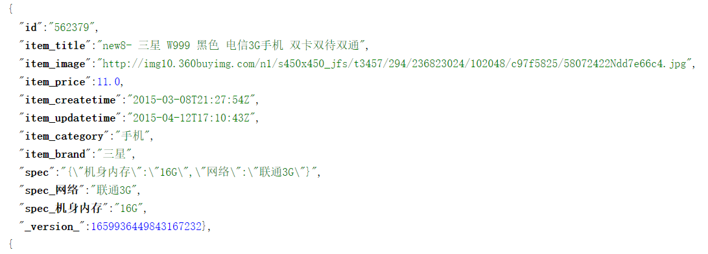
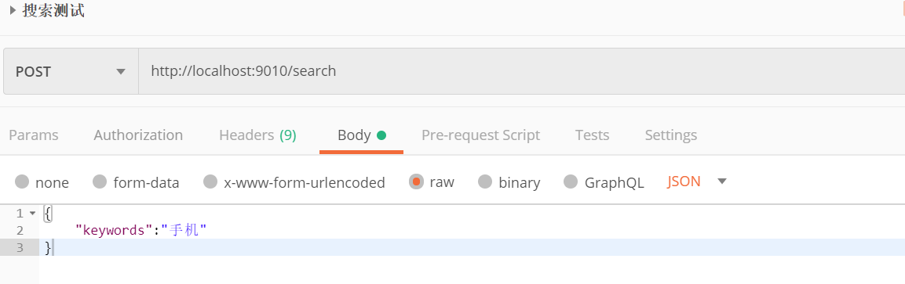
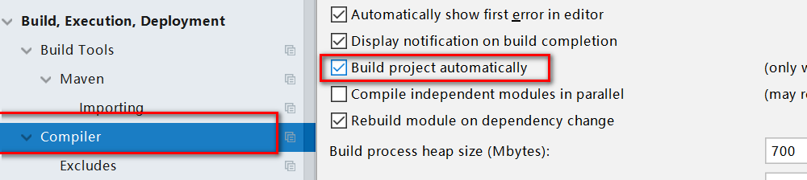
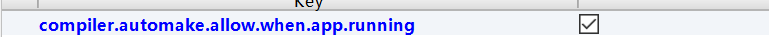
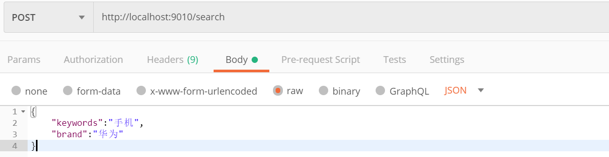
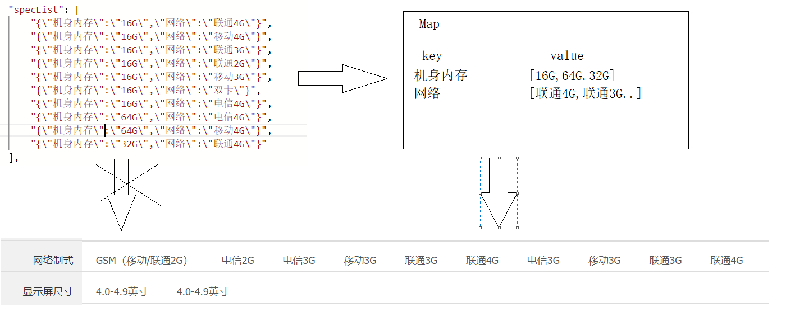
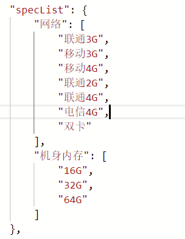

# Solr综合案例

## 1.综合案例准备

### 	1.1 综合案例需求

​				根据搜索关键字查询 

​				品牌、规格过滤

​				价格区间搜索 

​				排序查询 

​				分页查询 			

​				高亮查询 


### 	1.2 技术选型

​		后端：spring boot + spring mvc + spring data solr + mybatis

​		前端:   html + css + vue

### 	1.3 综合案例环境搭建

​		关于综合案例的环境搭建，首先我们要做的事情就是将mysql中的商品数据导入到Solr中。将mysql中的数据导入到solr中，这个事情只需要做一次。如果后期mysql中数据发生改变，比如添加了商品，修改了商品，删除了商品，可以采用增量更新的方式同步到Solr中。

​		要想完成增量更新，可能就需要使用mysql数据库中间件,比如canal.本次案例我们不考虑。如果大家对这个感兴趣。可以学习canal相关的知识。

##### 				1.3.1  商品数据导入服务模块搭建

###### 				1.2.1.1   父工程的创建

```
	<packaging>pom</packaging>
    <properties>
        <java.version>1.8</java.version>
    </properties>
    <parent>
        <groupId>org.springframework.boot</groupId>
        <artifactId>spring-boot-starter-parent</artifactId>
        <version>2.1.10.RELEASE</version>
    </parent>
    
    <dependencies>
        <dependency>
            <groupId>org.springframework.boot</groupId>
            <artifactId>spring-boot-starter-test</artifactId>
        </dependency>
    </dependencies>
```

###### 							1.2.1.2   数据导入模块的搭建

​					创建服务，继承父工程，引入相关依赖

```
 <dependencies>
       <!--spring boot整合Junit-->
        <dependency>
            <groupId>org.springframework.boot</groupId>
            <artifactId>spring-boot-starter-test</artifactId>
        </dependency>
          <!--spring Data solr的起步依赖-->
        <dependency>
            <groupId>org.springframework.boot</groupId>
            <artifactId>spring-boot-starter-data-solr</artifactId>
        </dependency>
        <!--通用mapper起步依赖-->
        <dependency>
            <groupId>tk.mybatis</groupId>
            <artifactId>mapper-spring-boot-starter</artifactId>
            <version>2.0.4</version>
        </dependency>
        <!--MySQL数据库驱动-->
        <dependency>
            <groupId>mysql</groupId>
            <artifactId>mysql-connector-java</artifactId>
        </dependency>
        <dependency>
            <groupId>org.projectlombok</groupId>
            <artifactId>lombok</artifactId>
        </dependency>
        
        <dependency>
            <groupId>com.alibaba</groupId>
            <artifactId>fastjson</artifactId>
            <version>1.2.47</version>
        </dependency>
    </dependencies>
```

​				编写引导类和yml配置文件

```
server:
  port: 9009
  
spring:
  data:
    solr:
      host: http://localhost:8080/solr
      
  datasource:
    driver-class-name: com.mysql.jdbc.Driver
    url: jdbc:mysql://localhost:3306/lucene?useUnicode=true&characterEncoding=UTF-8&serverTimezone=UTC
    username: root
    password: 123
```

##### 				1.3.2    搜索服务的搭建

创建服务，继承父工程，引入相关依赖

```
<dependencies>
        <dependency>
            <groupId>org.springframework.boot</groupId>
            <artifactId>spring-boot-starter-web</artifactId>
        </dependency>
        <dependency>
            <groupId>org.springframework.boot</groupId>
            <artifactId>spring-boot-starter-data-solr</artifactId>
        </dependency>
          <dependency>
            <groupId>com.alibaba</groupId>
            <artifactId>fastjson</artifactId>
            <version>1.2.47</version>
        </dependency>
</dependencies>
```

​	编写启动类，将SolrTemplate交由spring管理。

```
   @Bean
    public SolrTemplate solrTemplate(SolrClient solrClient) {
        return new SolrTemplate(solrClient);
    }
```

 编写yml文件

```
server:
  port: 9010
spring:
  data:
    solr:
      host: http://localhost:8080/solr
```

##### 	1.3.3 搜索服务API模块搭建

​		该模块的主要作用是存放实体类,不是一个微服务，仅仅是一个模块。

```
<dependencies>
        <dependency>
            <groupId>org.springframework.boot</groupId>
            <artifactId>spring-boot-starter-data-solr</artifactId>
        </dependency>
        <!--jpa依赖-->
        <dependency>
            <groupId>javax.persistence</groupId>
            <artifactId>javax.persistence-api</artifactId>
            <version>2.2</version>
        </dependency>
    </dependencies>
```


### 1.4  数据导入代码编写

​	关于导入操作，我们分为2步

​		第一步，使用tk-mybatis先将MySQL中的数据查询出来；

​		第二步：使用Spring Data Solr将数据导入到solr中。

##### 	1.4.1 MySQL数据库查询

​		   在legou_search_api模块中编写一个商品实体类，使用tk-mybatis中注解建立映射关系。

​			Table注解：建立实体类和表的映射关系

​    		Column注解：建立实体类属性和表字段的映射关系

   			Id注解：标识主键

```
@Table(name = "tb_item")
public class Item {
    @Id
    @Column(name="id")
    private Integer id;
    @Column(name="title")
    private String title;
    @Column(name="image")
    private String image;
    @Column(name="price")
    private Double price;
    @Column(name="create_time")
    private Date createTime;
    @Column(name="update_time")
    private Date updateTime;
    @Column(name="category")
    private String category;
    @Column(name="brand")
    private String brand;
    @Column(name="spec")
    private String spec;
}
```

​		 在legou_dataImport模块中创建一个ItemDao

```
  1.引入api模块依赖
  <dependency>
            <groupId>cn.itcast</groupId>
            <artifactId>legou_search_api</artifactId>
            <version>1.0-SNAPSHOT</version>
   </dependency>
```

```
2.Dao接口定义
public interface ItemDao extends Mapper<Item> {
}
```

​	

```
3.在启动类上指定Dao接口所在包
 @MapperScan("cn.itcast.legou.dataimport.dao")
```

​	测试，查询所有商品数据	

```
@RunWith(SpringRunner.class)
@SpringBootTest(classes = DataImportApplication.class)
public class Test01 {
    @Autowired
    private ItemDao itemDao;

    @Test
    public void test01() {
        List<Item> items = itemDao.selectAll();
        for (Item item : items) {
            System.out.println(item);
        }
    }
}
```

##### 	1.4.2 Solr数据导入


​	1.在schema文件中定义业务域

```

	<field name="item_title" type="text_ik" indexed="true" stored="true"/>
	<field name="item_price" type="pfloat" indexed="true" stored="true"/>
	<field name="item_image" type="string" indexed="false" stored="true"/>
	<field name="item_createtime" type="pdate" indexed="true" stored="true"/>
	<field name="item_updatetime" type="pdate" indexed="true" stored="true"/>
	<field name="item_category" type="string" indexed="true" stored="true" />
	<field name="item_brand" type="string" indexed="true" stored="true"/>
	<field name="spec" type="string" indexed="true" stored="true"/>
	<!--规格的数据，我们使用的就是动态域-->
	<dynamicField name="spec_*"  type="string"  indexed="true"  stored="true"/>
```

​	2. 修改商品实体类，使用Spring Data Solr中的注解，建立实体类属性和域的映射关系。

```
@Data
@Table(name = "tb_item")
public class Item {
    @Id
    @Column(name="id")
    @Field("id")
    private Integer id;
    @Column(name="title")
    @Field("item_title")
    private String title;
    @Column(name="image")
    @Field("item_image")
    private String image;
    @Column(name="price")
    @Field("item_price")
    private Double price;
    @Column(name="create_time")
    @Field("item_createtime")
    private Date createTime;
    @Column(name="update_time")
    @Field("item_updatetime")
    private Date updateTime;
    @Column(name="category")
    @Field("item_category")
    private String category;
    @Column(name="brand")
    @Field("item_brand")
    private String brand;
    @Column(name="spec")
    @Field("spec")
    private String spec;

    //将spec转化为Map才能进行映射
    //将Map的key拼接spec_作为动态域的域名，map的value作为对应的域值
    @Field("spec_*")
    @Dynamic
    private Map<String,String> specMap;
}
```

3. 完成导入操作

   ```
    @Test
       public void test01() {
           List<Item> items = itemDao.selectAll();
           for (Item item : items) {
               //1.将item中的spec转化Map,封装到item
               String spec = item.getSpec();
               if(!StringUtils.isEmpty(spec)) {
                   Map specMap = JSON.parseObject(spec, Map.class);
                   item.setSpecMap(specMap);
               }
           }
           //2.使用SolrTemplate完成导入
           solrTemplate.saveBeans("collection1", items);
           solrTemplate.commit("collection1");
       }
   ```

4. 测试

   spec最终是以动态域的形式存在。

   


## 2.代码编写

### 		2.1 关键字查询

​	需求：根据用户输入的搜索关键字，在item_title中进行搜索。

##### 						2.1 后端代码

​		业务层：

​			根据搜索的关键字，使用String类型来接收即可，但是后期可能还会有其他的搜索条件，为了扩展性，使用Map/Pojo来接收。

​			返回值的类型：将来给客户端响应的结果中，包含了当前页数据，品牌列表，规格列表...

​		业务层接口

```
public interface SearchService {
    /**
     *
     * @param searchMap 对客户端传递搜索条件的封装
     * @return  对搜索结果的封装
     */
    public Map<String,Object> search(Map<String,String> searchMap);
}

```

​		业务层实现

```
    private SolrTemplate solrTemplate;
    @Override
    public Map<String, Object> search(Map<String, String> searchMap) {
         //1.1根据关键字搜索
        //1.1.1从searchMap中获取搜索的关键字--->keywords
        String keywords = searchMap.get("keywords");
        //1.1.2 keywords，客户端一定会传递吗？用户在搜索的时候，是从首页进行搜索，所以一定会带有搜索关键字
        //1.1.3 构建查询条件

        //1.1.4 执行查询,因为查询带高亮的。
        FacetAndHighlightQuery query = new SimpleFacetAndHighlightQuery(new Criteria("item_title").is(keywords));
        FacetAndHighlightPage<Item> page = solrTemplate.queryForFacetAndHighlightPage("collection1", query, Item.class);
        //1.1.5解析查询结果
        //1.1.5.1获取当前页数据
        List<Item> list = page.getContent();
        Map<String, Object> resultMap = new HashMap();
        resultMap.put("list", list);
        return resultMap;
    }
```

​	表现层

```
@RestController
@RequestMapping("/search")
public class SearchController {
    //1.注入searchService
    @AutoWired
    private SearchService searchService;

    //2.定义搜索方法
    /**
     * 接收前端传递的搜索条件，格式JSON，封装到searchMap
     * @param searchMap
     * @return
     */
    @RequestMapping
    public Map<String,Object> search(@RequestBody Map<String,String> searchMap) {
        return searchService.search(searchMap);
    }
}
```

​	测试：启动微服务进行测试



##### 						2.2 前端代码

###### 		2.2.1前端准备

​		1.将资料中搜索页面的静态资源复制到搜索服务resources/static目录

​		2.页面修改后，避免重启服务，加入热部署

```
   <dependency>
            <groupId>org.springframework.boot</groupId>
            <artifactId>spring-boot-devtools</artifactId>
   </dependency>
```

​		

​		ctrl + alt+shift+/

​	


​	3.测试前端页面是否能访问

```
http://localhost:9010/search.html
```

###### 	 2.2.2  代码编写

​	用户能够来到搜索页面，肯定是从首页访问过来的，而且传递了搜索的关键字。

```
http://localhost:9010/search.html?keywords=手机
```

​	在搜索页面中获取用户输入的搜索关键字，在js文件中getParameter.js，提供了一个函数，即可获取静态页面传递的参数。

	<script type="text/javascript" src="js/getParameter.js"></script>

​	使用Vue的钩子函数，在页面加载完毕后，获取搜索的关键字，向后端搜索服务发送ajax获取商品数据。

```
引入vue.js和axios.js
<script type="text/javascript" src="js/vue.js"></script>
<script type="text/javascript" src="js/axios.js"></script>
```

```
var app = new Vue({
        el:"#app",
        data:{
            //数据模型
            searchMap:{keywords:""}, //存储条件参数
            resultMap:{} //存储服务端响应结果
        },
        methods:{
            //方法定义
            getData:function(){
                //向搜索服务发送ajax请求，获取响应的数据
                axios.post("search",this.searchMap).then((resp)=>{
                    this.resultMap = resp;
                });
            }
        },
        created:function(){
            //1.获取搜索关键字
            let keywords = getUrlKey("keywords");
            //2.将keywords存储到数据模型searchMap中
            this.searchMap.keywords = keywords;
            //3.向后端发送ajax请求，获取数据
            this.getData();
        }
    });
```

​	现在我们已经获取到后端返回的商品数据，在页面中迭代

```
v-for="item in resultMap.list"
```


###### 	2.2.3 关键字搜索条件的回显

​	

​	搜索条件是封装到数据模型的searchMap中。直接从searchMap中可以获取搜索的关键字。

```
{{searchMap.keywords}}
```

###### 	2.2.4 输入框关键字回显

​	回显

```
v-model="searchMap.keywords"
```


### 		2.2品牌的过滤

##### 					2.2.1 品牌列表的数据展示

###### 								2.2.1.1 后端代码

```
  		//2.1 对item_brand进行facet查询,设置facet的域
        FacetOptions facetOptions = new FacetOptions();
        facetOptions.addFacetOnField("item_brand");
        query.setFacetOptions(facetOptions);
        
        //2.2解析Facet结果 
        List<String> brandList = new ArrayList<>();
        Page<FacetFieldEntry> brandFacetPage = page.getFacetResultPage("item_brand");
        List<FacetFieldEntry> brandFacetPageContent = brandFacetPage.getContent();
        for (FacetFieldEntry facetFieldEntry : brandFacetPageContent) {
            String brand = facetFieldEntry.getValue();
            brandList.add(brand);
        }
        
        //2.3将brandList封装到返回结果中
        resultMap.put("brandList", brandList);
```

###### 								2.2.1.2  前端代码

​		前端我们要做的事情，就是从响应的结果中获取brandList,进行迭代展示。

```
<ul class="logo-list" v-for="brand in resultMap.brandList">
           <li>{{brand}}</li>
</ul>
```

###### 	2.2.1.3 测试

```
http://localhost:9010/search.html?keywords=手机
http://localhost:9010/search.html?keywords=平板电视
```


##### 					2.2.2 品牌的过滤

###### 							2.2.2.1 后端代码

```
		//2.3 品牌过滤
        //2.3.1判断searchMap中是否有品牌的搜索条件
        String brand = searchMap.get("brand");
        if(!StringUtils.isEmpty(brand)) {
        //添加品牌的过滤条件
            FilterQuery brandFilterQuery = new SimpleFilterQuery(new Criteria("item_brand").is(brand));
            query.addFilterQuery(brandFilterQuery);
        }
```

​	测试：

​	

###### 							2.2.2.2  前端代码

​	1.给品牌列表中每一个品牌绑定点击事件

```
@click="search('brand',brand)" 第一个参数，searchMap中的键,第二个参数,searchMap中的值
```

​	2.将点击的品牌作为条件参数添加到searchMap数据模型中

​	3.调用getData()重写完成搜索

```
  search:function(key,value){
                //将key和value添加到searchMapJSON中；
                this.searchMap[key] = value;
                this.getData();
 }
```

​	4.测试

##### 					2.2.3 品牌列表的隐藏

​	当搜索条件中有品牌的条件，品牌的列表要隐藏。

​	品牌列表显示时机searchMap.brand是null;

```
v-if="searchMap.brand == null || searchMap.brand==''"
```

##### 							2.2.4  品牌条件的回显/取消

​	回显

​		如果searchMap中的brand不是null,进行回显。

```
   <li class="with-x" v-if="searchMap.brand !=null && searchMap.brand!=''">{{searchMap.brand}}<i>×</i></li>
```

​	条件取消

​		将searchMap中的品牌条件删除，重写根据seachMap进行搜索

​		1.给x绑定点击事件

```
@click="remove('brand')"  传递删除的参数名称
remove:function(key) {
         delete this.searchMap[key];
         this.getData();
 }
```


### 		2.3 规格过滤

##### 2.3.1 规格列表的数据展示

###### 							2.3.1.1 后端代码

```
 //3.1 对spec进行facet查询,设置facet域
facetOptions.addFacetOnField("spec");

  //3.2 解析spec Facet的结果
        List<String> specList = new ArrayList<>();
        Page<FacetFieldEntry> specFacetPage = page.getFacetResultPage("spec");
        List<FacetFieldEntry> specFacetPageContent = specFacetPage.getContent();
        for (FacetFieldEntry facetFieldEntry : specFacetPageContent) {
            String faceSpec = facetFieldEntry.getValue();
            specList.add(faceSpec);
        }
   //3.3将specList封装到返回结果中
        resultMap.put("specList", specList);
```

​	测试

​	

​	将specList有List数据结构转化为Map结构

```
 private Map<String, Set<String>> sepcList2Map(List<String> specList) {
        Map<String,Set<String>> resultMap = new HashMap<>();
        //1.迭代specList---->获取规格数据,JSON格式字符串
        for (String specJson : specList) {
            // "{\"机身内存\":\"16G\",\"网络\":\"联通4G\"}",
            Map<String,String> map = JSON.parseObject(specJson, Map.class);
            for (String key : map.keySet()) {
                String value = map.get(key);
                //将JSON中的key和value存储到resultMap中；
                if(!resultMap.containsKey(key)) {
                    Set<String> resultMapValue = new HashSet<>();
                    resultMapValue.add(value);
                    resultMap.put(key,resultMapValue );
                }else {
                    Set<String> resultMapValue = resultMap.get(key);
                    resultMapValue.add(value);
                }
            }
        }
        
        return resultMap;
 }
 调用方法：完成转化 resultMap.put("specList", sepcList2Map(specList));
```

​	测试：



###### 2.3.1.2  前端代码

```
 <div class="type-wrap" v-for="(value,key) in resultMap.specList">
                <div class="fl key">{{key}}</div>
                <div class="fl value">
                    <ul class="type-list">
                        <li v-for="op in value">
                            <a>{{op}}</a>
                        </li>
                    </ul>
                </div>
                <div class="fl ext"></div>
            </div>
```

##### 					2.3.2 规格过滤的过滤

​	需求：当用户点击规格选项的时候，需要根据点击的规格选项进行过滤查询。

eg:用户点击的是移动3G。在动态域中查询spec_网络:移动3G。

​	 用户点击的是64G，在动态域中查询spec_机身内存:64G 。

###### 2.3.2.1 前端代码

​	1.给所有的规格选项绑定点击事件。

```
@click="specSearch(key,op)" 参数1：规格名称 参数2:规格选项名称

```

​	2.将规格的条件添加到searchMap模型变量

​	3.调用getData()重写根据searchMap模型变量进行搜索。

```
   specSearch:function(key,value) {
                //1.将规格条件加入到searchMap模型变量
                this.searchMap["spec_"+key] = value;
                this.getData();
    }
```


###### 							2.3.2.2 后端代码	

​	需要根据前端传递的规格条件进行过滤

```
 for (String key : searchMap.keySet()) {
            String value = searchMap.get(key);
            if(key.startsWith("spec_")) {
            	//在动态域中搜索
                FilterQuery specFilterQuery = new SimpleFilterQuery(new Criteria(key).is(value));
                query.addFilterQuery(specFilterQuery);
            }
  }

```

​	测试：{ "keywords": "手机", "spec_网络": "联通3G" }


##### 2.3.3 前端优化

###### 	2.3.2.1规格列表的隐藏

​		规格列表隐藏：searchMap中有对应的规格条件，隐藏。

```
"v-if="isShow(key)"
 isShow:function(key) {
     if(this.searchMap["spec_" + key] == null) {
     	return true
     }
     return false;
 }
```

###### 	2.3.2.2 规格条件的回显/取消

​		规格的条件可能是多个，所以需要迭代searchMap.以spec_开始的就是规格的条件。

```
   <li class="with-x" v-for="(value,key) in searchMap" v-if="isStartWithSpec(key)">{{key}}<i>×</i></li>
    isStartWithSpec:function(key){
                return key.startsWith("spec_");
    }
```

​	去掉spec_

​		

​	

```
<li class="with-x" v-for="(value,key) in searchMap" v-if="isStartWithSpec(key)">{{removeSpec(key)}}<i>×</i></li>

  removeSpec:function(key) {
                return key.replace("spec_","");
  }
```

规格条件删除

​		条件的取消就是将searchMap中对应的规格条件删除。重写调用getData();

​		1.给规格x绑定点击事件，调用remove方法即可。该方法就可以完成功能

```
<i @click="remove(key)">×</i>
```


### 		2.4 价格区间过滤

##### 					2.4.1 价格区间数据展示

###### 								2.4.1.1 后端代码

```
   //5.1 对item_price进行facet范围查询
    FacetOptions.FieldWithNumericRangeParameters parameters = new FacetOptions.FieldWithNumericRangeParameters("item_price", 0, 3000, 500);
        facetOptions.addFacetByRange(parameters);
        
//5.2 解析Facet结果
      //5.2 解析item_price Facet结果
        List<String> priceList = new ArrayList<>();
        Page<FacetFieldEntry> priceFacetPage = page.getRangeFacetResultPage("item_price");
        List<FacetFieldEntry> priceFacetPageContent = priceFacetPage.getContent();
        for (FacetFieldEntry facetFieldEntry : priceFacetPageContent) {
            //每个区间起始
            String start = facetFieldEntry.getValue();
            //每个区间结束位置
            String end = String.valueOf(Double.parseDouble(start) + 500);
            priceList.add(start + "-" + end);
        }
        priceList.add("3000以上");

        //3.3将specList封装到返回结果中
        resultMap.put("priceList", priceList);
        
        return resultMap;
```

###### 								2.4.1.2  前端代码

​		从resultMap中获取priceList进行迭代展示

```
   <li v-for="price in resultMap.priceList">
                            <a>{{price}}元</a>
   </li>
```

##### 					2.4.2 价格区间的过滤

​	需求：用户点击价格区间，根据价格区间进行过滤

​	思路：当用户点击价格区间的时候，将价格区间的字符串传递到后端。

​			  后端根据-进行切割，获取区间最大值和最小值。根据最大值和最小值进行过滤

​			  特殊：3000以上

###### 							2.4.2.1 后端代码

```
 //6.1 价格区间过滤
        //6.1.1获取价格区间字符串
        String price = searchMap.get("price");
        if(!StringUtils.isEmpty(price)) {
            String[] split = price.split("-");
            if(!split[1].equals("*")) {
                //500-1000
                //自动进行类型转化
                query.addFilterQuery(new SimpleFacetQuery(new Criteria("item_price").between(split[0],split[1] )));
            }else {
                //3000-*
                query.addFilterQuery(new SimpleFilterQuery(new Criteria("item_price").greaterThanEqual(split[0])));
            }
        }
```


###### 							2.4.2.2  前端代码

​		1.给价格区间绑定点击事件

```
  <a @click="search('price',price)">{{price}}</a>
  将price作为key,将价格区间字符串作为值添加到searchMap模型变量
```

​		2.将价格区间的字符串作为搜索条件加入searchMap

​		3.调用getData()重写搜索

##### 					2.4.3 价格区间的隐藏

​		判断searchMap中是否有price这个key.

```
div class="type-wrap" v-if="searchMap.price == null">
                <div class="fl key">价格</div>
                <div class="fl value">
                    <ul class="type-list">
                        <li v-for="price in resultMap.priceList">
                            <a @click="search('price',price)">{{price}}</a>
                        </li>
                    </ul>
                </div>
                <div class="fl ext">
                </div>
            </div>
```


##### 							2.4.4  价格区间条件的显示和删除

```
<li class="with-x" v-if="searchMap.price !=null">{{searchMap.price}}<i @click="remove('price')">×</i></li>
```


### 		2.5  排序

​	需求：用户点击价格↑，根据价格进行升序排序，当用户点击价格↓，根据价格进行降序排序。

##### 						2.5.1 后端代码

​			当用户点击价格↑或者↓的时候，我们需要将排序的方式，排序的字段传递给后端，后端才能进行排序。

```
   //7.1 价格排序
        //7.1.1获取前端传递的排序字段和排序方式
        String sortField = searchMap.get("sortField");
        String sortType = searchMap.get("sortType");
        if(!StringUtils.isEmpty(sortField) && !StringUtils.isEmpty(sortType)) {
            //添加排序的参数
            if(sortType.equals("ASC")) {
                query.addSort(new Sort(Sort.Direction.ASC,sortField));
            }else if(sortType.equals("DESC")) {
                query.addSort(new Sort(Sort.Direction.DESC,sortField));
            }
        }

```


##### 						2.5.2 前端代码

​			1.给价格↕绑定点击事件

​			

```
<li>
 	<a href="javascript:;" @click="sortSearch('item_price','ASC')">价格↑</a>
</li>
 <li>
	<a href="javascript:;" @click="sortSearch('item_price','DESC')">价格↓</a>
</li>
```

​			2.将排序的字段和排序的方式添加到searchMap数据模型中

​			3.调用getData()重写查询数据

```
  sortSearch:function(sortField,sortType){
                this.searchMap.sortField = sortField;
                this.searchMap.sortType = sortType;
                this.getData();
   }
```


### 		2.6 分页	

​		分析:前端需要向后端传递2项参数，当前页，每页显示条数。

​				后端需要向前端响应3项信息，总记录数，总页数，当前页的数据。

##### 						2.6.1 后端代码

```
        //8.1分页
        //8.1.1 获取前端传递的当前页和每页显示条数
        String currentPage = searchMap.get("currentPage");
        String rows = searchMap.get("rows");
        if(StringUtils.isEmpty(currentPage)) {
            currentPage = "1";
        }

        if(StringUtils.isEmpty(rows)) {
            rows = "15";
        }

        //设置分页参数
        //当前页，页码是从0开始
        query.setPageRequest(PageRequest.of(Integer.parseInt(currentPage) - 1, Integer.parseInt(rows)));


		
		 //8.2 获取总总记录数，总页数封装resultMap
        long total = page.getTotalElements();
        long totalPages = page.getTotalPages();
        resultMap.put("total", total);
        resultMap.put("totalPages", totalPages);
```


##### 					2.6.2 前端代码

```
  searchMap:{keywords:"",currentPage:1,pageSize:15}
  设置默认当前页，和每页显示条数
```

###### 									2.6.2.1 总记录数，总页数，分页导航条的显示

展示总记录数，总页数

```
<div>
       <span>共{{resultMap.totalPages}}页&nbsp;</span>
       <span>共{{resultMap.total}}条&nbsp;</span>
</div>
```

​			展示分页导航条的显示

​	使用v-for指令从1迭代到总页数，但是这种方式有问题。

```
v-for="page in resultMap.totalPages"
```

​		当用户点击上一页，下一页，页码的时候，展示对应页的数据。

​	思路：当用户点击分页导航条的时候，需要将对应的页码传递到后端。

​		1.给分页导航条绑定点击事件

```
 @click="pager(page)"
```

​		2.将点击的页码作为参数添加到searchMap中；

​		3.调用getData()重新搜索

```
  pager:function(page) {
             //1.将页码参数添加到searchMap中，传递到后端
         this.searchMap.currentPage = page;
         this.getData();
 }
```

  4. 给上一页|下一页绑定点击事件

     ```
     @click="pager(searchMap.currentPage-1)"
     @click="pager(searchMap.currentPage+1)"
     ```

     如果当前页是第一页，上一页页吗编程0，如果当前页是最后一页，点击下一页也有问题。

     判断页码是否越界

     ```
       if(page <= 0 || page > this.resultMap.totalPages) {
                         return;
       }
     ```

     

###### 									2.6.2.2 分页导航条的优化

​	如果在展示分页导航条的时候，将所有的页码都展示出来。如果总页数很多，可能会造成页面出现问题。

​		第一种情况：页面中页码很多。

​		第二种情况：页面出现布局问题。

​		需求:展示以当前页为中心的前2个页码和后2个页码；

​		1.定义2个模型变量记录页码的开始位置和结束位置。

```
startPage:0,
endPage:0
```

​		2.当获取查询到后端响应的数据后，计算startPage和endPage,代码写在getData中；

```
calcPageNumber:function(){
                //总页数小于等于5页;全部展示
                if(this.resultMap.totalPages <= 5) {
                    this.startPage = 1;
                    this.endPage = this.resultMap.totalPages;
                }else {
                    //当前页小于等于2，展示前5个页码
                    if(this.searchMap.currentPage <= 2) {
                        this.startPage = 1;
                        this.endPage = 5;

                    }else if(this.searchMap.currentPage + 2 > this.resultMap.totalPages) {
                        //如果当前页+2大于总页数，显示后5个页码
                        this.startPage = this.resultMap.totalPages - 4;
                        this.endPage =  this.resultMap.totalPages;
                    }else {
                        //展示以当前页为中心的前2个页码和后2个页码
                        this.startPage = this.searchMap.currentPage - 2;
                        this.endPage = this.searchMap.currentPage + 2;
                    }

                }
 },
```

​	3.利用startPage和endPage生成分页导航条。

​		v-for指令没有提供根据2个数字进行迭代。基于startPage和endPage生成数组，迭代该数组

```
pageNumber:[]
this.pageNumber = [];
for(var i=this.startPage;i<=this.endPage;i++) {
                    this.pageNumber.push(i);
}

```

​	当前页，进行高亮操作，当前的情况是所有的页码都进行了高亮。

​	思路：判断循环出来的页码那个和当前页相同，加样式。

```
:class="page == searchMap.currentPage?'active':''"
```

### 		2.7 高亮

​		需求：对标题中的搜索关键字进行红色高亮。

###### 						2.7.1 后端代码

​		1.设置高亮选项高亮的域，前后缀

```
        HighlightOptions highlightOptions = new HighlightOptions();
        //那个域中包含主查询条件中搜索的关键字，进行高亮
        highlightOptions.addField("item_title");
        highlightOptions.setSimplePrefix("<span style='color:red'>");
        highlightOptions.setSimplePostfix("</span>");
        query.setHighlightOptions(highlightOptions);

```

​		2.执行高亮查询

​		3.解析高亮结果

​	

```
    q=item_title:手机
    &hl=true
    &hl.fl=item_title
    &hl.simple.pre=<em>
    &simpletag.post=</em>
```

```
//9.2 解析高亮结果
        List<HighlightEntry<Item>> highlighted = page.getHighlighted();
        //迭代每个文档中的高亮信息
        for (HighlightEntry<Item> itemHighlightEntry : highlighted) {
            //包含高亮数据的文档
            Item item = itemHighlightEntry.getEntity();
            //文档对应的高亮数据
            List<HighlightEntry.Highlight> highlights = itemHighlightEntry.getHighlights();
            //获取第一个高亮域的数据
            if(highlights != null && highlights.size() >0) {
                HighlightEntry.Highlight highlight = highlights.get(0);
                //域名称
                String name = highlight.getField().getName();
                //域值
                List<String> snipplets = highlight.getSnipplets();
                //把不带高亮的标题替换掉
                if(name.equals("item_tile")) {
                    if(snipplets != null && snipplets.size() >0) {
                        item.setTitle(snipplets.get(0));
                    }

                }
            }
        }
```

​	测试

​	

​		通过刚才的测试，发现标题中的HTML标签没有被解析。

###### 						2.7.2  前端代码

​		在Vue中，{{}}表达式中html标签是不解析，可以使用一个指令v-html。

​		该指令作用，将指定的内容展示到标签的标签体中，还可以对html进行解析。


### 2.8 搜索的交互

​	当用户输入搜索的关键字，点击搜索，根据输入的关键字，重新搜索。地址栏中的参数值，也要改变，此时不能使用ajax进行交互。使用表单进行交互。

​	让表单提交到search.html	，给输入框指定name属性值

```
<form action="search.html" class="sui-form form-inline">
                                    <!--searchAutoComplete-->
                                    <div class="input-append">
                                        <input type="text" id="autocomplete" name="keywords" v-model="searchMap.keywords" class="input-error input-xxlarge" />
                                        <button class="sui-btn btn-xlarge btn-danger" type="submit">搜索</button>
                                    </div>
</form>
```

​	

​	

​	

